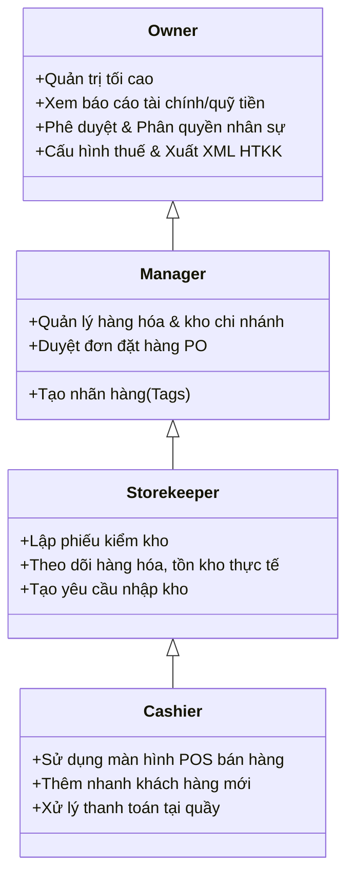
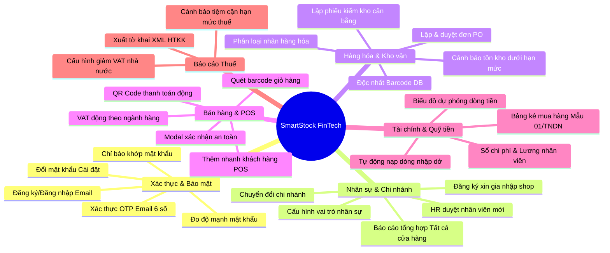
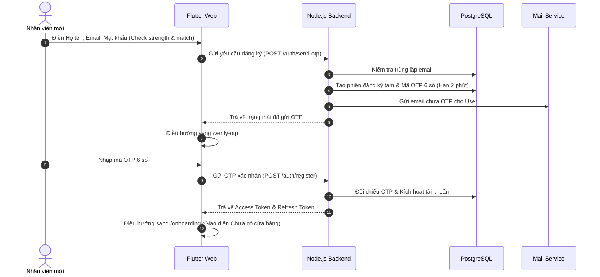
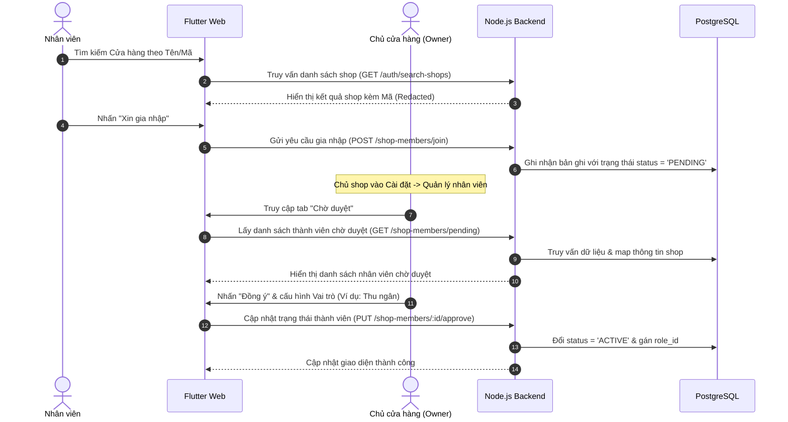
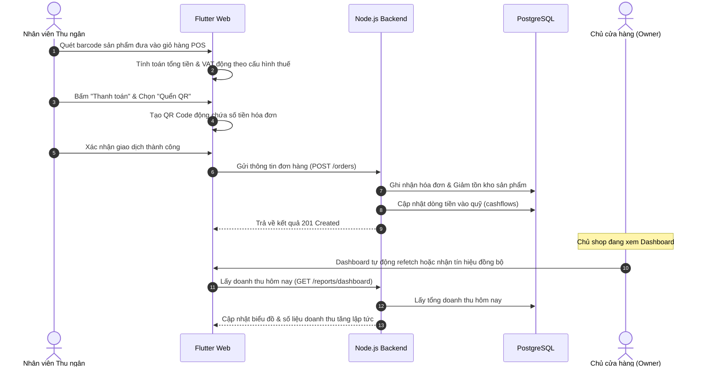

# TÀI LIỆU YÊU CẦU NGHIỆP VỤ TỔNG THỂ (BUSINESS REQUIREMENT DOCUMENT - BRD)
## Hệ thống SmartStock FinTech - Quản lý Bán hàng & Hỗ trợ Cảnh báo Thuế

---

## 1. Kiểm soát phiên bản (Version Control)

| Phiên bản | Ngày | Người thực hiện | Nội dung thay đổi | Trạng thái |
| :--- | :--- | :--- | :--- | :--- |
| v1.0.0 | 2026-07-21 | Senior Business Analyst | Khởi tạo tài liệu BRD hệ thống SmartStock FinTech | Hoàn thành |

---

## 2. Giới Thiệu & Bối Cảnh Dự Án (Project Introduction & Business Context)

### 2.1. Bối cảnh thị trường
Tại Việt Nam, hộ kinh doanh cá thể đóng góp vai trò to lớn vào nền kinh tế nhưng lại là đối tượng gặp nhiều khó khăn nhất trong quá trình chuyển đổi số và tuân thủ các quy định pháp luật về tài chính. Sự ra đời của **Thông tư 88/2021/TT-BTC** (hướng dẫn chế độ kế toán cho hộ kinh doanh, hợp tác xã) và **Nghị định 123/2020/NĐ-CP** (quy định về hóa đơn, chứng từ) đã đặt ra những yêu cầu bắt buộc và khắt khe về việc lưu trữ sổ sách kế toán, hóa đơn chứng từ đầu vào/đầu ra, cùng nghĩa vụ kê khai thuế định kỳ.

Tuy nhiên, hầu hết các hộ kinh doanh hiện tại đang vận hành theo phương thức truyền thống:
- Ghi chép sổ sách thủ công bằng giấy hoặc bảng tính Excel rời rạc.
- Không kiểm soát được tồn kho thực tế so với hóa đơn chứng từ, dẫn đến rủi ro bị xử phạt khi thanh tra thuế.
- Khó khăn trong việc tính toán nghĩa vụ thuế và kết xuất tờ khai theo định dạng XML để nhập vào phần mềm HTKK (Hỗ trợ Kê khai) của Tổng cục Thuế.

### 2.2. Mục tiêu dự án
**SmartStock FinTech** ra đời nhằm cung cấp một giải pháp công nghệ "Tất-cả-trong-một" (All-in-One) giúp giải quyết triệt để các nỗi đau trên:
1. **Tinh gọn hóa vận hành:** Số hóa các hoạt động bán hàng (POS), quản lý kho vận (Inventory), quản lý công nợ khách hàng và nhà cung cấp.
2. **Tự động hóa tuân thủ thuế:** Hỗ trợ hộ kinh doanh lưu trữ chứng từ, lập bảng kê mua bán, tính toán thuế tự động theo từng danh mục ngành hàng, và kết xuất tờ khai XML chuẩn HTKK.
3. **Cảnh báo sớm rủi ro (Tax Warning):** Đưa ra cảnh báo thông minh khi doanh thu tiệm cận ngưỡng chịu thuế mới, cảnh báo lệch tồn kho sổ sách với kiểm kê, và tối ưu hóa dự phóng dòng tiền (Cashflow Forecast).

---

## 3. Phạm Vi Hệ Thống (System Scope)

### 3.1. Phạm vi chức năng (In-Scope)
Hệ thống bao gồm các phân hệ cốt lõi sau:
- **Phân hệ Xác thực & Bảo mật (Authentication & Security):** Bảo vệ tài khoản người dùng thông qua mã hóa JWT, xác thực OTP Email, và thanh đo độ mạnh mật khẩu chuẩn quốc tế.
- **Phân hệ Quản lý Cửa hàng & Nhân sự (Shop & Staff Management):** Quản lý chuỗi chi nhánh, hỗ trợ phê duyệt yêu cầu gia nhập của nhân viên và phân quyền dựa trên vai trò (RBAC).
- **Phân hệ Hàng hóa & Kho vận (Products & Inventory):** Quản lý danh mục sản phẩm, nhãn hàng hóa (tags), đơn đặt hàng nhà cung cấp (PO), và phiếu kiểm kê cân bằng kho.
- **Phân hệ POS & Bán hàng (Point of Sale):** Giao diện quét mã vạch bán lẻ tại quầy, tính toán thuế VAT động, tạo nhanh khách hàng và hỗ trợ thanh toán QR Code động.
- **Phân hệ Tài chính & Quỹ tiền (Finance & Cashflow):** Quản lý thu chi, lập bảng kê mua hàng không hóa đơn (Mẫu 01/TNDN), và biểu đồ dự phóng dòng tiền trực quan.
- **Phân hệ Cảnh báo & Thuế (Tax & Warnings):** Cấu hình tỷ lệ giảm thuế VAT, cảnh báo hạn mức kho, và xuất tờ khai định dạng XML HTKK.

### 3.2. Ngoài phạm vi chức năng (Out-of-Scope)
Các tính năng sau sẽ không nằm trong phạm vi phát triển của phiên bản hiện tại mà sẽ được xem xét ở các giai đoạn tiếp theo:
- Kết nối trực tiếp với hóa đơn điện tử của các nhà cung cấp bên thứ ba (chỉ hỗ trợ xuất tệp XML tờ khai nạp vào HTKK).
- Tích hợp các đơn vị vận chuyển bên thứ ba (Giao Hàng Nhanh, Viettel Post, v.v.).
- Hệ thống chấm công và tính lương chi tiết dựa trên định vị hoặc vân tay (chỉ hỗ trợ lập phiếu chi lương cơ bản tại Sổ chi phí).

---

## 4. Tác Nhân Hệ Thống & Chân Dung Người Dùng (System Actors & User Personas)

Hệ thống thiết lập cơ chế phân quyền chặt chẽ dựa trên 4 nhóm tác nhân chính:

### 4.1. Chủ hộ kinh doanh (Owner)
- **Mô tả vai trò:** Người sở hữu chuỗi cửa hàng, chịu trách nhiệm pháp lý cao nhất và kiểm soát toàn bộ tài chính.
- **Chân dung người dùng:** Anh Trần Minh Tuấn (38 tuổi), chủ chuỗi 3 cửa hàng Vật liệu xây dựng tại TP.HCM. Anh cần một công cụ tổng hợp số liệu doanh thu tức thì, kiểm tra xem nhân viên có gian lận hay không, và xuất tờ khai thuế nhanh chóng mỗi quý mà không cần thuê kế toán dịch vụ đắt đỏ.
- **Quyền hạn chính:** Xem Dashboard tổng hợp (chế độ Tất cả cửa hàng), duyệt yêu cầu gia nhập của nhân viên mới, cấu hình hệ thống thuế suất, xuất tờ khai XML nạp vào HTKK, xem sổ quỹ tiền và dự phóng dòng tiền.

### 4.2. Quản lý chi nhánh (Manager)
- **Mô tả vai trò:** Người điều hành các hoạt động kinh doanh và nhân sự tại một chi nhánh cụ thể do Chủ hộ chỉ định.
- **Chân dung người dùng:** Chị Nguyễn Mai Vy (30 tuổi), quản lý chi nhánh 1 của chuỗi VLXD. Chị chịu trách nhiệm kiểm duyệt đơn nhập hàng từ nhà cung cấp, phân loại các sản phẩm mới nhập về bằng các nhãn (tags), và điều phối tồn kho.
- **Quyền hạn chính:** Xem danh sách đơn PO, phê duyệt đơn PO để tăng kho tự động, tạo và gắn nhãn sản phẩm, quản lý thông tin khách hàng/nhà cung cấp.

### 4.3. Thủ kho (Storekeeper)
- **Mô tả vai trò:** Chịu trách nhiệm trực tiếp về số lượng, chất lượng hàng hóa lưu kho và tính chính xác của tồn kho thực tế.
- **Chân dung người dùng:** Anh Lê Văn Hải (28 tuổi), nhân viên kho. Anh cần giao diện đơn giản trên thiết bị di động/máy tính bảng để điền số lượng kiểm kho thực tế tại kệ hàng, hệ thống tự động tính toán số lượng lệch thừa/thiếu.
- **Quyền hạn chính:** Tạo phiếu nhập kho nháp, lập phiếu kiểm kê kho (Stocktake) gửi cấp trên xác nhận hoặc tự động điều chỉnh cân bằng kho. Bị chặn hoàn toàn truy cập tới báo cáo doanh thu, quỹ tiền và thuế.

### 4.4. Nhân viên thu ngân (Cashier)
- **Mô tả vai trò:** Nhân viên bán hàng trực tiếp tại quầy, tương tác với khách hàng và xử lý giao dịch tiền tệ.
- **Chân dung người dùng:** Bạn Phạm Thùy Linh (21 tuổi), sinh viên làm thêm bán thời gian. Bạn cần màn hình POS trực quan, nút bấm to rõ ràng, hỗ trợ quét mã vạch nhanh bằng máy quét cầm tay, và có nút hủy đơn/xóa giỏ hàng hiển thị cảnh báo để tránh bấm nhầm khi đang đông khách.
- **Quyền hạn chính:** Truy cập duy nhất màn hình POS để quét bán hàng, tạo nhanh khách hàng mới, chọn phương thức thanh toán. Bị giới hạn hoàn toàn tất cả các màn hình Cài đặt nhân sự, Sổ sách tài chính và Báo cáo thuế.

---

## 5. Bản Đồ Tính Năng Hệ Thống (Feature Map)

---

## 6. Sơ Đồ Luồng Hoạt Động Nghiệp Vụ Chính (Business Workflows)

### 6.1. Quy trình Đăng ký & Kích hoạt tài khoản nhân viên mới (Onboarding Flow)

### 6.2. Quy trình Xin Gia Nhập & Duyệt Nhân Sự (Staff Join & Approval Flow)

### 6.3. Quy trình Bán hàng tại POS & Đồng bộ Doanh thu thời gian thực (POS Transactions & Sync Flow)

---

## 7. Các Quy Tắc Nghiệp Vụ Ràng Buộc (Business Rules)

| ID | Danh mục | Tên quy tắc | Mô tả chi tiết ràng buộc |
| :--- | :--- | :--- | :--- |
| **BR-SEC-01** | Bảo mật | Độ mạnh mật khẩu | Mật khẩu bắt buộc đạt $\ge 3/5$ tiêu chí đánh giá và độ dài tối thiểu 8 ký tự mới được gửi yêu cầu đăng ký/đổi mật khẩu. |
| **BR-SEC-02** | Bảo mật | Giới hạn thử OTP | Mã OTP chỉ có hiệu lực trong vòng 120 giây (2 phút). Quá thời gian này, mã tự động vô hiệu hóa. |
| **BR-INV-01** | Kho hàng | Độc nhất Barcode | Trong cùng một cửa hàng (`shop_id`), hai sản phẩm khác nhau không được phép có trùng mã vạch (`barcode`). Hệ thống database chặn mức Unique Constraint. |
| **BR-INV-02** | Kho hàng | Cập nhật kho qua PO | Số lượng tồn kho sản phẩm chỉ được tăng lên khi đơn đặt hàng PO được chuyển từ trạng thái `PENDING` sang `APPROVED` bởi quản lý hoặc chủ shop. |
| **BR-INV-03** | Kho hàng | Phiếu kiểm kê cân bằng | Khi phiếu kiểm kho được duyệt, số lượng tồn kho của sản phẩm trên hệ thống sẽ bị ghi đè hoàn toàn bằng số lượng kiểm kê thực tế, đồng thời ghi nhận lịch sử chênh lệch thừa/thiếu. |
| **BR-TAX-01** | Báo cáo Thuế | Kê khai doanh thu | Toàn bộ các hóa đơn bán ra thành công tại quầy POS bắt buộc phải được tổng hợp doanh thu và tự động tính toán thuế suất dựa trên danh mục thuế đã cấu hình. |
| **BR-TAX-02** | Báo cáo Thuế | Bảng kê không hóa đơn | Mọi giao dịch mua vào không có hóa đơn đỏ (Mẫu 01/TNDN) phải điền đầy đủ thông tin cá nhân của người bán (Họ tên, SĐT/CCCD, Địa chỉ) để đủ điều kiện khấu trừ chi phí hợp lý khi quyết toán thuế. |
| **BR-RBAC-01**| Phân quyền | Chặn quyền nhân sự | Vai trò `CASHIER` và `STOREKEEPER` bị chặn tuyệt đối quyền truy cập vào tất cả các API/giao diện liên quan đến Báo cáo doanh thu chuỗi, Cấu hình thuế, Sổ chi phí lương và Xuất XML HTKK. |
