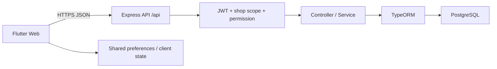

# System Requirement Specification (SRS)

## 1. Baseline kiến trúc



Nguồn:

- Router frontend: [`app_router.dart`](../lib/core/router/app_router.dart)
- HTTP client: [`api_client.dart`](../lib/core/network/api_client.dart)
- Route mount backend: [`index.ts`](../backend/src/index.ts)
- Data source: [`db.config.ts`](../backend/src/config/db.config.ts)

## 2. Actor

| Actor | Mô tả |
|---|---|
| Guest | Đăng ký, gửi OTP, đăng nhập, quên/đặt lại mật khẩu |
| Owner | Toàn quyền trong shop theo chính sách mục tiêu |
| Employee | Quyền theo `shop_roles.permissions` |
| Tax reviewer | Xác nhận rule/source và kết quả xuất |
| Vercel runtime | Khởi tạo backend serverless và kết nối DB |

## 3. Route frontend thực tế

### 3.1 Public

`/login`, `/register`, `/verify-otp`, `/forgot-password`, `/onboarding`,
`/waiting-approval`.

### 3.2 Bán hàng và quan hệ khách hàng

`/sales`, `/pos`, `/sales/:id`, `/sales/returns/:id`, `/customer-debts`,
`/customers`, `/customers/form`, `/customers/:id`, `/suppliers`,
`/suppliers/form`, `/suppliers/:id`.

### 3.3 Sản phẩm và kho

`/products`, `/products/tags`, `/products/form`, `/products/:id`,
`/inventory`, `/stock-take`, `/purchase-orders`, `/purchase-orders/detail`,
`/xnt-report`.

### 3.4 Tài chính và thuế

`/finance`, `/daily-closing`, `/profit-loss`, `/cashflow-forecast`,
`/debt-aging`, `/invoices`, `/purchases-no-invoice`, `/tax-calculator`,
`/expense-ledger`, `/tax-obligations`, `/salary-ledger`, `/tax-declaration`,
`/transactions`, `/transactions/detail`, `/tax-estimate`.

### 3.5 Quản trị

`/settings`, `/settings/ai-knowledge`, `/activity-logs`, `/tax-config`,
`/tax-support`, `/payment-config`, `/notifications`, `/staff`, `/employees`,
`/roles`, `/profile`, `/change-password`, `/shop-profile`.

Production dùng hash URL (`/#/route`) theo hành vi đã quan sát.

## 4. Nhóm endpoint backend thực tế

| Nhóm | Prefix/endpoint tiêu biểu | Middleware mong đợi |
|---|---|---|
| Auth | `/api/auth/*` | public hoặc JWT cho onboarding |
| User scope | `/api/profile`, `/api/my-shops`, `/api/notifications` | JWT |
| Sales | `/api/sales-orders*` | JWT + shop + sales permission |
| Product | `/api/products*`, `/categories`, `/cost-types` | JWT + shop + products permission |
| Inventory | `/api/inventory/*`, `/purchase-orders`, `/stock-takes` | JWT + shop + inventory permission |
| Finance | `/api/cash-*`, `/daily-closings`, `/invoices`, `/tax-obligations` | JWT + shop + finance permission |
| Customer | `/api/customers*` | Hiện thiếu permission middleware |
| Supplier | `/api/suppliers*` | Hiện thiếu permission middleware |
| Tag | `/api/tags` | Hiện thiếu permission middleware |
| Tax | `/api/tax/config`, `/api/tax/estimate`, `/api/tax/export-htkk` | finance permission |
| Tax config | `/api/tax/config` từ route config riêng | Hiện thiếu permission middleware ở một route set |
| Shop role/member | `/api/shop-roles`, `/api/shop-members` | owner |
| System | `/api/shop-profile`, `/activity-logs`, `/invoice-scans`, `/configs` | permission theo module |

## 5. Use case và yêu cầu chức năng

### UC-AUTH-01 — Đăng ký bằng OTP

**Tiền điều kiện:** email chưa tồn tại.

**Luồng chính:**

1. Guest nhập email.
2. Hệ thống gửi OTP có thời hạn.
3. Guest nhập OTP và thông tin đăng ký.
4. Backend so khớp email, mã và hạn dùng.
5. Backend tạo user và xóa OTP đã dùng.

**Ngoại lệ:** OTP thiếu/sai/hết hạn → 400; email tồn tại → 409.

**Acceptance:**

- Không trả OTP trong response production.
- OTP không dùng lại được.
- Có giới hạn gửi/thử và audit trong bản hardened.

### UC-AUTH-02 — Đăng nhập và refresh

1. User gửi credential.
2. Backend xác minh active status.
3. Trả access/refresh token và memberships.
4. Client chọn shop hợp lệ.
5. Khi access hết hạn, client dùng refresh đúng một lần theo policy.

Acceptance: refresh bị revoke/hết hạn trả 401; không lặp vô hạn.

### UC-SALE-01 — Bán hàng

1. User có `sales:edit/full`.
2. Chọn hàng còn bán được.
3. Chọn khách và phương thức thanh toán.
4. Backend validate price, quantity, stock và tổng.
5. Trong transaction: tạo order/item/payment, movement, COGS/công nợ.
6. Trả order hoàn tất và ghi audit.

Acceptance: client total không được tin tuyệt đối; retry không tạo đơn trùng.

### UC-SALE-02 — Hoàn/hủy

1. Kiểm tra đơn/trạng thái/quyền.
2. Xác định quantity và payment cần đảo.
3. Transaction tạo return, tăng tồn, điều chỉnh COGS/tiền/công nợ.
4. Ghi lý do, actor và audit.

Acceptance: tổng hoàn không vượt tổng đã bán; idempotent.

### UC-INV-01 — Nhận hàng

1. PO hợp lệ và user có quyền.
2. Nhập quantity, lot/expiry và chi phí.
3. Transaction cập nhật PO item, stock, lot, movement và cost.
4. Báo chênh lệch nếu thực nhận khác PO.

### UC-INV-02 — Kiểm kê

1. Tạo stock take snapshot.
2. Nhập số đếm thực tế.
3. Tính chênh lệch.
4. Người có quyền duyệt.
5. Sinh movement điều chỉnh và audit.

### UC-DEBT-01 — Thu nợ

1. Chọn receivable thật.
2. Nhập số tiền ≤ còn nợ.
3. Transaction tạo payment history và cash transaction.
4. Cập nhật trạng thái receivable.
5. Xuất biên nhận nếu cần.

### UC-TAX-01 — Ước tính và xuất

1. Chọn kỳ/năm.
2. Backend tải doanh thu đủ điều kiện và rule có hiệu lực.
3. Tính theo rule/version; không tạo số âm không hợp lệ.
4. UI hiển thị nguồn, hiệu lực, giả định và cảnh báo.
5. Khi xuất, validate hồ sơ và schema.
6. Lưu audit/checksum/version.

Baseline chưa đạt đầy đủ UC này.

## 6. Yêu cầu dữ liệu

| ID | Yêu cầu |
|---|---|
| DR-01 | Mọi dữ liệu nghiệp vụ phải truy được về shop |
| DR-02 | Giá trị tiền lưu kiểu chính xác, không dùng floating point không kiểm soát |
| DR-03 | Timestamp lưu nhất quán; report áp dụng timezone công bố |
| DR-04 | Soft delete/status phải được filter đồng nhất |
| DR-05 | Tổng hợp phải có kỳ, trạng thái và `asOf` |
| DR-06 | Dữ liệu mẫu không tồn tại trong production nghiệp vụ |
| DR-07 | Entity/table phải có một chủ sở hữu rõ |
| DR-08 | Schema chỉ thay đổi qua migration có version/checksum |

## 7. Yêu cầu API

### 7.1 Response contract mục tiêu

Thành công:

```json
{
  "success": true,
  "data": {},
  "message": "..."
}
```

Lỗi:

```json
{
  "success": false,
  "message": "Thông báo an toàn",
  "code": "STABLE_ERROR_CODE",
  "details": {}
}
```

`details` không chứa stack, SQL, secret hoặc dữ liệu cá nhân nhạy cảm.

### 7.2 HTTP status

| Tình huống | Status |
|---|---|
| Validation sai | 400 hoặc 422 theo contract được chọn |
| Chưa đăng nhập/token sai | 401 |
| Thiếu quyền/shop | 403 |
| Không tìm thấy | 404 |
| Conflict/idempotency | 409 |
| Rate limit | 429 |
| Lỗi không dự kiến | 500 |

Baseline còn nhiều controller trả 500 cho validation/not-found; cần chuẩn hóa V1.1.

## 8. Yêu cầu phi chức năng

### 8.1 Bảo mật

- Backend xác minh membership và permission cho mọi route.
- Không tin role/permission do client gửi.
- Access/refresh token tách policy, có rotation/revoke.
- OTP có hash, expiry, attempt limit và rate limit.
- Log redaction secret/token/PII nhạy cảm.
- CORS chỉ cho origin đã cấu hình.

### 8.2 Tính toàn vẹn

- Sale/return/payment/stock/debt dùng transaction.
- Idempotency cho request và callback có thể retry.
- Reconciliation jobs phát hiện số liệu lệch.

### 8.3 Hiệu năng mục tiêu đề xuất

| Chỉ số | Mục tiêu |
|---|---|
| P95 API đọc thông thường | ≤ 800 ms ở tải mục tiêu |
| P95 tạo đơn | ≤ 1.5 s chưa gồm payment ngoài |
| Dashboard initial usable | ≤ 3 s trên mạng thử nghiệm đã định nghĩa |
| Export 10.000 dòng | ≤ 30 s hoặc chạy background |

Chưa có load test; các số trên là tiêu chí đề xuất.

### 8.4 Khả dụng và quan sát

- Health/readiness không phụ thuộc route nghiệp vụ.
- Correlation ID từ frontend đến log DB/payment.
- Metrics lỗi, latency, cold start, DB pool và failed exports.
- DDL không chạy trong request/cold start.

### 8.5 UX và accessibility

- 390×844, 768×1024, 1440×900 không mất chức năng.
- Loading/empty/error/retry nhất quán.
- Keyboard, screen reader, contrast và zoom phải được kiểm thử trước khi công bố đạt.

## 9. Yêu cầu deployment

1. Build Flutter Web và backend TypeScript thành công.
2. Lint/test chạy trong CI; nếu bị chặn phải dừng phát hành theo policy đã duyệt.
3. Push `main` không force.
4. Hai Vercel project phải dùng cùng commit.
5. Smoke test đăng nhập/dashboard/POS/kho/tài chính/thuế/settings.
6. Có rollback bằng deployment trước; migration phải backward-compatible trong cửa sổ rollout.

## 10. Giới hạn baseline

- Flutter automated tests chưa chạy được trong môi trường audit do native asset/toolchain.
- Backend lint chưa chạy vì thiếu executable `eslint`.
- Không có quyền thay đổi dữ liệu production cho test hoàn/hủy/QR.
- Không có XSD/HTKK validation fixture.
- Không có accessibility test chuyên biệt.
