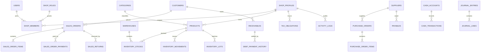
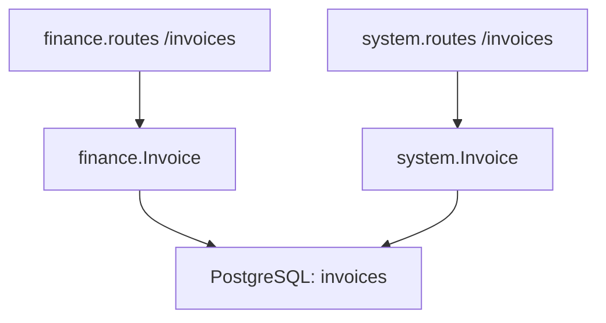

# Data Dictionary và ERD thực tế

## 1. Nguồn và kết luận

Tài liệu được lập từ 50 khai báo `@Entity` trong
[`backend/src`](../backend/src/) và SQL tại
[`backend/database`](../backend/database/).

- Có 50 khai báo entity.
- Có 49 tên bảng duy nhất vì `invoices` được ánh xạ bởi hai class khác nhau.
- `otps` được tạo bằng DDL runtime trong
  [`index.ts`](../backend/src/index.ts), không có TypeORM entity/migration chuẩn.
- Vì entity, SQL khởi tạo và database production chưa được introspect cùng lúc,
  trạng thái schema tổng thể là `Đúng một phần`.

## 2. ERD cấp cao

ERD trên mô tả quan hệ nghiệp vụ mục tiêu/quan hệ chính trong entity; không khẳng định
mọi foreign key đã tồn tại trong database production.

## 3. Danh mục entity theo module

### 3.1 Authentication, shop và hệ thống

| Bảng | Entity/file | Mục đích | Scope/quan hệ chính | Trạng thái/rủi ro |
|---|---|---|---|---|
| `users` | `auth/entities.ts` | Tài khoản, credential, trạng thái | User có nhiều membership | Cần policy PII/token rõ |
| `shop_roles` | `shop/entities.ts` | Vai trò tùy chỉnh | Quyền lưu dạng JSON/string | Cần schema/version permission |
| `shop_members` | `shop/entities.ts` | Membership user–shop | user, shop, role, memberType | Nguồn quyết định RBAC |
| `notifications` | `shop/entities.ts` | Thông báo người dùng | user/shop tùy loại | Route user-scoped cần lọc chặt |
| `shop_profiles` | `system/entities.ts` | Hồ sơ cửa hàng, MST, ngành | Root của shop scope | DDL runtime đang thêm field thuế |
| `activity_logs` | `system/entities.ts` | Nhật ký hoạt động | actor, shop, action/entity | Chưa chứng minh bao phủ đầy đủ |
| `invoice_scans` | `system/entities.ts` | Kết quả scan hóa đơn | shop, file/metadata | Cần retention và PII policy |
| `otps` | DDL trong `index.ts` | OTP đăng ký/reset | email đang lưu ở cột tên `phone` | Không có entity/migration; cần hash |

### 3.2 Sản phẩm

Nguồn: [`product/entities.ts`](../backend/src/product/entities.ts).

| Bảng | Mục đích | Quan hệ chính | Kiểm soát cần có |
|---|---|---|---|
| `tags` | Nhãn sản phẩm | product/tag | Unique theo shop/tên |
| `categories` | Danh mục | shop → products | Không xóa khi còn sản phẩm nếu policy cấm |
| `products` | Danh mục hàng hóa | category, shop, stock, order items | SKU/barcode unique theo shop |
| `cost_types` | Loại chi phí cấu thành | shop/product cost | Version/active status |
| `product_cost_items` | Thành phần chi phí | product + cost type | Tiền chính xác, ngày hiệu lực |
| `product_batches` | Batch sản phẩm | product | Phân biệt với `inventory_lots` |
| `unit_conversions` | Quy đổi đơn vị | product | Hệ số > 0, không vòng lặp |
| `product_price_history` | Lịch sử giá | product, actor/time | Không sửa lịch sử |

### 3.3 Khách hàng và công nợ phải thu

Nguồn: [`customer/entities.ts`](../backend/src/customer/entities.ts).

| Bảng | Mục đích | Quan hệ chính | Kiểm soát cần có |
|---|---|---|---|
| `customers` | Hồ sơ khách hàng | shop → sales/receivables | SĐT/email là PII |
| `receivables` | Khoản phải thu | customer, sales order | `total - paid = remaining` |
| `debt_evidences` | Bằng chứng nợ | receivable | File access/retention |
| `debt_payment_history` | Lịch sử thu nợ | receivable, cash transaction | Idempotency và immutable |

Production hiện chưa dùng các bảng này cho màn Sổ nợ; Flutter dùng dữ liệu mẫu.

### 3.4 Nhà cung cấp và công nợ phải trả

Nguồn: [`supplier/entities.ts`](../backend/src/supplier/entities.ts).

| Bảng | Mục đích | Quan hệ chính | Kiểm soát cần có |
|---|---|---|---|
| `suppliers` | Hồ sơ nhà cung cấp | shop → PO/payables | PII, unique theo shop |
| `payables` | Khoản phải trả | supplier, purchase | Tổng/đã trả/còn lại |

### 3.5 Bán hàng

Nguồn: [`sales/entities.ts`](../backend/src/sales/entities.ts).

| Bảng | Mục đích | Quan hệ chính | Kiểm soát cần có |
|---|---|---|---|
| `sales_orders` | Header đơn bán | shop, customer | Trạng thái, tổng, kỳ |
| `sales_order_items` | Dòng hàng bán | order, product | Snapshot tên/giá/thuế/cost |
| `sales_order_payments` | Thanh toán đơn | order, account/method | Tổng payment không vượt rule |
| `sales_returns` | Header hoàn hàng | sales order | Lý do, trạng thái, idempotency |
| `sales_return_items` | Dòng hoàn | return, original item | Quantity ≤ đã bán-chưa hoàn |
| `sales_order_lot_deductions` | Lô đã xuất theo đơn | item, inventory lot | Cần đảo đúng khi hoàn |

### 3.6 Kho

Nguồn:
[`inventory/entities.ts`](../backend/src/inventory/entities.ts) và
[`inventory/lot.entity.ts`](../backend/src/inventory/lot.entity.ts).

| Bảng | Mục đích | Quan hệ chính | Kiểm soát cần có |
|---|---|---|---|
| `warehouses` | Kho vật lý | shop | Ít nhất một kho mặc định theo rule |
| `inventory_stocks` | Số tồn hiện tại | warehouse, product | Unique warehouse+product |
| `inventory_movements` | Sổ biến động kho | product, warehouse, reference | Immutable/reconciliation |
| `purchase_orders` | Header đơn mua | shop, supplier | Trạng thái và tổng |
| `purchase_order_items` | Dòng đơn mua | PO, product | Ordered/received quantity |
| `stock_takes` | Phiên kiểm kê | shop, warehouse | Snapshot/status/approver |
| `stock_take_items` | Dòng kiểm kê | stock take, product | System vs actual vs variance |
| `inventory_lots` | Lô tồn thực tế | product, warehouse | Quantity, cost, expiry |

`product_batches` và `inventory_lots` có phạm vi gần nhau; cần quyết định một nguồn
chuẩn cho batch/lot để tránh lệch.

### 3.7 Tài chính, sổ cái và thuế

Nguồn:
[`finance/entities.ts`](../backend/src/finance/entities.ts),
[`finance/ledger.entity.ts`](../backend/src/finance/ledger.entity.ts) và
[`finance/entities/financial-ledger.entity.ts`](../backend/src/finance/entities/financial-ledger.entity.ts).

| Bảng | Mục đích | Quan hệ chính | Kiểm soát cần có |
|---|---|---|---|
| `cash_accounts` | Tài khoản tiền | shop | Opening/current balance |
| `cash_transactions` | Thu/chi | account, reference | Direction, amount > 0, idempotency |
| `tax_rules` | Rule thuế | sector/effective period | Nguồn, version, approvedBy |
| `budget_plans` | Kế hoạch ngân sách | shop, period | Version/status |
| `cashflow_forecasts` | Dự báo dòng tiền | shop, period | Phân biệt actual/forecast |
| `daily_closings` | Chốt ngày | shop, date | Unique shop+date, signed/locked |
| `invoices` | Hóa đơn tài chính | shop, counterparty | Trùng tên với system Invoice |
| `tax_obligations` | Nghĩa vụ thuế | shop, period/rule | Không âm, nguồn rule |
| `purchases_without_invoice` | Mua chưa hóa đơn | shop, supplier | Theo dõi bổ sung chứng từ |
| `purchase_without_invoice_items` | Dòng mua chưa hóa đơn | parent, product/description | Tổng khớp header |
| `journal_entries` | Bút toán | shop, date, reference | Cân debit=credit |
| `journal_lines` | Dòng bút toán | entry, account | Debit/credit hợp lệ |
| `financial_ledger` | Sổ tài chính tổng hợp | shop, reference | Phạm vi chồng với journal/cash cần làm rõ |

### 3.8 Hóa đơn hệ thống

Nguồn: [`system/entities.ts`](../backend/src/system/entities.ts).

| Bảng | Mục đích | Quan hệ chính | Rủi ro |
|---|---|---|---|
| `invoices` | Một mô hình Invoice thứ hai | shop, invoice items | Trùng vật lý với finance Invoice |
| `invoice_items` | Dòng hóa đơn system | system invoice | Có thể không tương thích finance Invoice |

## 4. Xung đột `invoices`

Mức độ: `Không chính xác` / P0.

Rủi ro:

- TypeORM metadata có hai định nghĩa cột/quan hệ cho cùng bảng.
- Express route được mount cùng prefix `/api`, route khai báo trước có thể shadow route sau.
- Migration tương lai không biết model nào là nguồn đúng.
- Dữ liệu hóa đơn/summary có thể được đọc bằng service khác với service ghi.

Quyết định cần có trước khi sửa:

1. Invoice nào là aggregate root?
2. `invoice_scans` là dữ liệu nhập hay hóa đơn chính?
3. Có cần tách `purchase_invoices`/`sales_invoices`?
4. Contract `/api/invoices` hiện có consumer nào?

## 5. Shop scope và khóa dữ liệu

Yêu cầu mục tiêu:

- Bảng nghiệp vụ trực tiếp hoặc gián tiếp phải gắn shop.
- Unique business key phải gồm `shop_id` khi phù hợp.
- Repository query không được chạy nếu không có `ShopScope`.
- `all` được dịch thành danh sách shop được phép, không thành `shop_id=null`.

Các bảng cần kiểm tra migration/constraint cụ thể: `products`, `customers`,
`suppliers`, `warehouses`, `sales_orders`, `cash_accounts`, `tax_rules`,
`receivables`, `payables`, `activity_logs`.

## 6. Quy tắc dữ liệu quan trọng

| ID | Invariant |
|---|---|
| DI-01 | `receivable.remaining = total - paid`, không âm |
| DI-02 | `payable.remaining = total - paid`, không âm |
| DI-03 | `sales_order.total = sum(items) ± discount/tax` theo contract |
| DI-04 | `sum(payments) + receivable = payable amount` theo trạng thái |
| DI-05 | Tồn cuối cân từ movement; stock là read model có thể đối soát |
| DI-06 | Return quantity không vượt sold quantity còn lại |
| DI-07 | Journal entry cân debit/credit |
| DI-08 | Cash balance cân opening + inflow - outflow |
| DI-09 | Tax obligation không âm và trỏ rule version |
| DI-10 | Export chính thức không chứa identifier fallback |

## 7. Migration inventory

| File | Mục đích suy ra | Ghi chú |
|---|---|---|
| `20260421_phase1_hkd_updates.sql` | Cập nhật nghiệp vụ HKD | Cần đối chiếu entity hiện tại |
| `20260504_optimize_indexes.sql` | Index | Cần verify query plan/production |
| `20260524_create_journal_ledger.sql` | Journal ledger | Chồng với financial ledger cần làm rõ |
| `20260525_create_financial_ledger.sql` | Financial ledger | Có file recreate kế tiếp |
| `20260525_recreate_financial_ledger.sql` | Tạo lại ledger | Rủi ro mất dữ liệu nếu chạy không kiểm soát |
| `20260525_create_sales_order_lot_deductions.sql` | Lot deduction | Cần FK/index |
| `20260525_create_tax_rules.sql` | Tax rules | Cần nguồn/effective date/approval |
| `QLKH.sql` | SQL khởi tạo/tổng hợp cũ | Không được coi là migration production tự động |

## 8. DDL runtime cần loại bỏ

[`index.ts`](../backend/src/index.ts) chạy `ALTER TABLE shop_profiles` và
`CREATE TABLE IF NOT EXISTS otps` khi khởi động local lẫn Vercel initialization.

Tác động:

- cold start phụ thuộc quyền DDL và lock DB;
- schema production có thể thay đổi ngoài lịch sử migration;
- lỗi bị log rồi request vẫn có thể tiếp tục với schema thiếu;
- khó rollback và audit.

Mục tiêu V1.2: runtime chỉ kết nối; migration chạy riêng, có checksum, backup,
staging rehearsal và approval.

## 9. Dữ liệu chưa xác minh

- Constraint/foreign key/index thực tế của production.
- Kiểu tiền/scale của mọi cột.
- Dòng orphan và duplicate trong production.
- Sự cân bằng stock/cash/journal hiện tại.
- PII retention và encryption.

Để xác minh cần schema-only dump hoặc quyền read-only vào `information_schema` và
query kiểm soát đã được duyệt; không cần quyền sửa dữ liệu.
