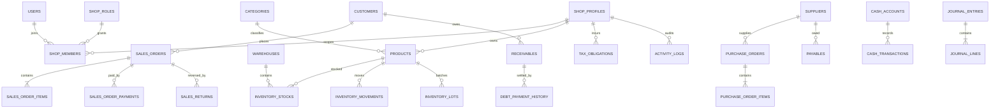

# Data Dictionary và ERD thực tế

> Cập nhật đối chiếu source ngày 01/08/2026.

## 1. Nguồn và kết luận

Tài liệu được lập từ 51 khai báo `@Entity` trong
[`backend/src`](../backend/src/) và SQL tại
[`backend/database`](../backend/database/).

- Có 51 khai báo entity và 51 tên bảng duy nhất.
- Xung đột hai entity cùng ánh xạ `invoices` đã được loại bỏ; `FinanceService` dùng `Invoice`
  duy nhất từ `system/entities.ts`.
- `refresh_sessions` đã có entity và migration hardening auth.
- `otps` vẫn không có TypeORM entity, nhưng schema đã được đưa vào migration
  `20260725_p0_schema_baseline.sql` và `20260801_harden_authentication.sql`; không còn tạo bảng
  trực tiếp trong `index.ts`.
- Vì entity, SQL khởi tạo và database production chưa được introspect cùng lúc,
  trạng thái schema tổng thể là `Đúng một phần`.

## 2. ERD cấp cao

ERD trên mô tả quan hệ nghiệp vụ mục tiêu/quan hệ chính trong entity; không khẳng định
mọi foreign key đã tồn tại trong database production.

## 3. Danh mục entity theo module

### 3.1 Authentication, shop và hệ thống

| Bảng | Entity/file | Mục đích | Scope/quan hệ chính | Trạng thái/rủi ro |
|---|---|---|---|---|
| `users` | `auth/entities.ts` | Tài khoản, credential, trạng thái | User có nhiều membership | Cần policy PII/token rõ |
| `refresh_sessions` | `auth/entities.ts` | Phiên refresh token theo family | user, expiry, revoke/replacement | Cần cleanup định kỳ và phát hiện reuse |
| `shop_roles` | `shop/entities.ts` | Vai trò tùy chỉnh | Quyền lưu dạng JSON/string | Cần schema/version permission |
| `shop_members` | `shop/entities.ts` | Membership user–shop | user, shop, role, memberType | Nguồn quyết định RBAC |
| `notifications` | `shop/entities.ts` | Thông báo người dùng | user/shop tùy loại | Route user-scoped cần lọc chặt |
| `shop_profiles` | `system/entities.ts` | Hồ sơ cửa hàng, MST, ngành | Root của shop scope | Cần xác minh production đã chạy migration baseline |
| `activity_logs` | `system/entities.ts` | Nhật ký hoạt động | actor, shop, action/entity | Chưa chứng minh bao phủ đầy đủ |
| `invoice_scans` | `system/entities.ts` | Kết quả scan hóa đơn | shop, file/metadata | Cần retention và PII policy |
| `otps` | SQL migration, truy vấn trực tiếp trong `auth.service.ts` | OTP đăng ký/reset | email vẫn lưu ở cột legacy tên `phone` | OTP đã hash; cần entity/repository hoặc rename rõ nghĩa |

### 3.2 Sản phẩm

Nguồn: [`product/entities.ts`](../backend/src/product/entities.ts).

| Bảng | Mục đích | Quan hệ chính | Kiểm soát cần có |
|---|---|---|---|
| `tags` | Nhãn sản phẩm | product/tag | Unique theo shop/tên |
| `categories` | Danh mục | shop → products | Không xóa khi còn sản phẩm nếu policy cấm |
| `products` | Danh mục hàng hóa | category, shop, stock, order items | SKU/barcode unique theo shop |
| `cost_types` | Loại chi phí cấu thành | shop/product cost | Version/active status |
| `product_cost_items` | Thành phần chi phí | product + cost type | Tiền chính xác, ngày hiệu lực |
| `product_batches` | Batch sản phẩm | product | Phân biệt với `inventory_lots` |
| `unit_conversions` | Quy đổi đơn vị | product | Hệ số > 0, không vòng lặp |
| `product_price_history` | Lịch sử giá | product, actor/time | Không sửa lịch sử |

### 3.3 Khách hàng và công nợ phải thu

Nguồn: [`customer/entities.ts`](../backend/src/customer/entities.ts).

| Bảng | Mục đích | Quan hệ chính | Kiểm soát cần có |
|---|---|---|---|
| `customers` | Hồ sơ khách hàng | shop → sales/receivables | SĐT/email là PII |
| `receivables` | Khoản phải thu | customer, sales order | `total - paid = remaining` |
| `debt_evidences` | Bằng chứng nợ | receivable | File access/retention |
| `debt_payment_history` | Lịch sử thu nợ | receivable, cash transaction | Idempotency và immutable |

Màn Sổ nợ hiện gọi API `/customer-receivables`; không còn dùng danh sách mẫu tại Flutter. Cần kiểm
tra production để chứng minh số tổng khớp `receivables` và lịch sử thu nợ.

### 3.4 Nhà cung cấp và công nợ phải trả

Nguồn: [`supplier/entities.ts`](../backend/src/supplier/entities.ts).

| Bảng | Mục đích | Quan hệ chính | Kiểm soát cần có |
|---|---|---|---|
| `suppliers` | Hồ sơ nhà cung cấp | shop → PO/payables | PII, unique theo shop |
| `payables` | Khoản phải trả | supplier, purchase | Tổng/đã trả/còn lại |

### 3.5 Bán hàng

Nguồn: [`sales/entities.ts`](../backend/src/sales/entities.ts).

| Bảng | Mục đích | Quan hệ chính | Kiểm soát cần có |
|---|---|---|---|
| `sales_orders` | Header đơn bán | shop, customer | Trạng thái, tổng, kỳ |
| `sales_order_items` | Dòng hàng bán | order, product | Snapshot tên/giá/thuế/cost |
| `sales_order_payments` | Thanh toán đơn | order, account/method | Tổng payment không vượt rule |
| `sales_returns` | Header hoàn hàng | sales order | Lý do, trạng thái, idempotency |
| `sales_return_items` | Dòng hoàn | return, original item | Quantity ≤ đã bán-chưa hoàn |
| `sales_order_lot_deductions` | Lô đã xuất theo đơn | item, inventory lot | Cần đảo đúng khi hoàn |

### 3.6 Kho

Nguồn:
[`inventory/entities.ts`](../backend/src/inventory/entities.ts) và
[`inventory/lot.entity.ts`](../backend/src/inventory/lot.entity.ts).

| Bảng | Mục đích | Quan hệ chính | Kiểm soát cần có |
|---|---|---|---|
| `warehouses` | Kho vật lý | shop | Ít nhất một kho mặc định theo rule |
| `inventory_stocks` | Số tồn hiện tại | warehouse, product | Unique warehouse+product |
| `inventory_movements` | Sổ biến động kho | product, warehouse, reference | Immutable/reconciliation |
| `purchase_orders` | Header đơn mua | shop, supplier | Trạng thái và tổng |
| `purchase_order_items` | Dòng đơn mua | PO, product | Ordered/received quantity |
| `stock_takes` | Phiên kiểm kê | shop, warehouse | Snapshot/status/approver |
| `stock_take_items` | Dòng kiểm kê | stock take, product | System vs actual vs variance |
| `inventory_lots` | Lô tồn thực tế | product, warehouse | Quantity, cost, expiry |

`product_batches` và `inventory_lots` có phạm vi gần nhau; cần quyết định một nguồn
chuẩn cho batch/lot để tránh lệch.

### 3.7 Tài chính, sổ cái và thuế

Nguồn:
[`finance/entities.ts`](../backend/src/finance/entities.ts),
[`finance/ledger.entity.ts`](../backend/src/finance/ledger.entity.ts) và
[`finance/entities/financial-ledger.entity.ts`](../backend/src/finance/entities/financial-ledger.entity.ts).

| Bảng | Mục đích | Quan hệ chính | Kiểm soát cần có |
|---|---|---|---|
| `cash_accounts` | Tài khoản tiền | shop | Opening/current balance |
| `cash_transactions` | Thu/chi | account, reference | Direction, amount > 0, idempotency |
| `tax_rules` | Rule thuế | sector/effective period | Nguồn, version, approvedBy |
| `budget_plans` | Kế hoạch ngân sách | shop, period | Version/status |
| `cashflow_forecasts` | Dự báo dòng tiền | shop, period | Phân biệt actual/forecast |
| `daily_closings` | Chốt ngày | shop, date | Unique shop+date, signed/locked |
| `invoices` | Hóa đơn tài chính dùng chung | shop, counterparty, items | Một entity duy nhất tại `system/entities.ts` |
| `tax_obligations` | Nghĩa vụ thuế | shop, period/rule | Không âm, nguồn rule |
| `purchases_without_invoice` | Mua chưa hóa đơn | shop, supplier | Theo dõi bổ sung chứng từ |
| `purchase_without_invoice_items` | Dòng mua chưa hóa đơn | parent, product/description | Tổng khớp header |
| `journal_entries` | Bút toán | shop, date, reference | Cân debit=credit |
| `journal_lines` | Dòng bút toán | entry, account | Debit/credit hợp lệ |
| `financial_ledger` | Sổ tài chính tổng hợp | shop, reference | Phạm vi chồng với journal/cash cần làm rõ |

### 3.8 Hóa đơn và scan chứng từ

Nguồn: [`system/entities.ts`](../backend/src/system/entities.ts).

| Bảng | Mục đích | Quan hệ chính | Rủi ro |
|---|---|---|---|
| `invoices` | Aggregate hóa đơn dùng chung | shop, invoice items, reference | Cần unique theo shop/số/ký hiệu/kỳ |
| `invoice_items` | Dòng hóa đơn | invoice, product tùy chọn | Cần snapshot đơn vị/tên/thuế |

## 4. Trạng thái hợp nhất `invoices`

Mâu thuẫn hai entity `Invoice` cùng dùng bảng `invoices` trong tài liệu cũ đã được xử lý ở source
hiện tại:

- chỉ còn một `@Entity('invoices')` trong `system/entities.ts`;
- `FinanceService` import model này làm repository hóa đơn;
- datasource đăng ký `SystemInvoice` và `SystemInvoiceItem` đúng một lần.

Trạng thái: `Đã xác minh từ code`. Vẫn cần introspect production để xác minh cột/index thật khớp
entity và không còn migration cũ tạo schema khác.

## 5. Shop scope và khóa dữ liệu

Yêu cầu mục tiêu:

- Bảng nghiệp vụ trực tiếp hoặc gián tiếp phải gắn shop.
- Unique business key phải gồm `shop_id` khi phù hợp.
- Repository query không được chạy nếu không có `ShopScope`.
- `all` được dịch thành danh sách shop được phép, không thành `shop_id=null`.

Các bảng cần kiểm tra migration/constraint cụ thể: `products`, `customers`,
`suppliers`, `warehouses`, `sales_orders`, `cash_accounts`, `tax_rules`,
`receivables`, `payables`, `activity_logs`.

## 6. Quy tắc dữ liệu quan trọng

| ID | Invariant |
|---|---|
| DI-01 | `receivable.remaining = total - paid`, không âm |
| DI-02 | `payable.remaining = total - paid`, không âm |
| DI-03 | `sales_order.total = sum(items) ± discount/tax` theo contract |
| DI-04 | `sum(payments) + receivable = payable amount` theo trạng thái |
| DI-05 | Tồn cuối cân từ movement; stock là read model có thể đối soát |
| DI-06 | Return quantity không vượt sold quantity còn lại |
| DI-07 | Journal entry cân debit/credit |
| DI-08 | Cash balance cân opening + inflow - outflow |
| DI-09 | Tax obligation không âm và trỏ rule version |
| DI-10 | Export chính thức không chứa identifier fallback |

## 7. Migration inventory

| File | Mục đích suy ra | Ghi chú |
|---|---|---|
| `20260421_phase1_hkd_updates.sql` | Cập nhật nghiệp vụ HKD | Cần đối chiếu entity hiện tại |
| `20260504_optimize_indexes.sql` | Index | Cần verify query plan/production |
| `20260524_create_journal_ledger.sql` | Journal ledger | Chồng với financial ledger cần làm rõ |
| `20260525_create_financial_ledger.sql` | Financial ledger | Có file recreate kế tiếp |
| `20260525_recreate_financial_ledger.sql` | Tạo lại ledger | Rủi ro mất dữ liệu nếu chạy không kiểm soát |
| `20260525_create_sales_order_lot_deductions.sql` | Lot deduction | Cần FK/index |
| `20260525_create_tax_rules.sql` | Tax rules | Cần nguồn/effective date/approval |
| `QLKH.sql` | SQL khởi tạo/tổng hợp cũ | Không được coi là migration production tự động |

## 8. DDL runtime

`index.ts` hiện chỉ khởi tạo datasource và không còn chạy `ALTER TABLE`/`CREATE TABLE` khi cold
start. Đây là cải thiện đã xác minh từ code. Migration vẫn cần quy trình riêng có checksum, backup,
staging rehearsal và approval; datasource hiện để `migrations: []`, nên ứng dụng chưa tự chứng minh
production đã chạy đủ migration.

## 9. Dữ liệu chưa xác minh

- Constraint/foreign key/index thực tế của production.
- Kiểu tiền/scale của mọi cột.
- Dòng orphan và duplicate trong production.
- Sự cân bằng stock/cash/journal hiện tại.
- PII retention và encryption.

Để xác minh cần schema-only dump hoặc quyền read-only vào `information_schema` và
query kiểm soát đã được duyệt; không cần quyền sửa dữ liệu.

## 10. Đánh giá độ phù hợp của mô hình dữ liệu hiện tại

Đối với cửa hàng phân bón, vật liệu xây dựng và đồ gia dụng, schema hiện đủ để chạy demo nghiệp vụ
cơ bản nhưng chưa đủ chặt cho vận hành nhiều cửa hàng và báo cáo kiểm toán.

| ID | Mức | Khoảng trống đã thấy trong entity/migration | Ảnh hưởng | Hướng mục tiêu |
|---|---|---|---|---|
| DM-01 | P0 | `inventory_stocks` chưa có unique `(shop_id, warehouse_id, product_id)` trong entity hoặc migration index hiện có | Có thể sinh nhiều dòng tồn cho cùng sản phẩm/kho và cộng trùng báo cáo | Unique constraint + upsert transaction + query phát hiện duplicate trước migration |
| DM-02 | P1 | Phần lớn quantity đang suy ra kiểu integer; chỉ `purchase_without_invoice_items` dùng `numeric(18,3)` | Không phù hợp kg, mét, m², m³ hoặc bán lẻ một phần bao/cuộn | Chuẩn hóa quantity `numeric(18,3)` và snapshot đơn vị trên mọi dòng chứng từ |
| DM-03 | P0 | `sales_return_items` không trỏ `sales_order_item_id`, không lưu cost snapshot hoặc lô hoàn | Không thể xác định chắc giá vốn hoàn một phần/đơn có cùng sản phẩm nhiều dòng | Liên kết dòng bán gốc, lưu returned cost và đảo đúng lot deduction |
| DM-04 | P1 | `purchase_order_items` thiếu ordered/received/rejected quantity, đơn vị và lịch nhận | Không mô hình hóa nhập nhiều đợt, thiếu/thừa/hỏng | Receipt header/items riêng hoặc các cột nhận hàng có audit |
| DM-05 | P1 | `inventory_movements` entity thiếu đơn giá, thành tiền, tồn trước/sau; DDL cũ lại có `cost_price` | XNT số lượng có thể chạy nhưng định giá và đối soát giá vốn yếu | Ledger kho immutable có quantity, unit cost, value, before/after và reference bắt buộc |
| DM-06 | P1 | `products.tags` là `simple-array` trong khi có bảng `tags` riêng | Hai nguồn tag có thể lệch; lọc khó index | Bảng nối `product_tags(product_id, tag_id)` unique |
| DM-07 | P1 | Nhiều `shop_id` nullable nhưng các khóa `name/sku/code` lại unique toàn cục | Cửa hàng khác có thể không dùng cùng tên “Kho chính”/“Sơn” hoặc SKU mong muốn | Chốt catalog dùng chung hay theo shop; unique composite đúng scope, shop_id NOT NULL cho dữ liệu shop |
| DM-08 | P1 | `cash_accounts.balance` và `cash_transactions.running_balance` cùng lưu số dư | Sửa/xóa/backdate giao dịch có thể làm số dư lệch | Ledger bất biến + transaction posting; balance là read model có job đối soát |
| DM-09 | P2 | Dòng bán/hóa đơn chưa snapshot đầy đủ tên, SKU và đơn vị tại thời điểm phát sinh | Đổi thông tin sản phẩm có thể làm chứng từ lịch sử hiển thị khác | Snapshot các trường pháp lý/hiển thị trên dòng chứng từ |
| DM-10 | P2 | `activity_logs.old_value/new_value` là chuỗi giới hạn 2.000 ký tự | Khó truy vấn, có thể cắt payload lớn | JSONB có redaction PII, schema version và retention |
| DM-11 | P0 | 60 invoice đầu vào không có item; 558 invoice bán có line gross nhưng header net discount và schema thiếu `discount_amount` | Invoice không tự drill-down/đối soát, báo cáo thuế phải join ngầm sang đơn/PO | Header gross/discount/tax/total tự cân bằng, item bắt buộc, backfill có reconciliation và rollback |

### 10.1 Bảng bổ sung cho hệ thống báo cáo

Không nên tạo bảng riêng cho từng biểu đồ. Nên giữ nguồn giao dịch chuẩn và bổ sung read model có
thể tái tạo:

1. `inventory_daily_snapshots`: tồn cuối ngày, giá trị tồn và phương pháp giá vốn theo shop/kho/SKU.
2. `sales_daily_facts`: gross, discount, return, net, COGS, gross profit, order count theo ngày/shop.
3. `payment_reconciliation_daily`: doanh thu, thanh toán theo phương thức và chênh lệch.
4. `receivable_aging_snapshots` và `payable_aging_snapshots`: bucket tuổi nợ theo ngày chốt.
5. Materialized view/read model cho ABC, sell-through, days cover, turnover và GMROI.

Mỗi read model phải có `as_of`, `shop_id`, công thức/version và job đối soát với bảng giao dịch; không
được trở thành nguồn ghi nghiệp vụ thứ hai.

Định nghĩa KPI, blueprint report/table và kết quả 24 quy tắc đối soát mới nhất được ghi tại
[KPI, report, table và data benchmark](23_KPI_REPORT_TABLE_AND_DATA_BENCHMARK_20260801.md).
