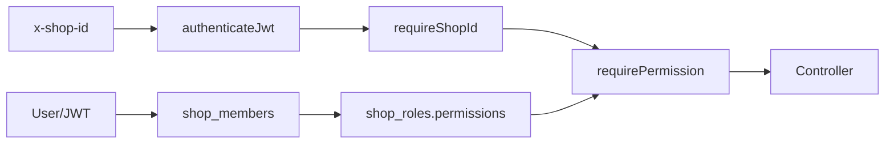
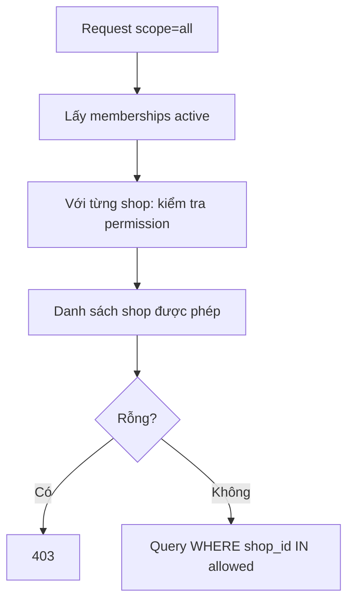

# Vai trò người dùng và ma trận RBAC

## 1. Kết luận baseline

RBAC hiện tại là `Không chính xác` cho production nhiều cửa hàng. Membership theo
shop đã được kiểm tra ở một phần backend, nhưng có ba lỗi cấu trúc:

1. Chọn “tất cả cửa hàng” ở frontend tự gán `memberType='OWNER'`.
2. Backend `requirePermission` cho `x-shop-id: all` luôn cho đi tiếp nếu user có ít
   nhất một membership, kể cả không phải owner.
3. Khóa quyền frontend (`pos`, `sales_view`) không khớp khóa backend (`sales`);
   customer/supplier/tag/tax-config còn thiếu middleware quyền.

Nguồn:

- [`shop_provider.dart`](../lib/features/settings/providers/shop_provider.dart)
- [`staff_management_screen.dart`](../lib/features/settings/presentation/staff_management_screen.dart)
- [`auth.middleware.ts`](../backend/src/middleware/auth.middleware.ts)
- [`permission.middleware.ts`](../backend/src/middleware/permission.middleware.ts)
- [`backend/src/routes`](../backend/src/routes/)

## 2. Mô hình hiện tại

### 2.1 Membership

- `memberType`: `OWNER` hoặc `EMPLOYEE`.
- `status/isActive`: quyết định membership có hiệu lực.
- `role`: có thể chứa permission JSON.
- Owner được toàn quyền trong shop cụ thể.

### 2.2 Cấp độ quyền

`none < view < edit < full`.

Backend dùng so sánh thứ bậc; `full` hiện không được dùng như một hành vi khác `edit`
ở đa số route. Cần định nghĩa rõ `full` có bao gồm delete/approve/export/config hay
không.

## 3. Mâu thuẫn khóa quyền

| Nghiệp vụ | Khóa frontend role editor | Khóa backend | Kết luận |
|---|---|---|---|
| POS | `pos` | `sales` | Không khớp |
| Xem đơn | `sales_view` | `sales` | Không khớp |
| Sản phẩm | `products` | `products` | Khớp |
| Kho | `inventory` | `inventory` | Khớp |
| Khách hàng | `customers` | Chưa gọi middleware | Không được enforce |
| Nhà cung cấp | `suppliers` | Chưa gọi middleware | Không được enforce |
| Tài chính | `finance` | `finance` | Khớp ở route có middleware |
| Cài đặt | `settings` | `settings` | Khớp |
| Dashboard | Không có key trong editor | `dashboard` được dùng thay thế ở summary | Không cấu hình được rõ |
| Tag | Không có key riêng | Chưa gọi middleware | Không được enforce |
| Tax config | Không có key riêng | Một route set thiếu middleware | Không nhất quán |

Khuyến nghị: dùng một registry permission chia sẻ bằng contract/schema, không khai
báo chuỗi độc lập ở Flutter và Express.

## 4. Ma trận quyền mục tiêu

Ký hiệu: `V` view, `E` edit/create, `F` full gồm delete/approve/export/config,
`—` không mặc định.

| Module | Owner | Quản lý | Bán hàng | Kho | Kế toán | Chỉ xem |
|---|---:|---:|---:|---:|---:|---:|
| Dashboard | F | V | V | V | V | V |
| POS/sales | F | F | E | V | V | V |
| Return/cancel | F | F | E theo hạn mức | — | V | — |
| Product | F | E | V | E | V | V |
| Inventory/PO | F | E | V | F | V | V |
| Customer | F | E | E | V | V | V |
| Supplier | F | E | — | E | V | V |
| Receivable/payable | F | E | E theo hạn mức | V | F | V |
| Finance/cash | F | E | V giới hạn | V | F | V |
| Tax/report/export | F | V | — | — | F | V |
| Staff/role | F | E, không sửa owner cuối | — | — | — | — |
| Shop settings | F | E giới hạn | — | — | — | — |
| Audit log | F | V | — | — | V | — |
| AI knowledge | F | E có duyệt | V | V | E | V |

Đây là ma trận đề xuất; cần PO/Owner duyệt trước khi thay đổi code.

## 5. Ma trận route hiện tại

| Route group | Auth | Shop scope | Permission | Trạng thái |
|---|---:|---:|---:|---|
| `/sales-orders*` | Có | Có | `sales` | Đúng một phần do key UI lệch |
| `/products*`, `/categories`, `/cost-types` | Có | Có | `products` | Đã gắn |
| `/inventory/*`, `/purchase-orders`, `/stock-takes` | Có | Có | `inventory` | Đã gắn |
| `/cash-*`, `/daily-closings`, finance `/invoices` | Có | Có | `finance` | Đã gắn nhưng route invoice trùng |
| `/tax/*` | Có | Có | `finance` | Đã gắn |
| `/shop-profile`, `/activity-logs`, `/configs` | Có | Có | `settings` | Đã gắn |
| `/customers*` | Có | Có | Không | P0 |
| `/suppliers*` | Có | Có | Không | P0 |
| `/tags` | Có | Có | Không | P0 |
| tax config route riêng | Có | Có | Không | P0 |
| `/shop-members`, `/shop-roles` | Có | Có | `requireOwner` | Đúng một phần; cần test `all` |
| `/profile`, `/my-shops`, notifications | Có | User scoped | N/A | Phải lọc theo user |

## 6. Lỗ hổng `all shops`

### 6.1 Frontend

`ShopState.isOwner` trả true nếu `isAllShops`. `_selectAllShops` còn đặt trực tiếp
`memberType: 'OWNER'` và permission rỗng, sau đó `hasPermission` trả true.

### 6.2 Backend

`authenticateJwt` nhận `x-shop-id: all`, lấy mọi membership active và đặt
`req.isAllShops=true`.

Trong `requirePermission`:

- code kiểm tra có membership;
- tính `req.isOwner` bằng “owner của ít nhất một shop”;
- nhưng luôn `return next()` mà không kiểm tra permission của từng shop.

Do đó employee hoặc user chỉ owner ở một shop có thể truy cập tổng hợp ngoài policy
dự kiến. Mức ảnh hưởng: `Rất cao`, ưu tiên P0.

### 6.3 Hành vi mục tiêu

Không đặt `isOwner=true` chỉ vì scope là `all`.

## 7. Quy tắc backend bắt buộc

1. Auth → membership/scope → permission → controller.
2. Controller/repository nhận `ShopScope`, không tự đọc shopId tùy ý.
3. Ẩn menu chỉ là UX; không thay thế kiểm tra API.
4. Mọi create/update/delete phải lấy `shop_id` từ scope đã xác minh, không từ body.
5. Owner bypass chỉ áp dụng cho shop mà membership là OWNER.
6. `full` phải được định nghĩa rõ cho delete/approve/export/config.
7. Route mới không được merge nếu chưa có permission mapping và negative test.
8. Thay đổi role/member phải ghi audit.

## 8. Test bắt buộc trước khi đóng P0

- Employee `none` gọi GET/POST/PUT/DELETE từng module → 403.
- Employee `view` gọi GET → 200, ghi → 403.
- Employee gửi shop không thuộc về → 403.
- Employee gửi `all` → chỉ thấy shop được phép, không tăng cấp.
- User owner shop A, employee shop B → quyền được tính riêng từng shop.
- Customer/supplier/tag/tax-config có đủ negative tests.
- Body/query cố chèn `shopId` khác không thay đổi scope.
- Cache/refresh role không giữ quyền cũ sau revoke.

Tham chiếu đầy đủ: [TC-RBAC](11_ACCEPTANCE_TEST_CATALOG.md#3-rbac-và-shop-scope).
