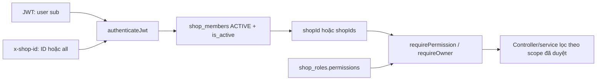

# Vai trò người dùng và ma trận RBAC

## 1. Phạm vi và trạng thái xác minh

Tài liệu này phản ánh mã nguồn tại commit nền
`bba0c5f59c64a5f21b8c99ba3958817c2b52351e` cùng các thay đổi RBAC chưa commit trong
working tree ngày 25/07/2026.

Quy ước trạng thái:

- **Đã xác minh code/test**: hành vi có trong code và được unit test tự động bao phủ.
- **Đã xác minh code**: đã truy vết frontend, middleware, route, controller và service,
  nhưng chưa có test tự động đủ sâu.
- **Đúng một phần**: hướng xử lý đúng nhưng còn thiếu test, lệch contract hoặc rủi ro vận
  hành.
- **Không chính xác**: hành vi hiện tại mâu thuẫn với mô hình quyền dự kiến.
- **Chưa xác minh production**: chưa có bằng chứng rằng frontend/backend production đang
  chạy đúng working tree này và chưa thực hiện negative test bằng tài khoản nhiều vai trò.

Kết luận baseline: **Đúng một phần, chưa xác minh production**.

Các lỗi P0 đã phát hiện trước đây về tăng quyền khi chọn `all`, lệch khóa `pos` /
`sales_view`, và thiếu middleware cho customer/supplier/tag/tax-config đã được xử lý ở
mức code. Bộ test `npm run test:permissions` đạt **9/9**, nhưng chỉ bao phủ utility xử lý
permission và parser shop scope; chưa bao phủ middleware với database thật, toàn bộ route
hay hành vi production.

Nguồn chính:

- [Frontend shop state](../lib/features/settings/providers/shop_provider.dart)
- [Frontend route guard](../lib/core/router/app_router.dart)
- [Màn hình cấu hình vai trò](../lib/features/settings/presentation/staff_management_screen.dart)
- [JWT và shop scope](../backend/src/middleware/auth.middleware.ts)
- [Permission middleware](../backend/src/middleware/permission.middleware.ts)
- [Permission utilities](../backend/src/middleware/permission.utils.ts)
- [Shop-scope utilities](../backend/src/middleware/shop-scope.utils.ts)
- [Shop member service](../backend/src/services/shop-member.service.ts)
- [Permission unit tests](../backend/test/permission.utils.test.js)
- [Shop-scope unit tests](../backend/test/shop-scope.utils.test.js)

## 2. Mô hình RBAC và multi-shop hiện tại

### 2.1 Membership

- `memberType` có hai giá trị đang được code sử dụng: `OWNER`, `EMPLOYEE`.
- Membership chỉ có hiệu lực khi `status = ACTIVE` và `isActive = true`.
- Employee nhận quyền từ `shop_roles.permissions`; role phải thuộc đúng `shopId`.
- Owner bypass permission trong **shop cụ thể** mà membership đó là Owner.
- `shop_members` có unique theo `(shop_id, user_id)` trong baseline database, nhưng entity
  chưa biểu diễn unique constraint này.

Trạng thái: **Đã xác minh code**. Chưa có integration test với database xác nhận constraint
và quan hệ khóa ngoại trên môi trường production.

### 2.2 Cấp độ quyền

Thứ bậc hiện tại:

`none < view < edit < full`

- `view`: thỏa yêu cầu đọc.
- `edit`: thỏa yêu cầu đọc và ghi.
- `full`: thỏa mọi cấp độ theo phép so sánh thứ bậc.
- Chuỗi JSON hỏng, object không hợp lệ hoặc level lạ đều fail closed về `none`.
- Owner luôn thỏa permission check.
- Role của shop khác không được cấp quyền cho shop đang yêu cầu.

Trạng thái: **Đã xác minh code/test**.

Lưu ý: ý nghĩa nghiệp vụ của `full` chưa thống nhất. Customer, supplier và tag yêu cầu
`full` khi xóa, trong khi product, finance, purchase order và stock-take chỉ yêu cầu
`edit` khi xóa. Vì vậy chưa thể coi `full = quyền xóa` trên toàn hệ thống.

### 2.3 Tương thích khóa quyền bán hàng cũ

Khóa chuẩn hiện tại là `sales`. Backend vẫn đọc dữ liệu role cũ theo quy tắc:

- `pos` giữ nguyên level và có thể cấp quyền ghi bán hàng.
- `sales_view` chỉ cấp tối đa `view`, kể cả dữ liệu cũ lưu `edit` hoặc `full`.
- Nếu có cả hai khóa cũ, backend chọn level cao hơn sau khi giới hạn `sales_view`.
- Màn hình sửa role chuyển dữ liệu cũ sang `sales`, rồi loại `pos` và `sales_view`.

Trạng thái: **Đã xác minh code/test**. Chưa xác minh migration của toàn bộ role đã lưu trên
production; khả năng tương thích hiện được thực hiện lúc đọc/sửa chứ chưa phải data
migration.

## 3. Hành vi multi-shop (`x-shop-id: all`)

### 3.1 Backend

Khi nhận `all`, backend:

1. Chỉ lấy membership `ACTIVE` và `isActive = true` của user.
2. Từ chối nếu user không có shop hoạt động.
3. Chỉ cho phép route gọi `requirePermission(..., 'view', { allowAllShops: true })`.
4. Từ chối mọi permission level ghi và mọi route không khai báo `allowAllShops`.
5. Kiểm tra permission riêng trên từng membership và thu hẹp `req.shopIds` còn các shop
   được phép.
6. Trả `403` nếu không có shop nào thỏa quyền.
7. Không coi user là Owner toàn cục; `req.isOwner` chỉ true nếu mọi membership được phép
   đều là Owner.
8. Controller/service của các endpoint tổng hợp dùng `shopIds` đã được thu hẹp trong
   điều kiện `IN`/`ANY`.

Trạng thái: **Đã xác minh code**, **chưa có integration test middleware/database** và
**chưa xác minh production**.

Các endpoint hiện cho phép `all`:

| Endpoint | Permission thay thế | Phạm vi query | Trạng thái |
|---|---|---|---|
| `GET /sales-orders/summary` | `sales` hoặc `finance` hoặc `dashboard` | `shopIds` đã lọc | Đã xác minh code |
| `GET /sales-orders/payment-summary` | `sales` hoặc `finance` hoặc `dashboard` | `shopIds` đã lọc | Đã xác minh code |
| `GET /sales-orders/top-products` | `sales` hoặc `finance` hoặc `dashboard` | `shopIds` đã lọc | Đã xác minh code |
| `GET /cash-transactions/summary` | `finance` hoặc `dashboard` | `shopIds` đã lọc | Đã xác minh code |
| `GET /inventory/low-stock` | `inventory` | `shopIds` đã lọc | Đã xác minh code |
| `GET /inventory/categories-summary` | `inventory` hoặc `dashboard` | `shopIds` đã lọc | Đã xác minh code |

Rủi ro còn lại: mỗi endpoint có thể được tính trên một tập shop khác nhau tùy permission.
Ví dụ user có `sales` ở shop A và `finance` ở shop B có thể thấy các KPI dashboard trên
hai tập dữ liệu khác nhau. Đây là hành vi an toàn về truy cập nhưng cần PO xác nhận có
đúng ý nghĩa nghiệp vụ của “Tất cả cửa hàng” hay không.

### 3.2 Frontend

Khi chọn tất cả cửa hàng:

- `currentShopId = null`, `memberType = null`, `isAllShops = true`.
- `ShopState.isOwner` luôn false trong scope `all`.
- Frontend chỉ cho `view` với `sales`, `inventory`, `finance`, và chỉ khi có ít nhất một
  shop hoạt động thỏa quyền tương ứng.
- Route guard chỉ cho Dashboard, Settings, Profile, Change password và Notifications;
  các màn hình giao dịch yêu cầu chọn shop cụ thể.

Trạng thái: **Đã xác minh code**, chưa có widget/integration test dành riêng cho RBAC
multi-shop và chưa xác minh production.

## 4. Ma trận khóa quyền hiện tại

| Nghiệp vụ | Khóa role editor | Khóa backend | Enforce API | Kết luận |
|---|---|---|---:|---|
| Bán hàng/POS/đơn | `sales` | `sales` | Có | Đã đồng bộ; có tương thích khóa cũ |
| Sản phẩm/danh mục/chi phí | `products` | `products` | Có | Đã đồng bộ |
| Tag sản phẩm | Không có key riêng | `products` | Có | Dùng chung quyền product |
| Kho/PO/kiểm kho | `inventory` | `inventory` | Có | Đã đồng bộ |
| Khách hàng/công nợ phải thu | `customers` | `customers` | Có | Đã bổ sung middleware |
| Nhà cung cấp/công nợ phải trả | `suppliers` | Chi tiết từng nhà cung cấp: `suppliers` hoặc `finance`; báo cáo tổng hợp tuổi nợ: `finance` | Có | Đã bổ sung middleware và test 403 |
| Tài chính/hóa đơn/thuế | `finance` | `finance` | Có | Đã đồng bộ |
| Cấu hình thuế API | `finance` trong backend | `finance` | Có | API nhất quán |
| Cài đặt/shop profile/config | `settings` | `settings` | Có | Đã đồng bộ |
| Dashboard aggregate | Không có | `dashboard` là alias cùng các key module | Có | Không cấu hình được role dashboard-only trên UI |
| Nhân viên/vai trò | Owner, không dùng key | `requireOwner` | Có | Chỉ shop cụ thể |
| Activity log | `settings` | `settings` | Có | Chỉ mới kiểm soát xem |

Mâu thuẫn còn lại:

- Frontend route `/tax-config` yêu cầu `settings`, trong khi API cấu hình thuế yêu cầu
  `finance`. Employee chỉ có `finance` có thể bị UI chặn; employee chỉ có `settings` có
  thể vào màn hình rồi bị API trả `403`.
- Role editor không có khóa `dashboard`, dù backend hỗ trợ alias này.
- Tag dùng `products` ở API nhưng màn hình còn kiểm tra `authProvider.isShopOwner`
  (account type toàn tài khoản), không kiểm tra Owner của shop hiện tại hoặc quyền
  `products`. Đây là lệch UX; API vẫn là lớp bảo vệ cuối.
- Settings còn hiển thị nhóm quản lý nhân viên nếu `auth.isShopOwner` dù membership shop
  hiện tại không phải Owner. Route guard và API vẫn chặn, nhưng menu có thể xuất hiện sai.

## 5. Ma trận route backend hiện tại

Tất cả business route sau `/my-shops`, `/shops/search` và
`/shop-members/request-join` đều đi qua `authenticateJwt` và `requireShopId` ở router
chung. Các route profile/notification là user-scoped nên không dùng shop permission.

| Route group | Permission đọc | Permission ghi | Permission xóa/duyệt | `all` |
|---|---|---|---|---|
| `/sales-orders*` | `sales:view` | `sales:edit` | cancel/payment/return: `edit` | Chỉ 3 endpoint tổng hợp |
| `/products*`, `/categories`, `/cost-types` | `products:view` | `products:edit` | `edit` | Không |
| `/tags*` | `products:view` | `products:edit` | `products:full` | Không |
| `/inventory/*`, `/purchase-orders`, `/stock-takes` | `inventory:view` | `inventory:edit` | `edit` | Chỉ low-stock và categories-summary |
| `/customers*`, `/customer-receivables` | `customers:view` | `customers:edit` | `customers:full` | Không |
| `/suppliers*` | `suppliers:view` | `suppliers:edit` | `suppliers:full` | Không |
| Supplier payable từng nhà cung cấp | `suppliers:view` hoặc `finance:view` | N/A | N/A | Không |
| Báo cáo tuổi nợ phải trả tổng hợp | `finance:view` | N/A | N/A | Không |
| `/cash-*`, `/daily-closings`, finance `/invoices`, obligations | `finance:view` | `finance:edit` | đa số `edit` | Chỉ cash summary |
| `/tax/config`, `/tax/estimate`, `/tax/export-htkk` | `finance:view` | config: `finance:edit` | N/A | Không |
| `/shop-profile`, `/configs`, `/activity-logs` | `settings:view` | `settings:edit` | N/A | Không |
| `/shop-members*`, `/shop-roles*` | Owner | Owner | Owner | Bị từ chối |

Trạng thái ma trận: **Đã xác minh code**, chưa có negative API test toàn route.

## 6. Ma trận vai trò mục tiêu đề xuất

Ký hiệu: `V` = view, `E` = edit/create, `F` = full, `—` = không mặc định.

| Module | Owner | Quản lý | Bán hàng | Kho | Kế toán | Chỉ xem |
|---|---:|---:|---:|---:|---:|---:|
| Dashboard | F | V | V | V | V | V |
| POS/sales | F | F | E | V | V | V |
| Return/cancel | F | F | E theo hạn mức | — | V | — |
| Product/tag | F | E | V | E | V | V |
| Inventory/PO | F | E | V | F | V | V |
| Customer | F | E | E | V | V | V |
| Supplier | F | E | — | E | V | V |
| Receivable/payable | F | E | E theo hạn mức | V | F | V |
| Finance/cash | F | E | V giới hạn | V | F | V |
| Tax/report/export | F | V | — | — | F | V |
| Staff/role | F | E có giới hạn | — | — | — | — |
| Shop settings | F | E có giới hạn | — | — | — | — |
| Audit log | F | V | — | — | V | — |
| AI knowledge | F | E có duyệt | V | V | E | V |

Đây là **đề xuất To-Be**, chưa phải hành vi code. PO/Owner cần duyệt:

- `full` có bắt buộc cho delete/approve/export/config hay không.
- Có tách `returns`, `payments`, `tax`, `reports`, `exports`, `staff`, `audit` thành key
  riêng hay tiếp tục dùng key module.
- Scope “Tất cả cửa hàng” là hợp của từng module được phép hay phải dùng cùng một tập shop
  cho toàn dashboard.

## 7. Sai lệch và backlog nâng cấp

| ID | Vấn đề | Ảnh hưởng | Ưu tiên | Đề xuất và tiêu chí nghiệm thu |
|---|---|---:|---:|---|
| RBAC-01 | Chưa có integration test middleware + DB + route | Không chứng minh được chống IDOR/cross-shop end-to-end | P0 | Test employee/owner/mixed membership trên DB test; mọi truy cập shop ngoài scope trả 403 |
| RBAC-02 | Chưa xác minh production chạy code RBAC mới | Không thể công nhận đã vá trên hệ thống thật | P0 | Gắn commit deployment và chạy negative test production bằng dữ liệu test an toàn |
| RBAC-03 | `/tax-config` lệch `settings` ở UI và `finance` ở API | Chặn nhầm hoặc mở menu sai | P0 | Chọn một contract được PO duyệt; UI route, menu và API dùng cùng key |
| RBAC-04 | `auth.isShopOwner` dùng account type thay membership hiện tại | Menu staff/tag hiển thị sai trong mixed-shop | P0 | Mọi kiểm tra shop dùng `ShopState.isOwner`/permission; account type không cấp quyền shop |
| RBAC-05 | Delete dùng `edit`/`full` không nhất quán | Role “edit” có thể xóa dữ liệu ở một số module | P1 | Lập action matrix và test riêng create/update/delete/approve/export |
| RBAC-06 | Không cấu hình được `dashboard` trong role editor | Không tạo được vai trò chỉ xem dashboard | P1 | Thêm key hoặc bỏ alias backend; có migration/compatibility test |
| RBAC-07 | Tập shop của từng KPI aggregate có thể khác nhau | Dashboard tổng hợp khó diễn giải | P1 | Trả metadata `includedShopIds` hoặc định nghĩa scope chung; UI thông báo rõ |
| RBAC-08 | Self-join giới hạn một shop nhưng invite có thể tạo employee đa shop | Quy tắc membership không nhất quán | P1 | PO quyết định single-shop hay multi-shop employee và enforce cùng một rule |
| RBAC-09 | Thay role/member chưa ghi audit bắt buộc | Thiếu truy vết thay đổi quyền | P1 | Ghi actor, shop, target, before/after, timestamp; Owner xem được log |
| RBAC-10 | Frontend giữ permissions trong state đến lần tải lại shops | Quyền vừa revoke có thể còn hiển thị UI | P1 | Refresh shop state sau role change và khi app resume; API luôn phải từ chối ngay |
| RBAC-11 | Xóa role chưa có quy tắc rõ khi role đang được gán | Có thể lỗi FK hoặc để member không role | P1 | Chặn xóa và trả số member đang dùng, hoặc bắt buộc reassign có transaction |

## 8. Bộ kiểm thử bắt buộc trước khi công nhận hoàn thành

### 8.1 Đã chạy

Lệnh: `npm run test:permissions`

Kết quả ngày 25/07/2026: **9 pass, 0 fail**.

Phạm vi đã test:

- Owner bypass permission.
- Hierarchy quyền employee.
- JSON role hỏng fail closed.
- `sales_view` cũ chỉ cấp read-only.
- `pos` cũ tương thích quyền ghi sales.
- Module không liên quan không cấp quyền.
- Role thuộc shop khác không cấp quyền.
- Parser chấp nhận shop ID dương và `all`.
- Parser từ chối ID mơ hồ, âm, thập phân, rỗng và vượt safe integer.

### 8.2 Chưa có bằng chứng test

- Middleware thực với repository/database.
- Employee `none/view/edit/full` trên GET/POST/PUT/DELETE từng module.
- User owner shop A, employee shop B khi chọn từng shop và `all`.
- IDOR qua path param, body hoặc query chứa resource/shop của cửa hàng khác.
- Các endpoint aggregate chỉ trả dữ liệu từ `req.shopIds` đã lọc.
- Revoke role có hiệu lực ngay ở API và sau refresh frontend.
- Route `/tax-config`, staff, role và tag khớp giữa menu, route guard và API.
- Constraint/migration production cho `shop_members` và `shop_roles`.
- Desktop/mobile production với tài khoản Owner, Employee và mixed membership.

Không nâng trạng thái thành “Đã xác minh production” cho đến khi hoàn thành các mục trên.

Tham chiếu test nghiệp vụ liên quan:
[Acceptance Test Catalog – RBAC và shop scope](11_ACCEPTANCE_TEST_CATALOG.md#3-rbac-và-shop-scope).
