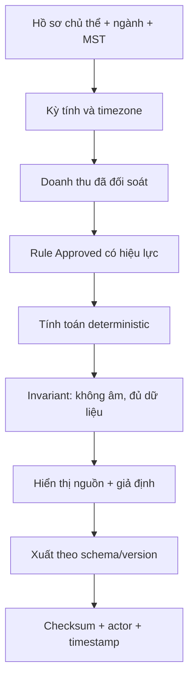

# Hướng dẫn nghiệp vụ thuế và kiểm soát tuân thủ

> Tài liệu này mô tả hành vi phần mềm và yêu cầu kiểm soát. Không phải ý kiến tư
> vấn pháp lý. Công thức/rule phải được chuyên gia thuế hoặc kế toán có thẩm quyền
> duyệt trước khi dùng để kê khai.

> **Cập nhật code/test local 25/07/2026:** nội dung pháp lý và nguồn đã có trong
> tài liệu không bị thay đổi. Bản vá mới chưa deploy nên chưa được tuyên bố đạt
> trên production.

## Kết quả bản vá thuế local

| Kiểm soát | Kết quả | Bằng chứng | Production |
|---|---|---|---|
| Ngưỡng 100 triệu lỗi thời | Code/UI hiện dùng policy 2026 với ngưỡng 1 tỷ và metadata nguồn/hiệu lực đã có | [`tax-policy.ts`](../backend/src/tax/tax-policy.ts), [`tax_config_provider.dart`](../lib/features/settings/providers/tax_config_provider.dart) | Chưa xác minh sau deploy |
| Thuế âm | `normalizeNonNegative` và `calculateOutstandingTax` chặn số phải nộp âm; số nộp thừa trả riêng | [`tax-policy.ts`](../backend/src/tax/tax-policy.ts), [`finance.service.ts`](../backend/src/services/finance.service.ts) | Chưa xác minh sau deploy |
| MST fallback | Không còn tự điền MST; thiếu/sai MST hoặc placeholder `0123456789` trả lỗi nghiệp vụ | [`tax.controller.ts`](../backend/src/controllers/tax.controller.ts), [`tax-policy.test.js`](../backend/test/tax-policy.test.js) | Chưa xác minh sau deploy |
| Kỳ tính thuế | Chỉ nhận tháng `01`–`12`, quý `Q1`–`Q4` và năm có policy được xác minh | [`tax-policy.ts`](../backend/src/tax/tax-policy.ts) | Chưa xác minh sau deploy |

`Đã xác minh qua code/test` không đồng nghĩa XML đã đúng XSD hoặc import được
HTKK. TC-TAX-03 vẫn `Bị chặn` cho đến khi có fixture, validator và biên bản import
trên phiên bản HTKK mục tiêu.

Runtime DDL cho `system_configs` cũng chưa được loại vì cần migration có kiểm
soát trước; không đưa thay đổi schema này vào bản vá thuế an toàn.

## 1. Ngày chốt pháp lý

Ngày rà soát: **25/07/2026**.

Nguồn chính thức/tham chiếu cơ quan nhà nước:

1. [Luật Thuế thu nhập cá nhân 109/2025/QH15](https://vanban.chinhphu.vn/?classid=1&docid=216495&orggroupid=1&pageid=27160),
   ban hành 10/12/2025, hiệu lực 01/07/2026.
2. [Nghị định 68/2026/NĐ-CP](https://vanban.chinhphu.vn/?classid=1&docid=217111&orggroupid=2&pageid=27160),
   về chính sách thuế đối với hộ/cá nhân kinh doanh.
3. [Nghị định 141/2026/NĐ-CP](https://vanban.chinhphu.vn/?classid=1&docid=217960&pageid=27160&typegroupid=4),
   sửa Nghị định 68/2026 và có hiệu lực từ 01/01/2026.
4. [Hướng dẫn triển khai Nghị định 141 của Bộ Tư pháp](https://htpldn.moj.gov.vn/Pages/chi-tiet-tin.aspx?ItemID=233&l=Tuvanphapluat),
   nêu mức doanh thu năm không chịu GTGT/không phải nộp TNCN được sửa từ
   500 triệu thành 1 tỷ đồng.
5. [Nghị định 253/2026/NĐ-CP](https://vanban.chinhphu.vn/?docid=218684&orggroupid=2&pageid=27160),
   hướng dẫn Luật Thuế TNCN.
6. [Nghị định 70/2025/NĐ-CP](https://vanban.chinhphu.vn/?docid=213179&pageid=27160)
   và [Thông tư 32/2025/TT-BTC](https://vanban.chinhphu.vn/?classid=1&docid=213855&pageid=27160)
   về hóa đơn, chứng từ.

Khi có văn bản mới, không được sửa một hằng số đơn lẻ rồi coi là hoàn tất; phải đánh
giá ngày hiệu lực, điều khoản chuyển tiếp, loại đối tượng, ngành và kỳ tính.

## 2. Hành vi production baseline trước bản vá

Bảng này bảo toàn finding As-Is dùng để so sánh. Trạng thái code local mới nằm ở
phần “Kết quả bản vá thuế local” phía trên.

| Thành phần | Hành vi baseline | Trạng thái |
|---|---|---|
| `tax.service.ts` | Default miễn thuế `100.000.000`, cảnh báo `90.000.000` | Không chính xác |
| `system.controller.ts` | Cùng default 100M/90M | Không chính xác |
| `tax.controller.ts` | Tier 100M, 500M, 1B | Không có mô hình hiệu lực rõ |
| `tax_config.controller.ts` | Tier1 ghi “100M miễn thuế” | Không chính xác |
| `tax_config_provider.dart` | UI fallback tier1 100M | Không chính xác |
| `tax_warning_widget.dart` | Tính GTGT/TNCN theo tỷ lệ | Đúng một phần; cần rule được duyệt |
| Dashboard | Nhãn “Thuế TNDN tạm tính” | Sai thuật ngữ với luồng HKD/TNCN |
| Dashboard | Hiển thị VAT và TNDN âm | Không chính xác |
| `ai_knowledge_provider.dart` | Nguồn mặc định TT40/2021, ngưỡng 100M | Không chính xác/lỗi thời |
| `export-htkk` | Xuất XML Mẫu 01/CNKD | Đúng một phần |
| `tax.service.ts` | MST fallback `0123456789` | Không chính xác/rủi ro cao |

Nguồn code:

- [`tax.service.ts`](../backend/src/services/tax.service.ts)
- [`tax.controller.ts`](../backend/src/controllers/tax.controller.ts)
- [`tax-config.controller.ts`](../backend/src/controllers/tax-config.controller.ts)
- [`tax_config_provider.dart`](../lib/features/settings/providers/tax_config_provider.dart)
- [`dashboard_screen.dart`](../lib/features/dashboard/presentation/dashboard_screen.dart)
- [`ai_knowledge_provider.dart`](../lib/features/settings/providers/ai_knowledge_provider.dart)

## 3. Sai lệch trọng yếu

### TAX-GAP-01 — Ngưỡng 100 triệu đã lỗi thời

Production ngày 25/07/2026 vẫn ghi:

> “Nếu doanh thu < 100 triệu VNĐ/năm, hộ kinh doanh có thể được miễn thuế.”

Bằng chứng:
[05-tax-estimate-desktop.png](assets/production-audit-2026-07-25/05-tax-estimate-desktop.png).

Theo hướng dẫn triển khai Nghị định 141/2026 được dẫn ở trên, mức liên quan được sửa
thành 1 tỷ đồng. Vì vậy không được tiếp tục coi 100 triệu là rule hiện hành.

Hành động P0:

- vô hiệu hóa nội dung cũ trong UI và kho tri thức;
- đưa rule vào bảng có `legal_source`, `effective_from`, `effective_to`,
  `approved_by`, `approved_at`, `version`;
- chuyên gia thuế duyệt mapping trước khi bật.

### TAX-GAP-02 — Nhầm TNCN/TNDN

Màn ước tính dùng `TNCN`; dashboard dùng `TNDN`. Hộ/cá nhân kinh doanh và doanh
nghiệp là đối tượng pháp lý khác nhau. UI phải xác định loại chủ thể từ hồ sơ và chỉ
hiển thị sắc thuế phù hợp.

### TAX-GAP-03 — Nghĩa vụ âm

Dashboard hiển thị VAT -8.375đ và TNDN -16.750đ. Nghĩa vụ thuế dự kiến không được
biểu diễn âm chỉ vì lợi nhuận âm. Cần tách:

- cơ sở tính theo doanh thu;
- cơ sở tính theo thu nhập/lợi nhuận nếu rule áp dụng;
- hoàn/giảm/khấu trừ theo cơ chế riêng;
- trạng thái “không đủ dữ liệu/không phát sinh” thay vì số âm.

### TAX-GAP-04 — MST fallback

`tax.service.ts` tự dùng `0123456789` nếu shop chưa có MST. Tệp xuất có thể trông
hợp lệ nhưng chứa thông tin giả. Đây là lỗi P0.

Yêu cầu: thiếu MST/định danh bắt buộc phải chặn xuất với lỗi nghiệp vụ và đường dẫn
đến màn hồ sơ; tuyệt đối không sinh tệp chính thức bằng fallback.

### TAX-GAP-05 — Chưa chứng nhận HTKK

Frontend/backend đã khớp route `/api/tax/export-htkk`, nhưng chưa có:

- XSD/đặc tả phiên bản;
- fixture expected;
- validator tự động;
- biên bản import thành công vào HTKK;
- quản lý thay đổi khi HTKK cập nhật.

Do đó trạng thái là `Bị chặn`, không được ghi “100% compatible”.

## 4. Mô hình rule thuế mục tiêu

| Trường | Mục đích |
|---|---|
| `rule_code` | Mã ổn định |
| `subject_type` | HKD/cá nhân/doanh nghiệp/... |
| `business_sector` | Ngành/phân loại |
| `tax_type` | GTGT/TNCN/TNDN/... |
| `calculation_basis` | Revenue/profit/fixed/... |
| `rate` | Tỷ lệ với scale rõ |
| `threshold_from/to` | Khoảng áp dụng |
| `effective_from/to` | Hiệu lực |
| `legal_source_url` | Link văn bản chính thức |
| `legal_reference` | Điều/khoản/mục |
| `version` | Phiên bản rule |
| `status` | Draft/Approved/Retired |
| `approved_by/at` | Người và thời điểm duyệt |

Không cho phép sửa rule Approved tại chỗ; tạo phiên bản mới.

## 5. Luồng tính thuế mục tiêu



## 6. Data contract cho kết quả ước tính

```json
{
  "period": {"from": "2026-01-01", "to": "2026-12-31", "timezone": "Asia/Saigon"},
  "subjectType": "HOUSEHOLD_BUSINESS",
  "revenue": 0,
  "ruleVersion": "string",
  "legalSource": {"url": "https://...", "reference": "Điều/Khoản"},
  "taxes": [
    {"type": "VAT", "basis": 0, "rate": 0, "amount": 0}
  ],
  "status": "ESTIMATE",
  "assumptions": [],
  "warnings": []
}
```

## 7. Yêu cầu nghiệm thu

| ID | Tiêu chí |
|---|---|
| TAX-AC-01 | Không còn nội dung 100M như quy định hiện hành trên UI/AI |
| TAX-AC-02 | Rule chọn đúng theo subject, ngành, kỳ và effective date |
| TAX-AC-03 | Kết quả không âm; thiếu dữ liệu tạo warning/block |
| TAX-AC-04 | UI hiển thị nguồn chính thức và ngày hiệu lực |
| TAX-AC-05 | Thiếu MST chặn xuất, không có fallback |
| TAX-AC-06 | XML pass validator và import HTKK đúng phiên bản |
| TAX-AC-07 | Mỗi lần xuất có actor, shop, period, rule version, checksum |
| TAX-AC-08 | Bộ expected result được chuyên gia thuế duyệt |

## 8. Phân quyền và audit

- Xem ước tính: `finance:view` hoặc permission thuế riêng.
- Sửa cấu hình draft: `tax:edit`.
- Duyệt rule: `tax:approve`, không mặc định cho mọi owner nếu policy yêu cầu
  separation of duties.
- Xuất tệp: `tax:export`.
- Mọi thay đổi rule và lần xuất đều ghi audit; không ghi bí mật/PII dư thừa.

## 9. Phạm vi chưa xác minh

- Tỷ lệ theo từng ngành và cách áp dụng chuyển tiếp trong mọi trường hợp.
- Quy tắc hóa đơn điện tử theo doanh thu/máy tính tiền cho shop cụ thể.
- Cấu trúc XML đúng phiên bản HTKK tại ngày phát hành.
- Nghĩa vụ của dữ liệu lịch sử trước/sau ngày hiệu lực.

Các mục này phải được đánh dấu `Bị chặn` cho đến khi có nguồn/đặc tả và người duyệt.
