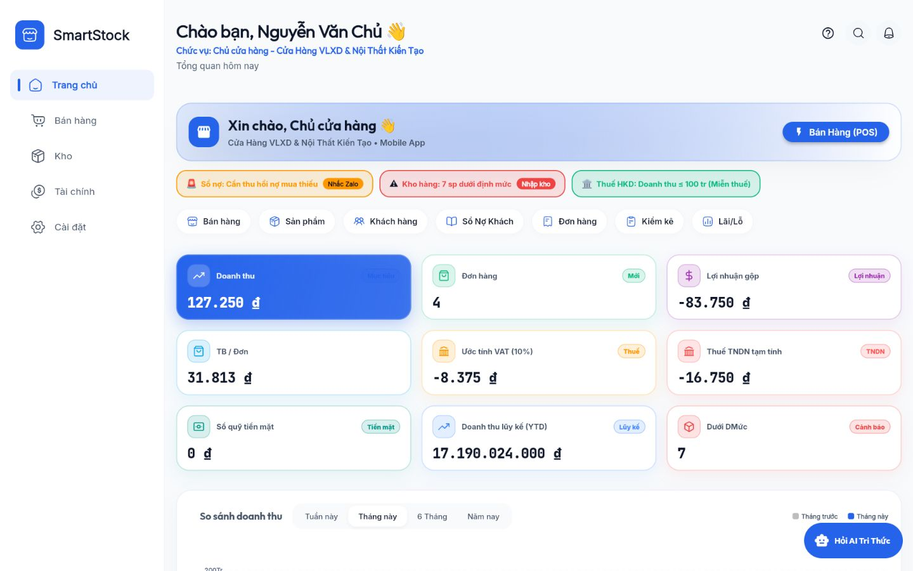
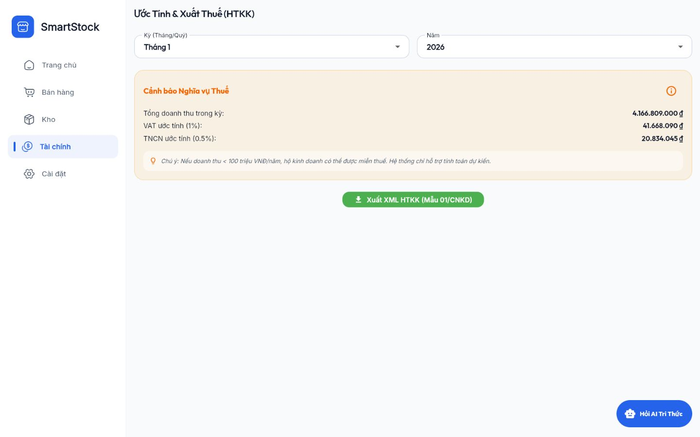
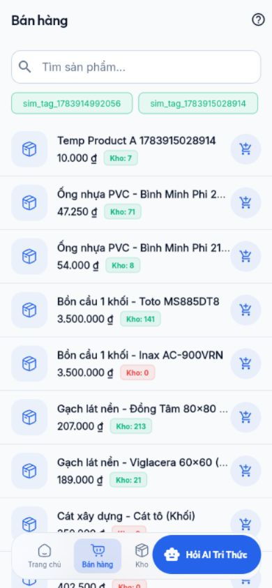

# Báo cáo đánh giá UI/UX production

## 1. Phạm vi

| Thuộc tính | Giá trị |
|---|---|
| Production | [smartstock-tax.vercel.app](https://smartstock-tax.vercel.app) |
| Ngày chụp | 25/07/2026 |
| Desktop | 1440×900 |
| Mobile | 390×844 |
| Trạng thái | Tài khoản chủ cửa hàng đã đăng nhập |
| Accessibility | Chưa kiểm thử chuyên biệt; không kết luận đạt |

Ảnh được chụp trong chính phiên đánh giá này và lưu tại
[`assets/production-audit-2026-07-25`](assets/production-audit-2026-07-25/).

## 2. Tổng quan

Giao diện có visual language tương đối nhất quán: nền sáng, card bo góc, xanh dương
làm màu chính, typography rõ ở desktop và nhóm chức năng theo sidebar. Các màn
dashboard, POS, kho, tài chính và settings đều tải được.

Vấn đề chính không nằm ở “đẹp/xấu” mà ở độ tin cậy và khả năng hoàn tất tác vụ:

1. Số liệu giữa các card/màn mâu thuẫn.
2. Mobile cắt chip/text và trợ lý AI che thanh điều hướng/CTA.
3. POS mobile không thấy giỏ và bước thanh toán.
4. Dữ liệu mẫu được trình bày giống dữ liệu thật.
5. Màn thuế trình bày quy tắc lỗi thời như thông tin nghiệp vụ.

Đánh giá tổng thể: `Đúng một phần`, chưa đủ điều kiện production-ready.

## 3. Hành trình đã kiểm tra

| Bước | Màn | Kết quả | Bằng chứng |
|---|---|---|---|
| 1 | Dashboard desktop | Tải được; card rõ; số tiền/thuế mâu thuẫn | [01](assets/production-audit-2026-07-25/01-dashboard-desktop.png) |
| 2 | POS desktop | Tìm hàng/list/giỏ hiển thị; chưa tạo đơn | [02](assets/production-audit-2026-07-25/02-pos-desktop.png) |
| 3 | Kho desktop | Tổng SP/cảnh báo/kho/chart/quick actions hiển thị | [03](assets/production-audit-2026-07-25/03-inventory-desktop.png) |
| 4 | Tài chính desktop | Số dư và cashflow hiển thị; lệch dashboard | [04](assets/production-audit-2026-07-25/04-finance-desktop.png) |
| 5 | Thuế desktop | Ước tính + nút XML; nội dung 100M lỗi thời | [05](assets/production-audit-2026-07-25/05-tax-estimate-desktop.png) |
| 6 | Settings desktop | Nhóm chức năng rõ; nhiều nội dung dài cần cuộn | [06](assets/production-audit-2026-07-25/06-settings-desktop.png) |
| 7 | Sổ nợ desktop | Bảng dễ đọc nhưng dữ liệu là hard-code | [07](assets/production-audit-2026-07-25/07-customer-debts-desktop.png) |
| 8 | Kho tri thức AI | Quản lý tài liệu rõ; nguồn cũ vẫn active | [08](assets/production-audit-2026-07-25/08-ai-knowledge-desktop.png) |
| 9 | Dashboard mobile | Chip/action bị cắt; FAB che nav | [09](assets/production-audit-2026-07-25/09-dashboard-mobile.png) |
| 10 | POS mobile | Danh sách tốt; thiếu vùng giỏ/checkout trong viewport | [10](assets/production-audit-2026-07-25/10-pos-mobile.png) |
| 11 | Settings mobile | Nội dung cuối bị nav/FAB che | [11](assets/production-audit-2026-07-25/11-settings-mobile.png) |
| 12 | Sales mobile | Summary 0 đơn nhưng có list; FAB che nav | [12](assets/production-audit-2026-07-25/12-sales-history-mobile.png) |

## 4. Ảnh chính

### Dashboard desktop

### Thuế desktop

### Dashboard mobile

### POS mobile

## 5. Findings theo mức độ

### P0 — Dữ liệu và niềm tin

#### UX-P0-01 — Thuế âm và sai thuật ngữ

- Vị trí: Dashboard desktop.
- Hiện tượng: lợi nhuận gộp -83.750đ; VAT -8.375đ; “Thuế TNDN” -16.750đ.
- Vấn đề: số âm được trình bày như một nghĩa vụ thuế; màn khác dùng TNCN.
- Tác động: người dùng có thể hiểu đây là số kê khai.
- Đề xuất: hiển thị “Không phát sinh/Chưa đủ dữ liệu” theo rule được duyệt; thống
  nhất loại thuế theo loại chủ thể; link “Cách tính”.

#### UX-P0-02 — Quy tắc thuế lỗi thời được trình bày như thông tin tin cậy

- Vị trí: Tax estimate và AI knowledge.
- Hiện tượng: nội dung dưới 100 triệu/năm và TT40/2021 vẫn active.
- Tác động: cảnh báo/tư vấn sai thời điểm 2026.
- Đề xuất: banner “Nguồn đã hết hiệu lực”; disable retrieval; hiển thị nguồn và ngày
  hiệu lực ngay cạnh kết quả.

#### UX-P0-03 — Sổ nợ mẫu không có nhãn demo

- Vị trí: Customer debts.
- Hiện tượng: bảng có tên, số điện thoại, đơn, số tiền và CTA Thu nợ/Xuất Excel như
  dữ liệu thật; code cho thấy list hard-code.
- Tác động: người dùng thao tác/quyết định trên dữ liệu giả.
- Đề xuất: tạm ẩn module hoặc gắn banner `Dữ liệu minh họa`; ưu tiên nối API thật.

### P1 — Chặn hoặc gây khó luồng chính

#### UX-P1-01 — POS mobile thiếu luồng checkout rõ

- Vị trí: 390×844 POS.
- Hiện tượng: chỉ thấy list; giỏ/khách/tổng/CTA nằm ngoài layout hiện tại.
- Tác động: mobile không hoàn tất tác vụ cốt lõi.
- Đề xuất: bottom cart bar cố định hiển thị số item/tổng; tap mở bottom sheet giỏ;
  CTA checkout luôn trên safe area.

#### UX-P1-02 — Trợ lý AI che navigation và nội dung

- Vị trí: dashboard, POS, settings, sales mobile.
- Hiện tượng: FAB “Hỏi AI Trí Thức” chồng lên bottom nav và dòng nội dung cuối.
- Tác động: khó bấm Kho/Settings, mất khả năng đọc.
- Đề xuất: trên mobile dùng icon FAB 48px ở trên nav với offset safe-area; hoặc đưa
  AI thành tab/action trong app bar. Nội dung cần bottom padding = nav + FAB + safe area.

#### UX-P1-03 — Alert/action row bị cắt ngang

- Vị trí: Dashboard mobile.
- Hiện tượng: cảnh báo kho chỉ còn một phần icon/viền ở mép phải; quick action
  “Khách hàng” bị cắt.
- Đề xuất: wrap thành nhiều dòng hoặc horizontal list có affordance rõ; không để
  một nửa component xuất hiện.

#### UX-P1-04 — Summary đơn mâu thuẫn list

- Vị trí: Sales mobile.
- Hiện tượng: card “0 Đơn hàng”, bên dưới có nhiều đơn.
- Tác động: người dùng mất niềm tin và filter có thể sai.
- Đề xuất: skeleton cho cả summary/list cùng query; hiển thị kỳ/filter; dùng cùng
  data contract.

### P2 — Chất lượng và tính nhất quán

#### UX-P2-01 — Số dư tiền mặt dùng định nghĩa không rõ

- Dashboard: “Sổ quỹ tiền mặt” 0đ.
- Finance: “Số dư quỹ tiền mặt” 127.250đ.
- Đề xuất: thêm label `Trong kỳ`/`Tại thời điểm`; cùng `asOf`; tooltip công thức.

#### UX-P2-02 — Card dashboard thiếu trạng thái dữ liệu

Card không cho biết đang tải, thời điểm cập nhật hoặc metric nào có lỗi. Khi một API
thất bại, người dùng có thể nhầm `0` với dữ liệu thật.

Đề xuất: mỗi cụm có `Cập nhật lúc`, error state riêng và retry; dùng `—` thay vì `0`
khi chưa có dữ liệu.

#### UX-P2-03 — Truncation tên shop/sản phẩm

- Mobile settings và dashboard rút gọn tên shop rất sớm.
- POS dùng ellipsis cho tên sản phẩm; không có cách xem tên đầy đủ trong danh sách.
- Đề xuất: hai dòng cho tên quan trọng; tooltip/long press; ưu tiên số lượng/giá.

#### UX-P2-04 — Kho tri thức dùng ngôn ngữ tuyệt đối

Tiêu đề “Kiểm Soát Tri Thức Trợ Lý AI 100%” tạo cam kết không được chứng minh.

Đề xuất: “Trợ lý ưu tiên tài liệu đã bật”; hiển thị citation và cơ chế “không đủ
nguồn”; bỏ số 100%.

## 6. Đánh giá theo heuristic

| Heuristic | Kết quả | Nhận xét |
|---|---|---|
| Visibility of system status | Đúng một phần | Có skeleton ở sales; thiếu freshness/error per card |
| Match with real world | Không chính xác | TNDN/TNCN, rule thuế và dữ liệu demo |
| User control/freedom | Đúng một phần | Có nav/back; mobile checkout không rõ |
| Consistency | Đúng một phần | Visual tốt; metric/permission/term không nhất quán |
| Error prevention | Không chính xác | Có thể xuất MST fallback, dữ liệu demo có CTA thật |
| Recognition over recall | Tốt một phần | Quick action rõ; một số route/settings dài |
| Flexibility/efficiency | Đúng một phần | Desktop tốt; mobile bị chặn |
| Minimal design | Tốt một phần | Card sạch; dashboard/chip dày và FAB quá nổi |
| Error recovery | Chưa đủ bằng chứng | Không kiểm tra hết API failure |
| Help/documentation | Đúng một phần | AI/help có, nhưng nguồn cũ làm giảm độ tin cậy |

## 7. Responsive acceptance criteria

### 390×844

- Không component bị cắt ngang ngoài carousel có affordance.
- Bottom nav và AI không che nhau.
- Nội dung cuối cuộn lên được trên vùng cố định.
- POS luôn thấy trạng thái giỏ và đường vào checkout.
- Touch target tối thiểu theo chuẩn dự án; không suy luận từ ảnh.

### 768×1024

- Sidebar/bottom nav chọn một mẫu rõ, không nhảy layout giữa chừng.
- Bảng chuyển card hoặc scroll ngang có header cố định.

### 1440×900

- Nội dung không quá dàn rộng; chart và bảng có mật độ hợp lý.
- Sidebar active state nhất quán với route.
- Card số liệu ghi kỳ/asOf và trạng thái dữ liệu.

## 8. Design system đề xuất giữ nguyên

Nên giữ:

- màu xanh dương thương hiệu;
- card nền sáng và bo góc;
- icon outline nhất quán;
- typography hiện tại;
- cấu trúc sidebar desktop/bottom nav mobile.

Cần chuẩn hóa:

- spacing 4/8/12/16/24/32;
- semantic colors cho success/warning/error/info;
- card metric có label, value, period, state, freshness;
- responsive chip/list/FAB;
- loading/empty/error components dùng chung;
- truncation policy và tooltip.

## 9. Không kết luận accessibility

Ảnh chụp không chứng minh được keyboard navigation, screen reader, focus order,
semantic label, contrast, zoom/reflow hoặc reduced motion. Các nội dung này ở trạng
thái `Bị chặn` cho đến khi chạy TC-UX-03 đến TC-UX-05 trong
[Acceptance Test Catalog](11_ACCEPTANCE_TEST_CATALOG.md).

## 10. Thứ tự xử lý UX

1. P0: dữ liệu/thuế/demo content.
2. P1: POS mobile, FAB/nav, overflow, sales summary.
3. P2: metric definition, freshness/error state, truncation.
4. Sau đó mới tinh chỉnh animation/micro-interaction.
