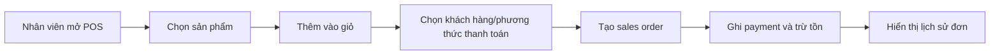
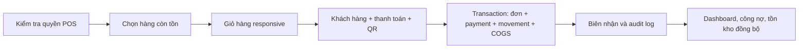
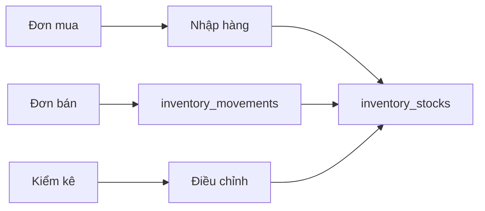
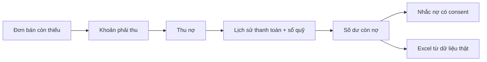
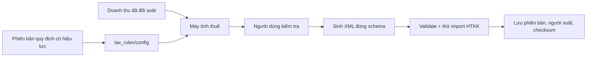
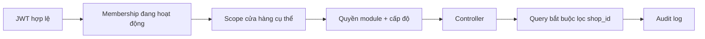

# Luồng nghiệp vụ As-Is và To-Be

## 1. Bán hàng và thanh toán

### As-Is

Điểm hiện tại:

- POS desktop có danh sách hàng và giỏ hàng.
- POS mobile chỉ thấy danh sách sản phẩm; vùng giỏ và CTA thanh toán không hiện rõ
  trong viewport đã kiểm tra.
- Lịch sử đơn có dữ liệu, nhưng ô tổng số đơn hiển thị `0` trong cùng trạng thái.
- Hoàn/hủy và QR chưa được thực hiện trên production vì có thể làm thay đổi dữ liệu.

### To-Be

Tiêu chí chính: hoặc toàn bộ transaction thành công, hoặc không ghi nhận phần nào;
tổng hợp phải khớp chi tiết; mobile phải hoàn tất thanh toán được.

## 2. Nhập–xuất–tồn

### As-Is

- Production hiển thị 13 sản phẩm, 7 sản phẩm dưới định mức và 1 kho.
- Code có stock, movement, lot, purchase order, stock take và COGS.
- Chưa có bộ đối soát độc lập chứng minh `tồn đầu + nhập - xuất ± điều chỉnh = tồn cuối`
  cho từng sản phẩm/lô.

### To-Be

- Mọi biến động kho có `reference_type`, `reference_id`, người thao tác và thời gian.
- Không cho bán vượt tồn nếu cấu hình không cho phép.
- Kiểm kê tạo chênh lệch chờ duyệt; chỉ người có quyền mới được ghi điều chỉnh.
- Báo cáo XNT truy ngược được đến chứng từ nguồn.

## 3. Công nợ

### As-Is

- Màn sổ nợ dùng ba bản ghi mẫu định nghĩa trực tiếp tại
  [`customer_debt_screen.dart`](../lib/features/sales/presentation/customer_debt_screen.dart).
- Nút thu nợ, nhắn tin và xuất Excel đang thao tác trên tập dữ liệu mẫu.
- Backend đã có `receivables`, `debt_payment_history`, `payables`, nhưng màn này chưa
  được nối đầy đủ với dữ liệu đó.

### To-Be

## 4. Thuế

### As-Is

- Doanh thu kỳ được tổng hợp rồi nhân tỷ lệ VAT/PIT.
- UI ghi ngưỡng miễn thuế 100 triệu đồng/năm.
- API xuất dùng route `/api/tax/export-htkk`.
- Chưa có bằng chứng import thành công vào HTKK; không được ghi “tương thích 100%”.
- Mã số thuế có fallback `0123456789` nếu hồ sơ cửa hàng thiếu.

### To-Be

## 5. Phân quyền và nhiều cửa hàng

### As-Is

- Frontend có thể chọn `all`, sau đó tự đặt `memberType='OWNER'`.
- Backend chấp nhận `x-shop-id: all` cho mọi thành viên đang hoạt động.
- `requirePermission` cho `all` gọi `next()` dù người dùng không phải owner.
- Một số route khách hàng, nhà cung cấp, tag và cấu hình thuế không gọi middleware
  kiểm tra quyền.

### To-Be

`all` chỉ là tập hợp các shop mà người dùng được phép xem; không được biến người dùng
thành owner và không được bỏ qua quyền.

## 6. Đăng ký và bảo vệ tài khoản

### As-Is

- Đăng ký hiện yêu cầu email và OTP.
- OTP có thời hạn và bị xóa sau khi dùng trong luồng đăng ký.
- Refresh token dùng cùng `jwtSecret` với access token.
- Chưa kiểm thử end-to-end email delivery, brute-force/rate limit, revoke token và
  nhiều phiên đăng nhập trên production.

### To-Be

- OTP được hash, giới hạn số lần thử, giới hạn gửi lại và có audit.
- Access/refresh token dùng secret/audience riêng; refresh token có rotation và revoke.
- Đổi mật khẩu hoặc khóa tài khoản thu hồi các phiên liên quan.
- Thông báo lỗi không tiết lộ email đã tồn tại nếu chính sách bảo mật yêu cầu.
