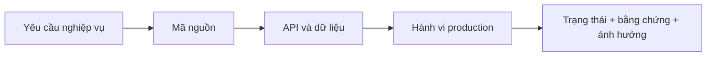

# Báo cáo xác minh tính chính xác hiện tại

> **Cập nhật production vòng 3 ngày 01/08/2026:** đã chụp và mở kiểm tra 99 ảnh production
> (52 desktop, 47 mobile), bao phủ 49 route/màn protected. Production đang ở `093b17ac`, local
> ở `cc800da3` và đi trước 6 commit. Phạm vi, ảnh và giới hạn xem tại
> [ma trận 55 route](21_PRODUCTION_SCREEN_CAPTURE_MATRIX_20260801.md) và
> [báo cáo trực quan vòng 3](25_PRODUCTION_VISUAL_AUDIT_RUN3_20260801.md).

> **Cập nhật production 26/07/2026:** bản vá và vòng nâng cấp UI thứ nhất đã được
> triển khai từ commit ứng dụng `17dd84d4b46994c921d373d03273bb39b9787ac4`.
> Frontend và backend đều ở trạng thái `READY` trên Vercel.

## Kết quả mới nhất từ source/test local 01/08/2026

| ID | Hạng mục | Trạng thái | Bằng chứng hiện tại | Ảnh hưởng |
|---|---|---|---|---|
| CUR-01 | Backend quyết định giá bán | Đúng một phần — đã sửa local, production chưa deploy | Backend chỉ chấp nhận giá bán lẻ, giá sỉ đủ số lượng hoặc giá khuyến mại còn hiệu lực đã cấu hình; chặn giá tùy ý, số tiền không hữu hạn và giảm giá ngoài khoảng. Chưa có luồng override giá có quyền/lý do/audit | Rất cao cho tới khi smoke test production |
| CUR-02 | Giá vốn hoàn một phần | Đúng một phần — đã sửa summary local, nghiệp vụ hoàn một phần chưa mở | Summary đảo giá vốn theo số lượng hoàn × đơn giá vốn đã bán; phiếu hoàn thiếu dòng được data gate chặn. Service hiện chỉ cho hoàn toàn bộ để không ghi dữ liệu một phần thiếu contract | Rất cao cho tới khi có item-level contract và smoke test production |
| CUR-03 | Danh sách dữ liệu lớn | Không chính xác | Nhiều provider cố định `page: 1`; backend mặc định 20 | Rất cao |
| CUR-04 | Auth schema production | Đã xác minh migration | Đã khai báo kiểu cột rõ ràng; metadata regression test đạt. Migration production chạy trong transaction ngày 02/08/2026; kiểm tra độc lập xác nhận `refresh_sessions`, `auth_version`, `otp purpose` sẵn sàng và OTP chờ = 0 | Trung bình; còn phải smoke test backend sau deploy |
| CUR-05 | Route CTA kho và hoàn trả | Đúng một phần | Đã khai báo `/purchase-orders/form`, chuyển CTA hoàn trả sang `/sales/returns/:id` và route registry test đạt; deep-link chi tiết vẫn cần bỏ phụ thuộc `state.extra` | Cao |
| CUR-06 | Guard route và API | Đúng một phần | Tax estimate/activity/AI knowledge/tax config có mapping quyền lệch | Cao |
| CUR-07 | Invoice entity | Đã xác minh từ code | 51 entity/51 bảng duy nhất; một model `invoices` | Trung bình; chờ introspect DB |
| CUR-08 | Sổ nợ | Đúng một phần | Production tải 453 khoản phải thu thật; chưa phân trang, chưa đối soát thu nợ và khách vượt hạn mức không có cảnh báo | Cao |
| CUR-09 | Bộ test backend P0 | Đã xác minh local | Build, lint và 57/57 test đạt ngày 02/08/2026; đã phủ kỳ tài chính, giá bán, giá vốn hoàn, đồng nhất khách hàng và khóa migration auth | Trung bình; chưa thay thế smoke test production |
| CUR-10 | Flutter analyze/test/build | Đã xác minh local | Analyze toàn dự án sạch; toàn bộ 61/61 test đạt và Web release build thành công ngày 02/08/2026 | Trung bình; còn phải smoke test production |
| CUR-11 | Accessibility | Bị chặn | Chưa test keyboard, focus, zoom 200%, screen reader | Trung bình |
| CUR-12 | KPI kho và ngưỡng cảnh báo | Không chính xác production | Production hiển thị tổng 20 nhưng dưới định mức 112; local đã sửa dùng server total và `min_stock` | Rất cao |
| CUR-13 | Định danh khách ở đơn bán | Không chính xác | Cùng `SOY109500`: list là Đội thầu Minh Tâm, detail là Khách mua lẻ; API detail thiếu join customer | Rất cao |
| CUR-14 | Kỳ chi phí/lương và chốt ca | Đúng một phần — đã sửa local, production chưa deploy | Backend dùng cùng kỳ cho tổng và danh sách chi phí; sổ lương lọc `SALARY` theo tháng tại API; chốt ca giữ trạng thái “Chưa đối soát” khi ô thực tế trống. Backend P0 57/57, Flutter toàn bộ 61/61 và analyze sạch | Rất cao cho tới khi smoke test production |
| CUR-15 | Toàn vẹn invoice/chứng từ | Không chính xác | 60 invoice đầu vào thiếu item, 558 invoice không tự cân bằng discount, chứng từ có quantity 0 | Rất cao |
| CUR-16 | Deep-link và route nhập hàng | Không chính xác production | Form PO Page Not Found; PO/transaction detail dựng `PO-null`/`-0 đ` và vẫn có action | Cao |
| CUR-17 | Thuế và báo cáo mobile | Đúng một phần, rủi ro cao | Ngưỡng 1 tỷ có nguồn chính thức; kỳ/sort/CTA chưa đúng, chart ngưỡng vỡ nhãn | Cao |

## Snapshot production đã xác minh ngày 26/07/2026

| Finding cũ | Kết quả hiện tại | Bằng chứng | Trạng thái |
|---|---|---|---|
| All-shops có thể tăng quyền | Parser fail-closed; chỉ view mới được aggregate; membership/role phải active và cùng shop | Backend P0 tests đạt; code production cùng commit | Đúng một phần; chưa negative test bằng nhiều vai trò production |
| Sales summary lệch list | Dashboard và sales cùng hiển thị 4 đơn, doanh thu tháng 127.250đ | Smoke test production desktop ngày 26/07/2026 | Đã xác minh với dữ liệu hiện có |
| Dashboard che lỗi bằng số fallback | Các vùng quan trọng có error/retry; phiên smoke test tải dữ liệu thành công | Source review và production dashboard | Đúng một phần; chưa fault injection production |
| Hai entity/route `invoices` | Chỉ còn một entity metadata và một nhóm route invoice | Metadata tests đạt; backend production cùng commit | Đúng một phần; chưa CRUD production |
| MST fallback | Fallback đã bỏ; placeholder cũ bị từ chối | Tax policy tests đạt | Đúng một phần; chưa xuất XML production |
| Thuế âm | Số phải nộp clamp 0; số nộp thừa trả riêng; item cũ âm được sanitize khi đọc | Tax policy/finance tests đạt | Đúng một phần; chưa có dataset thuế chuẩn để đối soát production |
| Sổ nợ hard-code | Màn production lấy API, hiển thị empty state 0đ/0 khách thay vì dữ liệu mẫu | Smoke test `/customer-debts` | Đã xác minh hành vi hiển thị; chưa đối soát khi có công nợ |
| CSV nợ không kiểm soát | CSV dùng dữ liệu API và có kiểm soát formula/escape/BOM; nút xuất bị vô hiệu khi không có dữ liệu | Flutter tests đạt; production empty state | Đúng một phần; chưa tải file có dữ liệu production |
| POS/AI che CTA mobile | Mobile 390×844 hiển thị giỏ, tổng tiền, CTA `THANH TOÁN`; không có AI FAB che nội dung | Smoke test `/pos` và widget/layout tests | Đã xác minh bố cục; không tạo giao dịch |
| Kỳ dashboard/sales/finance lệch nhau | Dashboard và sales cùng kỳ tháng, cùng 4 đơn/127.250đ; lợi nhuận cùng -83.750đ | Smoke test production và reporting-period tests | Đúng một phần; finance/DB chưa tái tính độc lập |
| Lỗi runtime frontend | Không có error group trong cửa sổ kiểm tra 1 giờ | Vercel Runtime Errors | Đã xác minh tại thời điểm kiểm tra |
| Cảnh báo runtime backend | Node ghi cảnh báo deprecation `DEP0169` từ luồng dùng `url.parse()` | 21 lần/1 giờ, route serverless `/src/index.ts`; không có bằng chứng gián đoạn | Đúng một phần; cần truy nguồn dependency và nâng cấp có kiểm soát |

### Bằng chứng phát hành của snapshot 26/07

- GitHub `main`: commit ứng dụng `17dd84d4b46994c921d373d03273bb39b9787ac4`.
- Frontend deployment `dpl_H2A15cYunhndkfbDHZwC5GEVt5dA`, alias
  [smartstock-tax.vercel.app](https://smartstock-tax.vercel.app), trạng thái `READY`.
- Backend deployment `dpl_EVVkwDdXsAfgFxBJt6L5vp5EedDh`, alias
  [stock-management-and-tax-warning.vercel.app](https://stock-management-and-tax-warning.vercel.app),
  trạng thái `READY`.
- `flutter analyze`: đạt.
- Flutter: 23/23 tests đạt; web release build thành công.
- Backend: lint/build đạt; 28/28 P0 tests đạt; audit production dependencies không
  phát hiện lỗ hổng mức high trở lên.
- Smoke test chỉ đọc trên desktop và mobile 390×844: dashboard, sales, customer
  debts và POS tải thành công; không thấy lỗi console ứng dụng.

### Phần còn bị chặn trong snapshot 26/07

- Chưa chạy kiểm thử lỗi API có chủ đích trên production để tránh ảnh hưởng dữ liệu.
- Chưa có dataset chuẩn để chứng minh dashboard, sales, finance, kho và công nợ
  khớp tuyệt đối.
- XML chưa được validate XSD/import HTKK.
- `system_configs` vẫn có DDL runtime và unique key chưa mô hình hóa đầy đủ theo
  shop; cần migration riêng.
- RBAC frontend/backend vẫn còn mapping module chưa thống nhất hoàn toàn; xem
  [ma trận RBAC](04_USER_ROLES_AND_RBAC_MATRIX.md).

## 1. Phạm vi và phương pháp

Đối chiếu bốn lớp:

Đã kiểm tra production desktop và mobile bằng tài khoản chủ cửa hàng hiện có. Không
thực hiện giao dịch ghi dữ liệu, hoàn tiền, xóa dữ liệu hoặc đổi phân quyền. Vì vậy,
những luồng cần tạo dữ liệu được ghi `Bị chặn`.

## 2. Kết quả production baseline trước bản vá

> Phần này được giữ làm bằng chứng lịch sử ngày 25/07/2026, không đại diện cho
> trạng thái production hiện tại.

| ID | Hạng mục | Trạng thái | Bằng chứng | Ảnh hưởng |
|---|---|---|---|---|
| VER-01 | Frontend và backend dùng cùng commit | Đã xác minh | Hai deployment Vercel READY trên `f073c1285d...` | Thấp |
| VER-02 | Đăng nhập tài khoản hiện có | Đã xác minh | Production mở dashboard có đúng user/shop | Thấp |
| VER-03 | Đăng ký email + OTP | Đúng một phần | Code bắt buộc OTP, kiểm tra hết hạn và xóa OTP; chưa tạo tài khoản production mới | Trung bình |
| VER-04 | Refresh token | Đúng một phần | Có endpoint và client flow; access/refresh dùng cùng secret, chưa test revoke/rotation | Cao |
| VER-05 | Dashboard doanh thu/đơn | Đúng một phần | Dashboard hiển thị doanh thu 127.250đ và 4 đơn; chưa tái tính trực tiếp từ DB | Cao |
| VER-06 | Tổng hợp lịch sử đơn | Không chính xác | Màn sales hiển thị `0` đơn nhưng có nhiều đơn trong danh sách | Cao |
| VER-07 | Lợi nhuận và thuế dashboard | Không chính xác | Lợi nhuận -83.750đ nhưng VAT -8.375đ và TNDN -16.750đ | Rất cao |
| VER-08 | Số dư tiền mặt giữa màn hình | Không chính xác | Dashboard 0đ; Tài chính 127.250đ trong cùng phiên kiểm tra | Rất cao |
| VER-09 | POS desktop | Đúng một phần | Danh sách hàng, tồn và giỏ hiển thị; chưa tạo giao dịch | Cao |
| VER-10 | POS mobile | Không chính xác | Không thấy giỏ/CTA hoàn tất; trợ lý AI che thanh điều hướng | Cao |
| VER-11 | Hoàn/hủy/QR | Bị chặn | Cần giao dịch có kiểm soát và đối soát payment | Rất cao |
| VER-12 | Tổng quan tồn kho | Đã xác minh | Dashboard và kho cùng hiển thị 7 sản phẩm dưới định mức | Trung bình |
| VER-13 | Công thức XNT/COGS | Bị chặn | Có entity/API nhưng chưa có dataset chuẩn để tái tính | Rất cao |
| VER-14 | Sổ nợ khách hàng | Không chính xác | Ba khách hàng/đơn nợ được hard-code trong Flutter | Rất cao |
| VER-15 | Xuất Excel sổ nợ | Không chính xác | Nguồn xuất là cùng danh sách hard-code | Rất cao |
| VER-16 | Thuế theo ngưỡng hiện hành | Không chính xác | UI và code dùng 100 triệu đồng/năm; kho tri thức dùng TT40/2021 | Rất cao |
| VER-17 | Route xuất XML | Đúng một phần | Frontend/backend khớp `/api/tax/export-htkk`; tài liệu cũ ghi `/tax/export-xml` | Cao |
| VER-18 | Tương thích HTKK | Bị chặn | Chưa có schema validation hoặc bằng chứng import HTKK | Rất cao |
| VER-19 | Dữ liệu MST khi xuất | Không chính xác | Service fallback `0123456789` nếu shop thiếu MST | Rất cao |
| VER-20 | Phân quyền shop cụ thể | Đúng một phần | Membership được kiểm tra; một số route thiếu `requirePermission` | Rất cao |
| VER-21 | Phân quyền `all` shops | Không chính xác | Frontend tự đặt OWNER; backend cho qua permission với mọi member | Rất cao |
| VER-22 | Customer/supplier/tag/tax-config RBAC | Không chính xác | Route chỉ dựa vào auth/shop scope, thiếu quyền module | Rất cao |
| VER-23 | Dữ liệu nhiều shop | Đúng một phần | Sales/finance/inventory có helper; controller khác vẫn dùng `req.shopId` | Cao |
| VER-24 | Entity và route `invoices` | Không chính xác | Hai `@Entity('invoices')`, hai nhóm route `/invoices` | Rất cao |
| VER-25 | Quản trị migration | Không chính xác | DDL `ALTER/CREATE` chạy trong startup và Vercel cold start | Cao |
| VER-26 | Loading/empty/error | Đúng một phần | Có skeleton/empty ở một số màn; chưa đồng nhất và một số lỗi trả 500 | Trung bình |
| VER-27 | Responsive dashboard/settings | Không chính xác | Chip bị cắt, text rút gọn quá mức, AI che nội dung/nav | Cao |
| VER-28 | Kho tri thức AI | Không chính xác | Nội dung mặc định khẳng định ngưỡng 100 triệu đã lỗi thời | Rất cao |
| VER-29 | Accessibility | Bị chặn | Chưa kiểm thử screen reader, keyboard, contrast và WCAG | Trung bình |
| VER-30 | Build và test | Đúng một phần | Web/backend build thành công; Flutter test và backend lint bị chặn bởi toolchain tại thời điểm audit baseline | Trung bình |

## 3. Bằng chứng trực tiếp

### Dashboard và tài chính

- [Dashboard desktop](assets/production-audit-2026-07-25/01-dashboard-desktop.png)
- [Tài chính desktop](assets/production-audit-2026-07-25/04-finance-desktop.png)
- Code tổng hợp:
  [`dashboard_screen.dart`](../lib/features/dashboard/presentation/dashboard_screen.dart),
  [`finance.controller.ts`](../backend/src/controllers/finance.controller.ts).

### Thuế

- [Ước tính thuế production](assets/production-audit-2026-07-25/05-tax-estimate-desktop.png)
- [`tax.service.ts`](../backend/src/services/tax.service.ts)
- [`ai_knowledge_provider.dart`](../lib/features/settings/providers/ai_knowledge_provider.dart)

### Công nợ

- [Sổ nợ production](assets/production-audit-2026-07-25/07-customer-debts-desktop.png)
- [`customer_debt_screen.dart`](../lib/features/sales/presentation/customer_debt_screen.dart)

### RBAC và dữ liệu

- [`shop_provider.dart`](../lib/features/settings/providers/shop_provider.dart)
- [`auth.middleware.ts`](../backend/src/middleware/auth.middleware.ts)
- [`permission.middleware.ts`](../backend/src/middleware/permission.middleware.ts)
- [`finance/entities.ts`](../backend/src/finance/entities.ts)
- [`system/entities.ts`](../backend/src/system/entities.ts)

### Mobile

- [Dashboard mobile](assets/production-audit-2026-07-25/09-dashboard-mobile.png)
- [POS mobile](assets/production-audit-2026-07-25/10-pos-mobile.png)
- [Settings mobile](assets/production-audit-2026-07-25/11-settings-mobile.png)
- [Sales mobile](assets/production-audit-2026-07-25/12-sales-history-mobile.png)

## 4. Mâu thuẫn giữa tài liệu cũ và baseline

| Chủ đề | Tài liệu cũ | Baseline thực tế |
|---|---|---|
| Số bảng | 18 bảng | 50 entity, 49 tên bảng duy nhất |
| Xuất thuế | `/tax/export-xml` | `/api/tax/export-htkk` |
| HTKK | Khẳng định tương thích | Chưa có bằng chứng validate/import |
| Thuế | 100 triệu là ngưỡng hiện hành | Code/UI cũ; cần cập nhật theo văn bản 2026 |
| RBAC | Chủ/nhân viên được chặn đúng | Có lỗ hổng `all` và route thiếu permission |
| Công nợ | Mô tả dữ liệu nghiệp vụ | Màn production dùng dữ liệu mẫu |
| Accessibility | Có thể suy luận từ UI | Chưa kiểm thử chuyên biệt |

## 5. Giới hạn xác minh và cách thu thập thêm bằng chứng

| Hạng mục bị chặn | Bằng chứng cần bổ sung |
|---|---|
| Nhập–xuất–tồn và COGS | Dataset chuẩn có tồn đầu, PO, sale, return, stock take và expected result |
| Hoàn/hủy/QR | Sandbox payment và giao dịch test có quyền xóa/đối soát |
| XML HTKK | XSD/đặc tả đúng phiên bản và biên bản import trên HTKK |
| Excel/report | File xuất mẫu, tổng kiểm soát và đối chiếu với query DB |
| OTP/email | Hộp thư test, log gửi, retry/rate-limit và expired OTP |
| Accessibility | Keyboard-only, screen reader, zoom 200%, contrast/WCAG |
| Hiệu năng | Kịch bản tải, dataset lớn và ngưỡng SLA |

## 6. Quyết định phát hành

Baseline phù hợp cho demo có kiểm soát, nhưng chưa nên dùng để ra quyết định thuế,
đối soát sổ quỹ hoặc vận hành phân quyền nhiều cửa hàng. Cần xử lý backlog P0 trước
khi tuyên bố production-ready.

## 7. Đối soát bổ sung ngày 09/08/2026

> Phạm vi này xác minh code cục bộ và dữ liệu production bằng truy vấn chỉ đọc.
> Các thay đổi code chưa được deploy nên chưa được ghi nhận là đã xác minh trên giao diện production.

| ID | Hạng mục | Trạng thái | Bằng chứng | Ảnh hưởng |
|---|---|---|---|---|
| VER-31 | `paid_amount` khớp tổng các lần thanh toán | Đã xác minh dữ liệu | Cửa hàng 34 và 35 đều có `0` vi phạm | Cao |
| VER-32 | Doanh thu thuần khớp tài khoản 511 | Đã xác minh dữ liệu | Tổng đơn trừ phiếu trả hợp lệ khớp phát sinh Có trừ Nợ tài khoản 511 ở cả hai cửa hàng | Rất cao |
| VER-33 | Giá vốn thuần khớp tài khoản 632 | Đã xác minh dữ liệu | Giá vốn đơn trừ giá vốn hàng trả khớp phát sinh Nợ trừ Có tài khoản 632 ở cả hai cửa hàng | Rất cao |
| VER-34 | So sánh kỳ dashboard | Đã sửa code, chưa production | Tuần/tháng/năm hiện so sánh cùng số ngày đã trôi qua; có kiểm thử biên cuối tháng và năm nhuận | Cao |
| VER-35 | Sản phẩm bán chạy | Đã sửa code, chưa production | Xếp hạng theo doanh thu hàng hóa sau trả; backend tính kỳ trước theo đúng `product_id` của từng sản phẩm hiện tại, không còn phụ thuộc top 10 kỳ trước; bổ sung biên lợi nhuận gộp | Cao |
| VER-36 | Ngữ cảnh dữ liệu AI | Đã sửa code, chưa production | Cảnh báo tồn dùng tồn thực tế so với định mức; doanh thu 30 ngày dùng `order_date` và trừ hàng trả | Rất cao |
| VER-37 | Hàng trả trong báo cáo thuế | Đã sửa code, chưa production | Phiếu `CANCELLED` và `REJECTED` đều bị loại khỏi doanh thu kỳ/năm | Rất cao |
| VER-38 | Hóa đơn có dòng chi tiết | Không chính xác | Mỗi cửa hàng có 30 hóa đơn đầu vào tham chiếu `PURCHASE_ORDER` nhưng không có `invoice_items` | Rất cao |
| VER-39 | Tự đối soát chiết khấu hóa đơn | Không chính xác | Cửa hàng 34 có 268 hóa đơn với tổng chiết khấu 42.296.000đ; cửa hàng 35 có 290 hóa đơn với tổng chiết khấu 57.854.000đ nhưng bảng `invoices` chưa có `discount_amount` | Rất cao |
| VER-40 | Độ mới dữ liệu demo | Đúng một phần | Hai cửa hàng có đủ 1.096 ngày liên tục nhưng ngày cuối là 28/07/2026 theo giờ Việt Nam | Trung bình |
| VER-41 | Quyền xem dashboard bán hàng | Đã sửa code, chưa production | Người có quyền `sales` hoặc `dashboard` được xem doanh thu/biểu đồ dù không có quyền `finance`; số dư quỹ vẫn bị ẩn | Cao |
| VER-42 | Nhãn kỳ so sánh | Đã sửa code, chưa production | Nhãn hiển thị chính xác ngày bắt đầu–kết thúc của cả kỳ hiện tại và kỳ đối chiếu | Trung bình |
| VER-43 | Kiểu dữ liệu ngày giờ nghiệp vụ | Đúng một phần | `sales_orders.order_date`, `sales_returns.return_date`, `sales_order_payments.paid_at` là `timestamp without time zone`; journal dùng `timestamp with time zone`, giao dịch tiền dùng `date` | Cao |
| VER-44 | Phân trang lịch sử đơn hàng | Đã sửa code, chưa production | API trả tối đa 20 dòng/trang nhưng UI cũ không có điều hướng; đã bổ sung tổng số đơn, trang hiện tại và nút Trước/Sau | Cao |
| VER-45 | Nút Google trên Flutter Web release | Đã sửa và xác minh local release | Bản release cũ ép kiểu sai do web implementation chưa được đăng ký trước khi dựng nút, tạo khối xám lớn; bản sửa hiển thị đúng trên 1440×1000 và 390×844, console không còn lỗi | Rất cao |
| VER-46 | Phân bổ tồn kho theo danh mục | Đã sửa code, chưa production | API xác định giá trị theo `SUM(quantity × cost_price)` và trả thêm số SKU; UI ghi rõ giá vốn, đơn vị đồng và không cộng trực tiếp Bao/Kg/Bộ | Cao |
| VER-47 | Phân trang các danh sách nghiệp vụ | Đã sửa code, chưa production | Khách hàng, nhà cung cấp, sản phẩm, hóa đơn, đơn nhập, kiểm kê, giao dịch, sổ lương, nhật ký hoạt động, lịch sử đơn theo khách và phát sinh kho theo sản phẩm đều dùng `page`, `totalPages`, `total` từ API | Rất cao |
| VER-48 | Dữ liệu bộ chọn trong luồng giao dịch | Đã sửa code, chưa production | POS không còn giới hạn danh mục ở trang đầu; bộ chọn khách hàng, nhà cung cấp và sản phẩm trong POS/nhập hàng/kiểm kê/bảng kê mua lấy tối đa 500 bản ghi thay vì mặc định 20 | Cao |
| VER-49 | Cơ cấu phương thức thanh toán | Đã sửa code, chưa production | Bổ sung bảng thanh tiến độ theo số tiền và lượt thanh toán trong tháng; nguồn là `sales_order_payments`, lọc theo `paid_at` và loại đơn hủy | Cao |
| VER-50 | Ảnh tại chi tiết sản phẩm | Đã sửa code, chưa production | Màn chi tiết dùng URL ảnh thật từ DB, chuyển đổi Cloudinary theo kích thước 480×480 và chỉ dùng asset kho khi thiếu/lỗi ảnh | Trung bình |
| VER-51 | Bộ lọc nhật ký giả | Đã sửa code, chưa production | Đã bỏ nút thông báo “đang phát triển” và thay bằng phân trang hoạt động thực sự; chưa ghi nhận bộ lọc vì backend chưa có hợp đồng lọc | Trung bình |
| VER-52 | Thứ tự ưu tiên dashboard mobile | Đã sửa code, chưa production | Biểu đồ doanh thu được đặt trước danh sách việc cần làm; danh sách việc cần làm vẫn cuộn độc lập khi dài | Trung bình |
| VER-53 | Đối soát toàn bộ quy tắc dữ liệu hiện có | Đúng một phần | Sau khi bổ sung kiểm tra journal giao dịch độc lập: mỗi cửa hàng đạt 28/32 nhóm, có 3 nhóm lỗi và 1 cảnh báo độ mới dữ liệu | Rất cao |
| VER-54 | Ảnh chứng từ công nợ | Đã sửa code, chưa production | Bổ sung ký upload Cloudinary theo shop, xác nhận quyền sở hữu ảnh, ghi `debt_evidences`, xem ảnh tối ưu và xóa cả DB/lưu trữ; backend có kiểm thử vòng đời | Cao |
| VER-55 | Tổng hợp báo cáo nhập–xuất–tồn | Đã sửa code, chưa production | Không còn trình bày tổng số lượng cộng lẫn Bao/Mét/Bộ/Cái; thẻ tổng hợp đếm SKU có tồn/nhập/xuất, bảng hiển thị đơn vị và phân trang 20 dòng | Rất cao |
| VER-56 | Biểu đồ báo cáo lãi/lỗ | Đã sửa code, chưa production | Bỏ biểu đồ tròn có tỷ lệ sai khi lỗ; thay bằng cầu nối `doanh thu − giá vốn = lợi nhuận gộp − chi phí = lợi nhuận ròng` và lưới KPI responsive | Rất cao |
| VER-57 | Công thức dự báo dòng tiền | Đã sửa code, chưa production | Backend tự tính `expectedBalance = expectedIncome − expectedExpense`, không tin giá client; chặn ngày/số âm/số không hữu hạn; UI ghi rõ dòng tiền thuần và đơn vị | Cao |
| VER-58 | Tổng tiền hóa đơn mới/cập nhật | Đã sửa code, chưa production | Backend tự tính `totalAmount = subtotal + taxAmount`, validate loại/ngày/đối tác/trạng thái; danh sách hóa đơn chuyển sang bố cục responsive không tràn mobile | Rất cao |
| VER-59 | Liên kết hỗ trợ thuế | Đã sửa code, chưa production | Bỏ ba số điện thoại chưa xác minh và nút giả; dùng cổng GDT/Thuế điện tử/tra cứu hóa đơn chính thức, thao tác sao chép và mở trình duyệt hoạt động thật | Cao |
| VER-60 | Đối ứng tiền mặt/chuyển khoản khi bán và hoàn tiền | Đã sửa code, chưa production | Tiền mặt ghi tài khoản 111; chuyển khoản/QR/thẻ ghi 112. Hủy đơn hoàn theo từng phương thức thanh toán thật và void các bút toán thu nợ liên quan | Rất cao |
| VER-61 | Dữ liệu lịch sử tài khoản 111/112 | Không chính xác | Cửa hàng 34 có 870 đơn, cửa hàng 35 có 834 đơn mà tổng thanh toán theo kênh không khớp phát sinh Nợ 111/112; cần backup và backfill bút toán riêng | Rất cao |
| VER-62 | Biểu đồ và xuất báo cáo tuổi nợ | Đã sửa code, chưa production | Nhãn bucket khớp backend (`chưa hạn`, `1–30`, `31–60`, `>60`), trục/tooltip ghi đơn vị đồng; nút giả được thay bằng CSV Excel có tổng kiểm soát và chống công thức trong ô text | Cao |
| VER-63 | Thao tác nhắc nợ | Đã sửa code, chưa production | UI cũ báo đã mở SMS/Zalo/Email nhưng không gọi ứng dụng; bản sửa chỉ xác nhận hành động thật là sao chép nội dung, dùng bố cục `Wrap` để không tràn mobile | Cao |
| VER-64 | Sửa/xóa giao dịch tiền và sổ kế toán | Đã sửa code, dữ liệu cũ đã đối soát | Backend validate loại/số tiền/ngày/phương thức; giao dịch độc lập sửa sẽ void bút toán cũ và ghi lại 111/112; giao dịch liên kết đơn/phiếu bị chặn sửa hoặc xóa trực tiếp. Cả hai cửa hàng có `0` giao dịch độc lập lệch journal 111/112 | Rất cao |
| VER-65 | Số thực tế trong kế hoạch ngân sách | Đã sửa code, chưa production | `actualIncome`/`actualExpense` được tổng hợp từ `cash_transactions` trong đúng khoảng ngày, client không còn được tự ghi; UI có luồng tạo kế hoạch, mốc thời gian và thanh tiến độ theo chiều rộng khung | Cao |
| VER-66 | Vị trí hành động chính trên mobile | Đã sửa và xác minh local | Kho, khách hàng, nhà cung cấp, tài chính và hóa đơn không còn đặt nút dài dưới phải che nội dung ở màn hẹp; hành động chuyển lên góc phải tiêu đề/thanh trên bằng asset của ứng dụng, desktop vẫn giữ FAB dưới phải | Trung bình |
| VER-67 | Cửa hàng được chọn ngay sau đăng nhập | Đã sửa code, chưa production | Login response cũ thiếu `shopName/shopCode`, làm header hiện “Cửa hàng”; backend bổ sung định danh shop và frontend tải lại `/my-shops` sau password/Google login. Bản production hiện tại chưa có backend mới nên chưa xác minh end-to-end | Rất cao |
| VER-68 | Hành động chính trên các màn phụ mobile | Đã sửa code, xác minh tĩnh | Đơn nhập, kiểm kê, dự báo dòng tiền, sổ chi phí, sổ lương, nghĩa vụ thuế, mua không hóa đơn, cấu hình thuế, nhân viên, vai trò và nhãn chuyển nút dài lên action nhỏ trên thanh trên; desktop giữ FAB dưới phải | Trung bình |
| VER-69 | Asset cho hành động chỉnh sửa | Đã sửa code, xác minh local build | Chi tiết sản phẩm, khách hàng và nhà cung cấp dùng `edit_icon.svg`; không còn dùng bánh răng cấu hình cho hành động chỉnh sửa | Thấp |
| VER-70 | KPI số kho/cửa hàng | Đã sửa code, chưa production | Bỏ giá trị hard-code `1`; shop đơn lấy số kho từ `/inventory/warehouses`, chế độ tổng hợp đếm cửa hàng hoạt động và không gọi endpoint shop đơn | Cao |
| VER-71 | Chế độ tất cả cửa hàng không được ghi kho | Đã sửa code, có kiểm thử | Ẩn hành động thêm sản phẩm/nhập hàng khi `isAllShops`; quyền tổng hợp chỉ còn mức xem | Rất cao |
| VER-72 | Danh sách hàng chậm luân chuyển | Đã sửa code, chưa production | UI đọc đúng `name/currentStock`; backend trả tên, đơn vị, tồn, ngày bán cuối và số ngày chưa bán. Tiêu chí chậm luân chuyển dựa trên đơn bán không hủy thay vì mọi phiếu xuất kho | Cao |
| VER-73 | Kỳ trên KPI và biểu đồ tài chính | Đã sửa code, xác minh local build | Thẻ tổng thu/tổng chi/dòng tiền và panel ghi mốc `01–09/08`; khi cả thu và chi bằng 0, biểu đồ không vẽ đường 0 gây hiểu nhầm mà hiển thị trạng thái chưa có giao dịch | Cao |
| VER-74 | Ý nghĩa cơ cấu thanh toán | Đã sửa code, chưa production | Đổi nhãn thành “Tiền đã thu theo phương thức”, vì nguồn là các lần thanh toán ghi nhận chứ không phải doanh thu thuần sau hoàn; hiển thị mốc ngày thay cho “Tháng này” chung chung | Trung bình |
| VER-75 | Ranh giới ngày giữa bán hàng và tài chính | Đã sửa code, có kiểm thử | Summary bán hàng, top sản phẩm, phương thức thanh toán, dòng tiền, lãi/lỗ và hóa đơn dùng chung ranh giới ngày Việt Nam; tránh lệch số ở giao dịch gần 0 giờ | Rất cao |
| VER-76 | Đối soát dữ liệu production ngày 09/08 | Không chính xác một phần | Mỗi shop vẫn đạt 28/32 nhóm; shop 34 còn 870 lỗi 111/112, 30 hóa đơn thiếu dòng và 268 hóa đơn thiếu mô hình chiết khấu; shop 35 lần lượt 834, 30 và 290. Dữ liệu bán dừng 28/07/2026 | Rất cao |
| VER-77 | Insight AI về tồn kho và công nợ | Đã sửa code, có kiểm thử | Cảnh báo tồn chỉ đếm sản phẩm có tồn thực tế chạm định mức; tổng nợ lấy từ khoản phải thu còn mở, không dùng `customers.balance` có thể lệch cache | Rất cao |
| VER-78 | Báo cáo tuổi nợ | Đã sửa code, có kiểm thử | Loại cả khoản `PAID` và `CANCELLED`, đếm đúng khoản còn dư và chốt `asOf` ở cuối ngày nghiệp vụ Việt Nam | Rất cao |
| VER-79 | Chốt ca theo ngày | Đã sửa code, chưa production | Giao dịch được lấy theo toàn bộ ngày Việt Nam thay vì so timestamp tuyệt đối; số đơn/doanh số/trả hàng lấy từ bảng bán hàng; server tự tính các tổng và chênh lệch, không tin số client gửi lên | Rất cao |
| VER-80 | Nhãn ngày trên biểu đồ bán hàng/dòng tiền | Đã sửa code, có kiểm thử | SQL gom nhóm theo `Asia/Ho_Chi_Minh` và danh sách ngày/tháng trống cũng sinh theo lịch Việt Nam; giao dịch gần 0 giờ không còn rơi vào cột ngày trước | Rất cao |
| VER-81 | Duyệt mua hàng không hóa đơn | Đã sửa code, có kiểm thử | Chủ shop tạo bản tự duyệt nay nhập kho/lot/dòng tiền/sổ cái trong cùng transaction; giữ `warehouseId` hoặc chọn kho hoạt động mặc định; duyệt lặp không nhập kho hai lần; 111/112 theo phương thức thật | Rất cao |
| VER-82 | Doanh thu, thuế đầu ra và hoàn toàn bộ đơn | Đã sửa code, có kiểm thử | Bán hàng tách doanh thu thuần 511 và thuế đầu ra 3331; trả toàn bộ dùng giá/dòng hàng phía server, hoàn theo từng kênh đã thu, đảo cả phải thu 131 và giá vốn; báo cáo trừ toàn giá trị đơn trả thay vì chỉ tiền đã hoàn | Rất cao |
| VER-83 | Doanh thu và tăng trưởng theo sản phẩm khi đơn có giảm giá | Đã sửa code, có kiểm thử và truy vấn dữ liệu thật | Truy vấn cũ cộng nguyên `sales_order_items.subtotal`, làm doanh thu/lợi nhuận theo sản phẩm cao hơn doanh thu thuần. Kỳ hiện tại, kỳ so sánh và hàng trả nay cùng phân bổ chiết khấu đơn theo tỷ trọng thành tiền; có chặn subtotal bằng 0 và dữ liệu giảm giá lịch sử bất thường | Rất cao |
| VER-84 | Bố cục tài khoản chưa có cửa hàng và launcher AI | Đã sửa code, có widget test | Cột “Quy trình kích hoạt” từng tràn 17 px ở desktop 1280×720; khoảng đệm đã được thu gọn và kiểm thử không còn exception. Launcher AI giữ vị trí giữa bên trái, kéo/ẩn được nhưng chuyển về dạng linh vật 72 px để hạn chế che bảng và chú thích biểu đồ | Trung bình |

### Bằng chứng tái lập

- Script chỉ đọc: [`validate-store-data.ts`](../backend/src/scripts/validate-store-data.ts).
- Dữ liệu đã kiểm tra: cửa hàng `34` có 7.595 đơn; cửa hàng `35` có 7.783 đơn.
- Backend: build/lint thành công; `106/106` kiểm thử P0 đạt; audit dependency production không còn lỗ hổng đã biết.
- Flutter: toàn bộ `79/79` unit/widget test đạt; `flutter analyze` toàn dự án không phát hiện lỗi; web release build thành công.
- Flutter local release: nút Google hiển thị đúng ở desktop/mobile; `16/16` kiểm thử
  dashboard, kỳ báo cáo, biểu đồ và kho đạt; nhóm phân trang/kho/biểu đồ đạt `7/7`.
- Nhóm kiểm thử responsive xác nhận breakpoint compact/medium/expanded, lưới co giãn và
  hành động chính không nằm trong vùng nội dung mobile. Chưa tái kiểm tra trực quan mobile
  trong phiên 09/08 vì trình duyệt audit không hỗ trợ thay đổi viewport.
- Truy vấn thật cho top sản phẩm tháng 07/2026 trả đủ `id`, đơn vị, doanh thu thuần,
  số lượng, giá vốn, lợi nhuận gộp và tỷ lệ biên lợi nhuận.
- Kiểm thử quyền xác nhận vai trò bán hàng/dashboard xem được số liệu bán hàng mà không
  nhận thêm quyền xem quỹ tiền mặt.

### Kết luận hiện tại

Số liệu bán hàng, thanh toán, tồn kho và công nợ của hai cửa hàng đủ nhất quán cho
audit tiếp theo. Phân hệ hóa đơn và phân loại tài khoản tiền 111/112 lịch sử vẫn là
chặn phát hành P0; mọi migration hoặc backfill phải có phương án sao lưu, câu lệnh
đối soát sau chạy và được duyệt riêng trước khi thực hiện.
Các cột thời gian chưa thống nhất cần được chuẩn hóa trong một migration riêng; trước khi
thực hiện phải xác định rõ dữ liệu lịch sử đang lưu theo giờ Việt Nam hay UTC để tránh dịch ngày.
