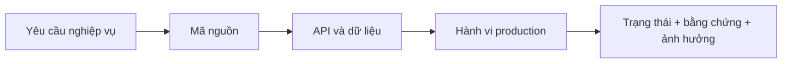

# Báo cáo xác minh tính chính xác hiện tại

> **Cập nhật production 26/07/2026:** bản vá và vòng nâng cấp UI thứ nhất đã được
> triển khai từ commit ứng dụng `17dd84d4b46994c921d373d03273bb39b9787ac4`.
> Frontend và backend đều ở trạng thái `READY` trên Vercel.

## Kết quả xác minh bản production hiện tại

| Finding cũ | Kết quả hiện tại | Bằng chứng | Trạng thái |
|---|---|---|---|
| All-shops có thể tăng quyền | Parser fail-closed; chỉ view mới được aggregate; membership/role phải active và cùng shop | Backend P0 tests đạt; code production cùng commit | Đúng một phần; chưa negative test bằng nhiều vai trò production |
| Sales summary lệch list | Dashboard và sales cùng hiển thị 4 đơn, doanh thu tháng 127.250đ | Smoke test production desktop ngày 26/07/2026 | Đã xác minh với dữ liệu hiện có |
| Dashboard che lỗi bằng số fallback | Các vùng quan trọng có error/retry; phiên smoke test tải dữ liệu thành công | Source review và production dashboard | Đúng một phần; chưa fault injection production |
| Hai entity/route `invoices` | Chỉ còn một entity metadata và một nhóm route invoice | Metadata tests đạt; backend production cùng commit | Đúng một phần; chưa CRUD production |
| MST fallback | Fallback đã bỏ; placeholder cũ bị từ chối | Tax policy tests đạt | Đúng một phần; chưa xuất XML production |
| Thuế âm | Số phải nộp clamp 0; số nộp thừa trả riêng; item cũ âm được sanitize khi đọc | Tax policy/finance tests đạt | Đúng một phần; chưa có dataset thuế chuẩn để đối soát production |
| Sổ nợ hard-code | Màn production lấy API, hiển thị empty state 0đ/0 khách thay vì dữ liệu mẫu | Smoke test `/customer-debts` | Đã xác minh hành vi hiển thị; chưa đối soát khi có công nợ |
| CSV nợ không kiểm soát | CSV dùng dữ liệu API và có kiểm soát formula/escape/BOM; nút xuất bị vô hiệu khi không có dữ liệu | Flutter tests đạt; production empty state | Đúng một phần; chưa tải file có dữ liệu production |
| POS/AI che CTA mobile | Mobile 390×844 hiển thị giỏ, tổng tiền, CTA `THANH TOÁN`; không có AI FAB che nội dung | Smoke test `/pos` và widget/layout tests | Đã xác minh bố cục; không tạo giao dịch |
| Kỳ dashboard/sales/finance lệch nhau | Dashboard và sales cùng kỳ tháng, cùng 4 đơn/127.250đ; lợi nhuận cùng -83.750đ | Smoke test production và reporting-period tests | Đúng một phần; finance/DB chưa tái tính độc lập |
| Lỗi runtime frontend | Không có error group trong cửa sổ kiểm tra 1 giờ | Vercel Runtime Errors | Đã xác minh tại thời điểm kiểm tra |
| Cảnh báo runtime backend | Node ghi cảnh báo deprecation `DEP0169` từ luồng dùng `url.parse()` | 21 lần/1 giờ, route serverless `/src/index.ts`; không có bằng chứng gián đoạn | Đúng một phần; cần truy nguồn dependency và nâng cấp có kiểm soát |

### Bằng chứng phát hành

- GitHub `main`: commit ứng dụng `17dd84d4b46994c921d373d03273bb39b9787ac4`.
- Frontend deployment `dpl_H2A15cYunhndkfbDHZwC5GEVt5dA`, alias
  [smartstock-tax.vercel.app](https://smartstock-tax.vercel.app), trạng thái `READY`.
- Backend deployment `dpl_EVVkwDdXsAfgFxBJt6L5vp5EedDh`, alias
  [stock-management-and-tax-warning.vercel.app](https://stock-management-and-tax-warning.vercel.app),
  trạng thái `READY`.
- `flutter analyze`: đạt.
- Flutter: 23/23 tests đạt; web release build thành công.
- Backend: lint/build đạt; 28/28 P0 tests đạt; audit production dependencies không
  phát hiện lỗ hổng mức high trở lên.
- Smoke test chỉ đọc trên desktop và mobile 390×844: dashboard, sales, customer
  debts và POS tải thành công; không thấy lỗi console ứng dụng.

### Phần vẫn bị chặn hoặc còn rủi ro

- Chưa chạy kiểm thử lỗi API có chủ đích trên production để tránh ảnh hưởng dữ liệu.
- Chưa có dataset chuẩn để chứng minh dashboard, sales, finance, kho và công nợ
  khớp tuyệt đối.
- XML chưa được validate XSD/import HTKK.
- `system_configs` vẫn có DDL runtime và unique key chưa mô hình hóa đầy đủ theo
  shop; cần migration riêng.
- RBAC frontend/backend vẫn còn mapping module chưa thống nhất hoàn toàn; xem
  [ma trận RBAC](04_USER_ROLES_AND_RBAC_MATRIX.md).

## 1. Phạm vi và phương pháp

Đối chiếu bốn lớp:

Đã kiểm tra production desktop và mobile bằng tài khoản chủ cửa hàng hiện có. Không
thực hiện giao dịch ghi dữ liệu, hoàn tiền, xóa dữ liệu hoặc đổi phân quyền. Vì vậy,
những luồng cần tạo dữ liệu được ghi `Bị chặn`.

## 2. Kết quả production baseline trước bản vá

> Phần này được giữ làm bằng chứng lịch sử ngày 25/07/2026, không đại diện cho
> trạng thái production hiện tại.

| ID | Hạng mục | Trạng thái | Bằng chứng | Ảnh hưởng |
|---|---|---|---|---|
| VER-01 | Frontend và backend dùng cùng commit | Đã xác minh | Hai deployment Vercel READY trên `f073c1285d...` | Thấp |
| VER-02 | Đăng nhập tài khoản hiện có | Đã xác minh | Production mở dashboard có đúng user/shop | Thấp |
| VER-03 | Đăng ký email + OTP | Đúng một phần | Code bắt buộc OTP, kiểm tra hết hạn và xóa OTP; chưa tạo tài khoản production mới | Trung bình |
| VER-04 | Refresh token | Đúng một phần | Có endpoint và client flow; access/refresh dùng cùng secret, chưa test revoke/rotation | Cao |
| VER-05 | Dashboard doanh thu/đơn | Đúng một phần | Dashboard hiển thị doanh thu 127.250đ và 4 đơn; chưa tái tính trực tiếp từ DB | Cao |
| VER-06 | Tổng hợp lịch sử đơn | Không chính xác | Màn sales hiển thị `0` đơn nhưng có nhiều đơn trong danh sách | Cao |
| VER-07 | Lợi nhuận và thuế dashboard | Không chính xác | Lợi nhuận -83.750đ nhưng VAT -8.375đ và TNDN -16.750đ | Rất cao |
| VER-08 | Số dư tiền mặt giữa màn hình | Không chính xác | Dashboard 0đ; Tài chính 127.250đ trong cùng phiên kiểm tra | Rất cao |
| VER-09 | POS desktop | Đúng một phần | Danh sách hàng, tồn và giỏ hiển thị; chưa tạo giao dịch | Cao |
| VER-10 | POS mobile | Không chính xác | Không thấy giỏ/CTA hoàn tất; trợ lý AI che thanh điều hướng | Cao |
| VER-11 | Hoàn/hủy/QR | Bị chặn | Cần giao dịch có kiểm soát và đối soát payment | Rất cao |
| VER-12 | Tổng quan tồn kho | Đã xác minh | Dashboard và kho cùng hiển thị 7 sản phẩm dưới định mức | Trung bình |
| VER-13 | Công thức XNT/COGS | Bị chặn | Có entity/API nhưng chưa có dataset chuẩn để tái tính | Rất cao |
| VER-14 | Sổ nợ khách hàng | Không chính xác | Ba khách hàng/đơn nợ được hard-code trong Flutter | Rất cao |
| VER-15 | Xuất Excel sổ nợ | Không chính xác | Nguồn xuất là cùng danh sách hard-code | Rất cao |
| VER-16 | Thuế theo ngưỡng hiện hành | Không chính xác | UI và code dùng 100 triệu đồng/năm; kho tri thức dùng TT40/2021 | Rất cao |
| VER-17 | Route xuất XML | Đúng một phần | Frontend/backend khớp `/api/tax/export-htkk`; tài liệu cũ ghi `/tax/export-xml` | Cao |
| VER-18 | Tương thích HTKK | Bị chặn | Chưa có schema validation hoặc bằng chứng import HTKK | Rất cao |
| VER-19 | Dữ liệu MST khi xuất | Không chính xác | Service fallback `0123456789` nếu shop thiếu MST | Rất cao |
| VER-20 | Phân quyền shop cụ thể | Đúng một phần | Membership được kiểm tra; một số route thiếu `requirePermission` | Rất cao |
| VER-21 | Phân quyền `all` shops | Không chính xác | Frontend tự đặt OWNER; backend cho qua permission với mọi member | Rất cao |
| VER-22 | Customer/supplier/tag/tax-config RBAC | Không chính xác | Route chỉ dựa vào auth/shop scope, thiếu quyền module | Rất cao |
| VER-23 | Dữ liệu nhiều shop | Đúng một phần | Sales/finance/inventory có helper; controller khác vẫn dùng `req.shopId` | Cao |
| VER-24 | Entity và route `invoices` | Không chính xác | Hai `@Entity('invoices')`, hai nhóm route `/invoices` | Rất cao |
| VER-25 | Quản trị migration | Không chính xác | DDL `ALTER/CREATE` chạy trong startup và Vercel cold start | Cao |
| VER-26 | Loading/empty/error | Đúng một phần | Có skeleton/empty ở một số màn; chưa đồng nhất và một số lỗi trả 500 | Trung bình |
| VER-27 | Responsive dashboard/settings | Không chính xác | Chip bị cắt, text rút gọn quá mức, AI che nội dung/nav | Cao |
| VER-28 | Kho tri thức AI | Không chính xác | Nội dung mặc định khẳng định ngưỡng 100 triệu đã lỗi thời | Rất cao |
| VER-29 | Accessibility | Bị chặn | Chưa kiểm thử screen reader, keyboard, contrast và WCAG | Trung bình |
| VER-30 | Build và test | Đúng một phần | Web/backend build thành công; Flutter test và backend lint bị chặn bởi toolchain tại thời điểm audit baseline | Trung bình |

## 3. Bằng chứng trực tiếp

### Dashboard và tài chính

- [Dashboard desktop](assets/production-audit-2026-07-25/01-dashboard-desktop.png)
- [Tài chính desktop](assets/production-audit-2026-07-25/04-finance-desktop.png)
- Code tổng hợp:
  [`dashboard_screen.dart`](../lib/features/dashboard/presentation/dashboard_screen.dart),
  [`finance.controller.ts`](../backend/src/controllers/finance.controller.ts).

### Thuế

- [Ước tính thuế production](assets/production-audit-2026-07-25/05-tax-estimate-desktop.png)
- [`tax.service.ts`](../backend/src/services/tax.service.ts)
- [`ai_knowledge_provider.dart`](../lib/features/settings/providers/ai_knowledge_provider.dart)

### Công nợ

- [Sổ nợ production](assets/production-audit-2026-07-25/07-customer-debts-desktop.png)
- [`customer_debt_screen.dart`](../lib/features/sales/presentation/customer_debt_screen.dart)

### RBAC và dữ liệu

- [`shop_provider.dart`](../lib/features/settings/providers/shop_provider.dart)
- [`auth.middleware.ts`](../backend/src/middleware/auth.middleware.ts)
- [`permission.middleware.ts`](../backend/src/middleware/permission.middleware.ts)
- [`finance/entities.ts`](../backend/src/finance/entities.ts)
- [`system/entities.ts`](../backend/src/system/entities.ts)

### Mobile

- [Dashboard mobile](assets/production-audit-2026-07-25/09-dashboard-mobile.png)
- [POS mobile](assets/production-audit-2026-07-25/10-pos-mobile.png)
- [Settings mobile](assets/production-audit-2026-07-25/11-settings-mobile.png)
- [Sales mobile](assets/production-audit-2026-07-25/12-sales-history-mobile.png)

## 4. Mâu thuẫn giữa tài liệu cũ và baseline

| Chủ đề | Tài liệu cũ | Baseline thực tế |
|---|---|---|
| Số bảng | 18 bảng | 50 entity, 49 tên bảng duy nhất |
| Xuất thuế | `/tax/export-xml` | `/api/tax/export-htkk` |
| HTKK | Khẳng định tương thích | Chưa có bằng chứng validate/import |
| Thuế | 100 triệu là ngưỡng hiện hành | Code/UI cũ; cần cập nhật theo văn bản 2026 |
| RBAC | Chủ/nhân viên được chặn đúng | Có lỗ hổng `all` và route thiếu permission |
| Công nợ | Mô tả dữ liệu nghiệp vụ | Màn production dùng dữ liệu mẫu |
| Accessibility | Có thể suy luận từ UI | Chưa kiểm thử chuyên biệt |

## 5. Giới hạn xác minh và cách thu thập thêm bằng chứng

| Hạng mục bị chặn | Bằng chứng cần bổ sung |
|---|---|
| Nhập–xuất–tồn và COGS | Dataset chuẩn có tồn đầu, PO, sale, return, stock take và expected result |
| Hoàn/hủy/QR | Sandbox payment và giao dịch test có quyền xóa/đối soát |
| XML HTKK | XSD/đặc tả đúng phiên bản và biên bản import trên HTKK |
| Excel/report | File xuất mẫu, tổng kiểm soát và đối chiếu với query DB |
| OTP/email | Hộp thư test, log gửi, retry/rate-limit và expired OTP |
| Accessibility | Keyboard-only, screen reader, zoom 200%, contrast/WCAG |
| Hiệu năng | Kịch bản tải, dataset lớn và ngưỡng SLA |

## 6. Quyết định phát hành

Baseline phù hợp cho demo có kiểm soát, nhưng chưa nên dùng để ra quyết định thuế,
đối soát sổ quỹ hoặc vận hành phân quyền nhiều cửa hàng. Cần xử lý backlog P0 trước
khi tuyên bố production-ready.
