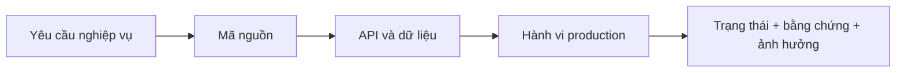

# Báo cáo xác minh tính chính xác hiện tại

> **Cập nhật local ngày 13/08/2026:** kiểm kê nguồn dữ liệu phát hiện DB production còn ngưỡng
> thuế cũ `100/90 triệu` và bảng `tax_rules` trống. Local đã chuyển cấu hình thuế sang luồng
> `DB → API → Flutter`, chặn AI ở chế độ tất cả cửa hàng, chuyển tra cứu địa chỉ onboarding qua
> backend và bỏ Google Client ID hard-code. Migration đã tạo nhưng **chưa chạy**, thay đổi **chưa
> deploy**. Xem [kiểm kê nguồn dữ liệu và bí mật](27_DATA_PROVENANCE_AND_SECRET_AUDIT_20260813.md).

> **Cập nhật production vòng 3 ngày 01/08/2026:** đã chụp và mở kiểm tra 99 ảnh production
> (52 desktop, 47 mobile), bao phủ 49 route/màn protected. Production đang ở `093b17ac`, local
> ở `cc800da3` và đi trước 6 commit. Phạm vi, ảnh và giới hạn xem tại
> [ma trận 55 route](21_PRODUCTION_SCREEN_CAPTURE_MATRIX_20260801.md) và
> [báo cáo trực quan vòng 3](25_PRODUCTION_VISUAL_AUDIT_RUN3_20260801.md).

> **Cập nhật production 26/07/2026:** bản vá và vòng nâng cấp UI thứ nhất đã được
> triển khai từ commit ứng dụng `17dd84d4b46994c921d373d03273bb39b9787ac4`.
> Frontend và backend đều ở trạng thái `READY` trên Vercel.

## Kết quả mới nhất từ source/test local 01/08/2026

| ID | Hạng mục | Trạng thái | Bằng chứng hiện tại | Ảnh hưởng |
|---|---|---|---|---|
| CUR-01 | Backend quyết định giá bán | Đúng một phần — đã sửa local, production chưa deploy | Backend chỉ chấp nhận giá bán lẻ, giá sỉ đủ số lượng hoặc giá khuyến mại còn hiệu lực đã cấu hình; chặn giá tùy ý, số tiền không hữu hạn và giảm giá ngoài khoảng. Chưa có luồng override giá có quyền/lý do/audit | Rất cao cho tới khi smoke test production |
| CUR-02 | Giá vốn hoàn một phần | Đúng một phần — đã sửa summary local, nghiệp vụ hoàn một phần chưa mở | Summary đảo giá vốn theo số lượng hoàn × đơn giá vốn đã bán; phiếu hoàn thiếu dòng được data gate chặn. Service hiện chỉ cho hoàn toàn bộ để không ghi dữ liệu một phần thiếu contract | Rất cao cho tới khi có item-level contract và smoke test production |
| CUR-03 | Danh sách dữ liệu lớn | Không chính xác | Nhiều provider cố định `page: 1`; backend mặc định 20 | Rất cao |
| CUR-04 | Auth schema production | Đã xác minh migration | Đã khai báo kiểu cột rõ ràng; metadata regression test đạt. Migration production chạy trong transaction ngày 02/08/2026; kiểm tra độc lập xác nhận `refresh_sessions`, `auth_version`, `otp purpose` sẵn sàng và OTP chờ = 0 | Trung bình; còn phải smoke test backend sau deploy |
| CUR-05 | Route CTA kho và hoàn trả | Đúng một phần | Đã khai báo `/purchase-orders/form`, chuyển CTA hoàn trả sang `/sales/returns/:id` và route registry test đạt; deep-link chi tiết vẫn cần bỏ phụ thuộc `state.extra` | Cao |
| CUR-06 | Guard route và API | Đúng một phần | Tax estimate/activity/AI knowledge/tax config có mapping quyền lệch | Cao |
| CUR-07 | Invoice entity | Đã xác minh từ code | 51 entity/51 bảng duy nhất; một model `invoices` | Trung bình; chờ introspect DB |
| CUR-08 | Sổ nợ | Đúng một phần — đã sửa local | KPI/grain và tuổi nợ đã đối soát; thu nợ liên kết đơn hoặc khoản thủ công đều có workflow transaction. Vẫn thiếu phân trang, cảnh báo vượt hạn mức và backfill 111/112 lịch sử | Cao |
| CUR-09 | Bộ test backend P0 | Đã xác minh local | Build, lint và 57/57 test đạt ngày 02/08/2026; đã phủ kỳ tài chính, giá bán, giá vốn hoàn, đồng nhất khách hàng và khóa migration auth | Trung bình; chưa thay thế smoke test production |
| CUR-10 | Flutter analyze/test/build | Đã xác minh local | Analyze toàn dự án sạch; toàn bộ 61/61 test đạt và Web release build thành công ngày 02/08/2026 | Trung bình; còn phải smoke test production |
| CUR-11 | Accessibility | Bị chặn | Chưa test keyboard, focus, zoom 200%, screen reader | Trung bình |
| CUR-12 | KPI kho và ngưỡng cảnh báo | Không chính xác production | Production hiển thị tổng 20 nhưng dưới định mức 112; local đã sửa dùng server total và `min_stock` | Rất cao |
| CUR-13 | Định danh khách ở đơn bán | Đã sửa local, có test và đối soát DB/API | API detail tải cùng quan hệ `customer` như danh sách; so 100 đơn mới nhất mỗi cửa hàng (200 đơn) có `0` tên khách lệch | Rất cao |
| CUR-14 | Kỳ chi phí/lương và chốt ca | Đúng một phần — đã sửa local, production chưa deploy | Backend dùng cùng kỳ cho tổng và danh sách chi phí; sổ lương lọc `SALARY` theo tháng tại API; chốt ca giữ trạng thái “Chưa đối soát” khi ô thực tế trống. Backend P0 57/57, Flutter toàn bộ 61/61 và analyze sạch | Rất cao cho tới khi smoke test production |
| CUR-15 | Toàn vẹn invoice/chứng từ | Đúng một phần | API/UI đã cảnh báo từ DB: 60 invoice thiếu item và 558 header lệch tổng tiền hàng so với dòng; dữ liệu lịch sử chưa backfill | Rất cao |
| CUR-16 | Deep-link và route nhập hàng | Không chính xác production | Form PO Page Not Found; PO/transaction detail dựng `PO-null`/`-0 đ` và vẫn có action | Cao |
| CUR-17 | Thuế và báo cáo mobile | Đúng một phần, rủi ro cao | Ngưỡng 1 tỷ có nguồn chính thức; kỳ/sort/CTA chưa đúng, chart ngưỡng vỡ nhãn | Cao |

## Snapshot production đã xác minh ngày 26/07/2026

| Finding cũ | Kết quả hiện tại | Bằng chứng | Trạng thái |
|---|---|---|---|
| All-shops có thể tăng quyền | Parser fail-closed; chỉ view mới được aggregate; membership/role phải active và cùng shop | Backend P0 tests đạt; code production cùng commit | Đúng một phần; chưa negative test bằng nhiều vai trò production |
| Sales summary lệch list | Dashboard và sales cùng hiển thị 4 đơn, doanh thu tháng 127.250đ | Smoke test production desktop ngày 26/07/2026 | Đã xác minh với dữ liệu hiện có |
| Dashboard che lỗi bằng số fallback | Các vùng quan trọng có error/retry; phiên smoke test tải dữ liệu thành công | Source review và production dashboard | Đúng một phần; chưa fault injection production |
| Hai entity/route `invoices` | Chỉ còn một entity metadata và một nhóm route invoice | Metadata tests đạt; backend production cùng commit | Đúng một phần; chưa CRUD production |
| MST fallback | Fallback đã bỏ; placeholder cũ bị từ chối | Tax policy tests đạt | Đúng một phần; chưa xuất XML production |
| Thuế âm | Số phải nộp clamp 0; số nộp thừa trả riêng; item cũ âm được sanitize khi đọc | Tax policy/finance tests đạt | Đúng một phần; chưa có dataset thuế chuẩn để đối soát production |
| Sổ nợ hard-code | Màn production lấy API, hiển thị empty state 0đ/0 khách thay vì dữ liệu mẫu | Smoke test `/customer-debts` | Đã xác minh hành vi hiển thị; chưa đối soát khi có công nợ |
| CSV nợ không kiểm soát | CSV dùng dữ liệu API và có kiểm soát formula/escape/BOM; nút xuất bị vô hiệu khi không có dữ liệu | Flutter tests đạt; production empty state | Đúng một phần; chưa tải file có dữ liệu production |
| POS/AI che CTA mobile | Mobile 390×844 hiển thị giỏ, tổng tiền, CTA `THANH TOÁN`; không có AI FAB che nội dung | Smoke test `/pos` và widget/layout tests | Đã xác minh bố cục; không tạo giao dịch |
| Kỳ dashboard/sales/finance lệch nhau | Dashboard và sales cùng kỳ tháng, cùng 4 đơn/127.250đ; lợi nhuận cùng -83.750đ | Smoke test production và reporting-period tests | Đúng một phần; finance/DB chưa tái tính độc lập |
| Lỗi runtime frontend | Không có error group trong cửa sổ kiểm tra 1 giờ | Vercel Runtime Errors | Đã xác minh tại thời điểm kiểm tra |
| Cảnh báo runtime backend | Node ghi cảnh báo deprecation `DEP0169` từ luồng dùng `url.parse()` | 21 lần/1 giờ, route serverless `/src/index.ts`; không có bằng chứng gián đoạn | Đúng một phần; cần truy nguồn dependency và nâng cấp có kiểm soát |

### Bằng chứng phát hành của snapshot 26/07

- GitHub `main`: commit ứng dụng `17dd84d4b46994c921d373d03273bb39b9787ac4`.
- Frontend deployment `dpl_H2A15cYunhndkfbDHZwC5GEVt5dA`, alias
  [smartstock-tax.vercel.app](https://smartstock-tax.vercel.app), trạng thái `READY`.
- Backend deployment `dpl_EVVkwDdXsAfgFxBJt6L5vp5EedDh`, alias
  [stock-management-and-tax-warning.vercel.app](https://stock-management-and-tax-warning.vercel.app),
  trạng thái `READY`.
- `flutter analyze`: đạt.
- Flutter: 23/23 tests đạt; web release build thành công.
- Backend: lint/build đạt; 28/28 P0 tests đạt; audit production dependencies không
  phát hiện lỗ hổng mức high trở lên.
- Smoke test chỉ đọc trên desktop và mobile 390×844: dashboard, sales, customer
  debts và POS tải thành công; không thấy lỗi console ứng dụng.

### Phần còn bị chặn trong snapshot 26/07

- Chưa chạy kiểm thử lỗi API có chủ đích trên production để tránh ảnh hưởng dữ liệu.
- Chưa có dataset chuẩn để chứng minh dashboard, sales, finance, kho và công nợ
  khớp tuyệt đối.
- XML chưa được validate XSD/import HTKK.
- `system_configs` vẫn có DDL runtime và unique key chưa mô hình hóa đầy đủ theo
  shop; cần migration riêng.
- RBAC frontend/backend vẫn còn mapping module chưa thống nhất hoàn toàn; xem
  [ma trận RBAC](04_USER_ROLES_AND_RBAC_MATRIX.md).

## 1. Phạm vi và phương pháp

Đối chiếu bốn lớp:

Đã kiểm tra production desktop và mobile bằng tài khoản chủ cửa hàng hiện có. Không
thực hiện giao dịch ghi dữ liệu, hoàn tiền, xóa dữ liệu hoặc đổi phân quyền. Vì vậy,
những luồng cần tạo dữ liệu được ghi `Bị chặn`.

## 2. Kết quả production baseline trước bản vá

> Phần này được giữ làm bằng chứng lịch sử ngày 25/07/2026, không đại diện cho
> trạng thái production hiện tại.

| ID | Hạng mục | Trạng thái | Bằng chứng | Ảnh hưởng |
|---|---|---|---|---|
| VER-01 | Frontend và backend dùng cùng commit | Đã xác minh | Hai deployment Vercel READY trên `f073c1285d...` | Thấp |
| VER-02 | Đăng nhập tài khoản hiện có | Đã xác minh | Production mở dashboard có đúng user/shop | Thấp |
| VER-03 | Đăng ký email + OTP | Đúng một phần | Code bắt buộc OTP, kiểm tra hết hạn và xóa OTP; chưa tạo tài khoản production mới | Trung bình |
| VER-04 | Refresh token | Đúng một phần | Có endpoint và client flow; access/refresh dùng cùng secret, chưa test revoke/rotation | Cao |
| VER-05 | Dashboard doanh thu/đơn | Đúng một phần | Dashboard hiển thị doanh thu 127.250đ và 4 đơn; chưa tái tính trực tiếp từ DB | Cao |
| VER-06 | Tổng hợp lịch sử đơn | Không chính xác | Màn sales hiển thị `0` đơn nhưng có nhiều đơn trong danh sách | Cao |
| VER-07 | Lợi nhuận và thuế dashboard | Không chính xác | Lợi nhuận -83.750đ nhưng VAT -8.375đ và TNDN -16.750đ | Rất cao |
| VER-08 | Số dư tiền mặt giữa màn hình | Không chính xác | Dashboard 0đ; Tài chính 127.250đ trong cùng phiên kiểm tra | Rất cao |
| VER-09 | POS desktop | Đúng một phần | Danh sách hàng, tồn và giỏ hiển thị; chưa tạo giao dịch | Cao |
| VER-10 | POS mobile | Không chính xác | Không thấy giỏ/CTA hoàn tất; trợ lý AI che thanh điều hướng | Cao |
| VER-11 | Hoàn/hủy/QR | Bị chặn | Cần giao dịch có kiểm soát và đối soát payment | Rất cao |
| VER-12 | Tổng quan tồn kho | Đã xác minh | Dashboard và kho cùng hiển thị 7 sản phẩm dưới định mức | Trung bình |
| VER-13 | Công thức XNT số lượng | Đã xác minh local và DB chỉ đọc | 56.247 phát sinh của hai cửa hàng được tái tính; tổng nhập/xuất khớp SQL độc lập, 100% SKU cân `tồn đầu + nhập − xuất = tồn cuối`, tồn cuối khớp `inventory_stocks`. Định giá COGS được đối soát riêng tại VER-123 | Rất cao |
| VER-14 | Sổ nợ khách hàng | Không chính xác | Ba khách hàng/đơn nợ được hard-code trong Flutter | Rất cao |
| VER-15 | Xuất Excel sổ nợ | Không chính xác | Nguồn xuất là cùng danh sách hard-code | Rất cao |
| VER-16 | Thuế theo ngưỡng hiện hành | Không chính xác | UI và code dùng 100 triệu đồng/năm; kho tri thức dùng TT40/2021 | Rất cao |
| VER-17 | Route xuất XML | Đúng một phần | Frontend/backend khớp `/api/tax/export-htkk`; tài liệu cũ ghi `/tax/export-xml` | Cao |
| VER-18 | Tương thích HTKK | Bị chặn | Chưa có schema validation hoặc bằng chứng import HTKK | Rất cao |
| VER-19 | Dữ liệu MST khi xuất | Không chính xác | Service fallback `0123456789` nếu shop thiếu MST | Rất cao |
| VER-20 | Phân quyền shop cụ thể | Đúng một phần | Membership được kiểm tra; một số route thiếu `requirePermission` | Rất cao |
| VER-21 | Phân quyền `all` shops | Không chính xác | Frontend tự đặt OWNER; backend cho qua permission với mọi member | Rất cao |
| VER-22 | Customer/supplier/tag/tax-config RBAC | Không chính xác | Route chỉ dựa vào auth/shop scope, thiếu quyền module | Rất cao |
| VER-23 | Dữ liệu nhiều shop | Đúng một phần | Sales/finance/inventory có helper; controller khác vẫn dùng `req.shopId` | Cao |
| VER-24 | Entity và route `invoices` | Không chính xác | Hai `@Entity('invoices')`, hai nhóm route `/invoices` | Rất cao |
| VER-25 | Quản trị migration | Không chính xác | DDL `ALTER/CREATE` chạy trong startup và Vercel cold start | Cao |
| VER-26 | Loading/empty/error | Đúng một phần | Có skeleton/empty ở một số màn; chưa đồng nhất và một số lỗi trả 500 | Trung bình |
| VER-27 | Responsive dashboard/settings | Không chính xác | Chip bị cắt, text rút gọn quá mức, AI che nội dung/nav | Cao |
| VER-28 | Kho tri thức AI | Không chính xác | Nội dung mặc định khẳng định ngưỡng 100 triệu đã lỗi thời | Rất cao |
| VER-29 | Accessibility | Bị chặn | Chưa kiểm thử screen reader, keyboard, contrast và WCAG | Trung bình |
| VER-30 | Build và test | Đúng một phần | Web/backend build thành công; Flutter test và backend lint bị chặn bởi toolchain tại thời điểm audit baseline | Trung bình |

## 3. Bằng chứng trực tiếp

### Dashboard và tài chính

- [Dashboard desktop](assets/production-audit-2026-07-25/01-dashboard-desktop.png)
- [Tài chính desktop](assets/production-audit-2026-07-25/04-finance-desktop.png)
- Code tổng hợp:
  [`dashboard_screen.dart`](../lib/features/dashboard/presentation/dashboard_screen.dart),
  [`finance.controller.ts`](../backend/src/controllers/finance.controller.ts).

### Thuế

- [Ước tính thuế production](assets/production-audit-2026-07-25/05-tax-estimate-desktop.png)
- [`tax.service.ts`](../backend/src/services/tax.service.ts)
- [`ai_knowledge_provider.dart`](../lib/features/settings/providers/ai_knowledge_provider.dart)

### Công nợ

- [Sổ nợ production](assets/production-audit-2026-07-25/07-customer-debts-desktop.png)
- [`customer_debt_screen.dart`](../lib/features/sales/presentation/customer_debt_screen.dart)

### RBAC và dữ liệu

- [`shop_provider.dart`](../lib/features/settings/providers/shop_provider.dart)
- [`auth.middleware.ts`](../backend/src/middleware/auth.middleware.ts)
- [`permission.middleware.ts`](../backend/src/middleware/permission.middleware.ts)
- [`finance/entities.ts`](../backend/src/finance/entities.ts)
- [`system/entities.ts`](../backend/src/system/entities.ts)

### Mobile

- [Dashboard mobile](assets/production-audit-2026-07-25/09-dashboard-mobile.png)
- [POS mobile](assets/production-audit-2026-07-25/10-pos-mobile.png)
- [Settings mobile](assets/production-audit-2026-07-25/11-settings-mobile.png)
- [Sales mobile](assets/production-audit-2026-07-25/12-sales-history-mobile.png)

## 4. Mâu thuẫn giữa tài liệu cũ và baseline

| Chủ đề | Tài liệu cũ | Baseline thực tế |
|---|---|---|
| Số bảng | 18 bảng | 50 entity, 49 tên bảng duy nhất |
| Xuất thuế | `/tax/export-xml` | `/api/tax/export-htkk` |
| HTKK | Khẳng định tương thích | Chưa có bằng chứng validate/import |
| Thuế | 100 triệu là ngưỡng hiện hành | Code/UI cũ; cần cập nhật theo văn bản 2026 |
| RBAC | Chủ/nhân viên được chặn đúng | Có lỗ hổng `all` và route thiếu permission |
| Công nợ | Mô tả dữ liệu nghiệp vụ | Màn production dùng dữ liệu mẫu |
| Accessibility | Có thể suy luận từ UI | Chưa kiểm thử chuyên biệt |

## 5. Giới hạn xác minh và cách thu thập thêm bằng chứng

| Hạng mục bị chặn | Bằng chứng cần bổ sung |
|---|---|
| Nhập–xuất–tồn và COGS | Dataset chuẩn có tồn đầu, PO, sale, return, stock take và expected result |
| Hoàn/hủy/QR | Sandbox payment và giao dịch test có quyền xóa/đối soát |
| XML HTKK | XSD/đặc tả đúng phiên bản và biên bản import trên HTKK |
| Excel/report | File xuất mẫu, tổng kiểm soát và đối chiếu với query DB |
| OTP/email | Hộp thư test, log gửi, retry/rate-limit và expired OTP |
| Accessibility | Keyboard-only, screen reader, zoom 200%, contrast/WCAG |
| Hiệu năng | Kịch bản tải, dataset lớn và ngưỡng SLA |

## 6. Quyết định phát hành

Baseline phù hợp cho demo có kiểm soát, nhưng chưa nên dùng để ra quyết định thuế,
đối soát sổ quỹ hoặc vận hành phân quyền nhiều cửa hàng. Cần xử lý backlog P0 trước
khi tuyên bố production-ready.

## 7. Đối soát bổ sung ngày 09/08/2026

> Phạm vi này xác minh code cục bộ và dữ liệu production bằng truy vấn chỉ đọc.
> Các thay đổi code chưa được deploy nên chưa được ghi nhận là đã xác minh trên giao diện production.

| ID | Hạng mục | Trạng thái | Bằng chứng | Ảnh hưởng |
|---|---|---|---|---|
| VER-31 | `paid_amount` khớp tổng các lần thanh toán | Đã xác minh dữ liệu | Cửa hàng 34 và 35 đều có `0` vi phạm | Cao |
| VER-32 | Doanh thu thuần khớp tài khoản 511 | Đã xác minh dữ liệu | Tổng đơn trừ phiếu trả hợp lệ khớp phát sinh Có trừ Nợ tài khoản 511 ở cả hai cửa hàng | Rất cao |
| VER-33 | Giá vốn thuần khớp tài khoản 632 | Đã xác minh dữ liệu | Giá vốn đơn trừ giá vốn hàng trả khớp phát sinh Nợ trừ Có tài khoản 632 ở cả hai cửa hàng | Rất cao |
| VER-34 | So sánh kỳ dashboard | Đã sửa code, chưa production | Tuần/tháng/năm hiện so sánh cùng số ngày đã trôi qua; có kiểm thử biên cuối tháng và năm nhuận | Cao |
| VER-35 | Sản phẩm bán chạy | Đã sửa code, chưa production | Xếp hạng theo doanh thu hàng hóa sau trả; backend tính kỳ trước theo đúng `product_id` của từng sản phẩm hiện tại, không còn phụ thuộc top 10 kỳ trước; bổ sung biên lợi nhuận gộp | Cao |
| VER-36 | Ngữ cảnh dữ liệu AI | Đã sửa code, chưa production | Cảnh báo tồn dùng tồn thực tế so với định mức; doanh thu 30 ngày dùng `order_date` và trừ hàng trả | Rất cao |
| VER-37 | Hàng trả trong báo cáo thuế | Đã sửa code, chưa production | Phiếu `CANCELLED` và `REJECTED` đều bị loại khỏi doanh thu kỳ/năm | Rất cao |
| VER-38 | Hóa đơn có dòng chi tiết | Không chính xác | Mỗi cửa hàng có 30 hóa đơn đầu vào tham chiếu `PURCHASE_ORDER` nhưng không có `invoice_items` | Rất cao |
| VER-39 | Tự đối soát chiết khấu hóa đơn | Không chính xác | Cửa hàng 34 có 268 hóa đơn với tổng chiết khấu 42.296.000đ; cửa hàng 35 có 290 hóa đơn với tổng chiết khấu 57.854.000đ nhưng bảng `invoices` chưa có `discount_amount` | Rất cao |
| VER-40 | Độ mới dữ liệu demo | Đúng một phần, đã có cảnh báo local | Hai cửa hàng có đủ 1.096 ngày liên tục nhưng sales/cash/movement đều dừng 28/07/2026. Dashboard, Tài chính và Kho nay lấy ngày gần nhất từ DB và cảnh báo KPI kỳ hiện tại có thể rỗng do thiếu dữ liệu | Cao |
| VER-41 | Quyền xem dashboard bán hàng | Đã sửa code, chưa production | Người có quyền `sales` hoặc `dashboard` được xem doanh thu/biểu đồ dù không có quyền `finance`; số dư quỹ vẫn bị ẩn | Cao |
| VER-42 | Nhãn kỳ so sánh | Đã sửa code, chưa production | Nhãn hiển thị chính xác ngày bắt đầu–kết thúc của cả kỳ hiện tại và kỳ đối chiếu | Trung bình |
| VER-43 | Kiểu dữ liệu ngày giờ nghiệp vụ | Đúng một phần | `sales_orders.order_date`, `sales_returns.return_date`, `sales_order_payments.paid_at` là `timestamp without time zone`; journal dùng `timestamp with time zone`, giao dịch tiền dùng `date` | Cao |
| VER-44 | Phân trang lịch sử đơn hàng | Đã sửa code, chưa production | API trả tối đa 20 dòng/trang nhưng UI cũ không có điều hướng; đã bổ sung tổng số đơn, trang hiện tại và nút Trước/Sau | Cao |
| VER-45 | Nút Google trên Flutter Web release | Đã sửa và xác minh local release | Bản release cũ ép kiểu sai do web implementation chưa được đăng ký trước khi dựng nút, tạo khối xám lớn; bản sửa hiển thị đúng trên 1440×1000 và 390×844, console không còn lỗi | Rất cao |
| VER-46 | Phân bổ tồn kho theo danh mục | Đã sửa code, chưa production | API xác định giá trị theo `SUM(quantity × cost_price)` và trả thêm số SKU; UI ghi rõ giá vốn, đơn vị đồng và không cộng trực tiếp Bao/Kg/Bộ | Cao |
| VER-47 | Phân trang các danh sách nghiệp vụ | Đã sửa code, chưa production | Khách hàng, nhà cung cấp, sản phẩm, hóa đơn, đơn nhập, kiểm kê, giao dịch, sổ lương, nhật ký hoạt động, lịch sử đơn theo khách và phát sinh kho theo sản phẩm đều dùng `page`, `totalPages`, `total` từ API | Rất cao |
| VER-48 | Dữ liệu bộ chọn trong luồng giao dịch | Đã sửa code, chưa production | POS không còn giới hạn danh mục ở trang đầu; bộ chọn khách hàng, nhà cung cấp và sản phẩm trong POS/nhập hàng/kiểm kê/bảng kê mua lấy tối đa 500 bản ghi thay vì mặc định 20 | Cao |
| VER-49 | Cơ cấu phương thức thanh toán | Đã sửa code, chưa production | Bổ sung bảng thanh tiến độ theo số tiền và lượt thanh toán trong tháng; nguồn là `sales_order_payments`, lọc theo `paid_at` và loại đơn hủy | Cao |
| VER-50 | Ảnh tại chi tiết sản phẩm | Đã sửa code, chưa production | Màn chi tiết dùng URL ảnh thật từ DB, chuyển đổi Cloudinary theo kích thước 480×480 và chỉ dùng asset kho khi thiếu/lỗi ảnh | Trung bình |
| VER-51 | Bộ lọc nhật ký giả | Đã sửa code, chưa production | Đã bỏ nút thông báo “đang phát triển” và thay bằng phân trang hoạt động thực sự; chưa ghi nhận bộ lọc vì backend chưa có hợp đồng lọc | Trung bình |
| VER-52 | Thứ tự ưu tiên dashboard mobile | Đã sửa code, chưa production | Biểu đồ doanh thu được đặt trước danh sách việc cần làm; danh sách việc cần làm vẫn cuộn độc lập khi dài | Trung bình |
| VER-53 | Đối soát toàn bộ quy tắc dữ liệu hiện có | Đúng một phần | Sau khi bổ sung kiểm tra journal giao dịch độc lập: mỗi cửa hàng đạt 28/32 nhóm, có 3 nhóm lỗi và 1 cảnh báo độ mới dữ liệu | Rất cao |
| VER-54 | Ảnh chứng từ công nợ | Đã sửa code, chưa production | Bổ sung ký upload Cloudinary theo shop, xác nhận quyền sở hữu ảnh, ghi `debt_evidences`, xem ảnh tối ưu và xóa cả DB/lưu trữ; backend có kiểm thử vòng đời | Cao |
| VER-55 | Tổng hợp báo cáo nhập–xuất–tồn | Đã sửa code, chưa production | Không còn trình bày tổng số lượng cộng lẫn Bao/Mét/Bộ/Cái; thẻ tổng hợp đếm SKU có tồn/nhập/xuất, bảng hiển thị đơn vị và phân trang 20 dòng | Rất cao |
| VER-56 | Biểu đồ báo cáo lãi/lỗ | Đã sửa code, chưa production | Bỏ biểu đồ tròn có tỷ lệ sai khi lỗ; thay bằng cầu nối `doanh thu − giá vốn = lợi nhuận gộp − chi phí = lợi nhuận ròng` và lưới KPI responsive | Rất cao |
| VER-57 | Công thức dự báo dòng tiền | Đã sửa code, chưa production | Backend tự tính `expectedBalance = expectedIncome − expectedExpense`, không tin giá client; chặn ngày/số âm/số không hữu hạn; UI ghi rõ dòng tiền thuần và đơn vị | Cao |
| VER-58 | Tổng tiền hóa đơn mới/cập nhật | Đã sửa code, chưa production | Backend tự tính `totalAmount = subtotal + taxAmount`, validate loại/ngày/đối tác/trạng thái; danh sách hóa đơn chuyển sang bố cục responsive không tràn mobile | Rất cao |
| VER-59 | Liên kết hỗ trợ thuế | Đã sửa code, chưa production | Bỏ ba số điện thoại chưa xác minh và nút giả; dùng cổng GDT/Thuế điện tử/tra cứu hóa đơn chính thức, thao tác sao chép và mở trình duyệt hoạt động thật | Cao |
| VER-60 | Đối ứng tiền mặt/chuyển khoản khi bán và hoàn tiền | Đã sửa code, chưa production | Tiền mặt ghi tài khoản 111; chuyển khoản/QR/thẻ ghi 112. Hủy đơn hoàn theo từng phương thức thanh toán thật và void các bút toán thu nợ liên quan | Rất cao |
| VER-61 | Dữ liệu lịch sử tài khoản 111/112 | Không chính xác | Cửa hàng 34 có 870 đơn, cửa hàng 35 có 834 đơn mà tổng thanh toán theo kênh không khớp phát sinh Nợ 111/112; cần backup và backfill bút toán riêng | Rất cao |
| VER-62 | Biểu đồ và xuất báo cáo tuổi nợ | Đã sửa code, chưa production | Nhãn bucket khớp backend (`chưa hạn`, `1–30`, `31–60`, `>60`), trục/tooltip ghi đơn vị đồng; nút giả được thay bằng CSV Excel có tổng kiểm soát và chống công thức trong ô text | Cao |
| VER-63 | Thao tác nhắc nợ | Đã sửa code, chưa production | UI cũ báo đã mở SMS/Zalo/Email nhưng không gọi ứng dụng; bản sửa chỉ xác nhận hành động thật là sao chép nội dung, dùng bố cục `Wrap` để không tràn mobile | Cao |
| VER-64 | Sửa/xóa giao dịch tiền và sổ kế toán | Đã sửa code, dữ liệu cũ đã đối soát | Backend validate loại/số tiền/ngày/phương thức; giao dịch độc lập sửa sẽ void bút toán cũ và ghi lại 111/112; giao dịch liên kết đơn/phiếu bị chặn sửa hoặc xóa trực tiếp. Cả hai cửa hàng có `0` giao dịch độc lập lệch journal 111/112 | Rất cao |
| VER-65 | Số thực tế trong kế hoạch ngân sách | Đã sửa code, chưa production | `actualIncome`/`actualExpense` được tổng hợp từ `cash_transactions` trong đúng khoảng ngày, client không còn được tự ghi; UI có luồng tạo kế hoạch, mốc thời gian và thanh tiến độ theo chiều rộng khung | Cao |
| VER-66 | Vị trí hành động chính trên mobile | Đã sửa và xác minh local | Kho, khách hàng, nhà cung cấp, tài chính và hóa đơn không còn đặt nút dài dưới phải che nội dung ở màn hẹp; hành động chuyển lên góc phải tiêu đề/thanh trên bằng asset của ứng dụng, desktop vẫn giữ FAB dưới phải | Trung bình |
| VER-67 | Cửa hàng được chọn ngay sau đăng nhập | Đã sửa code, chưa production | Login response cũ thiếu `shopName/shopCode`, làm header hiện “Cửa hàng”; backend bổ sung định danh shop và frontend tải lại `/my-shops` sau password/Google login. Bản production hiện tại chưa có backend mới nên chưa xác minh end-to-end | Rất cao |
| VER-68 | Hành động chính trên các màn phụ mobile | Đã sửa code, xác minh tĩnh | Đơn nhập, kiểm kê, dự báo dòng tiền, sổ chi phí, sổ lương, nghĩa vụ thuế, mua không hóa đơn, cấu hình thuế, nhân viên, vai trò và nhãn chuyển nút dài lên action nhỏ trên thanh trên; desktop giữ FAB dưới phải | Trung bình |
| VER-69 | Asset cho hành động chỉnh sửa | Đã sửa code, xác minh local build | Chi tiết sản phẩm, khách hàng và nhà cung cấp dùng `edit_icon.svg`; không còn dùng bánh răng cấu hình cho hành động chỉnh sửa | Thấp |
| VER-70 | KPI số kho/cửa hàng | Đã sửa code, chưa production | Bỏ giá trị hard-code `1`; shop đơn lấy số kho từ `/inventory/warehouses`, chế độ tổng hợp đếm cửa hàng hoạt động và không gọi endpoint shop đơn | Cao |
| VER-71 | Chế độ tất cả cửa hàng không được ghi kho | Đã sửa code, có kiểm thử | Ẩn hành động thêm sản phẩm/nhập hàng khi `isAllShops`; quyền tổng hợp chỉ còn mức xem | Rất cao |
| VER-72 | Danh sách hàng chậm luân chuyển | Đã sửa code, chưa production | UI đọc đúng `name/currentStock`; backend trả tên, đơn vị, tồn, ngày bán cuối và số ngày chưa bán. Tiêu chí chậm luân chuyển dựa trên đơn bán không hủy thay vì mọi phiếu xuất kho | Cao |
| VER-73 | Kỳ trên KPI và biểu đồ tài chính | Đã sửa code, xác minh local build | Thẻ tổng thu/tổng chi/dòng tiền và panel ghi mốc `01–09/08`; khi cả thu và chi bằng 0, biểu đồ không vẽ đường 0 gây hiểu nhầm mà hiển thị trạng thái chưa có giao dịch | Cao |
| VER-74 | Ý nghĩa cơ cấu thanh toán | Đã sửa code, chưa production | Đổi nhãn thành “Tiền đã thu theo phương thức”, vì nguồn là các lần thanh toán ghi nhận chứ không phải doanh thu thuần sau hoàn; hiển thị mốc ngày thay cho “Tháng này” chung chung | Trung bình |
| VER-75 | Ranh giới ngày của báo cáo bán hàng | Đã sửa lại code và đối soát DB, chưa production | Kiểm tra production ngày 28/07 cho thấy API cũ trả 10 đơn/24.291.000đ nhưng truy vấn đúng theo ngày nghiệp vụ chỉ có 7 đơn/16.900.000đ. Nguyên nhân là truyền `Date` UTC vào cột `timestamp without time zone`. Bản sửa dùng khóa ngày `YYYY-MM-DD`, cận trên loại trừ ngày kế tiếp cho summary, top sản phẩm, hàng trả và thanh toán; local API khớp DB 7 đơn/16.900.000đ, tiền thu 13.808.000đ | Rất cao |
| VER-76 | Đối soát dữ liệu production, tái chạy 11/08 | Không chính xác một phần | Mỗi shop vẫn đạt 28/32 nhóm; shop 34 còn 870 lỗi 111/112, 30 hóa đơn thiếu dòng và 268 hóa đơn thiếu mô hình chiết khấu; shop 35 lần lượt 834, 30 và 290. Dữ liệu bán dừng 28/07/2026 | Rất cao |
| VER-77 | Insight AI về tồn kho và công nợ | Đã sửa code, có kiểm thử | Cảnh báo tồn chỉ đếm sản phẩm có tồn thực tế chạm định mức; tổng nợ lấy từ khoản phải thu còn mở, không dùng `customers.balance` có thể lệch cache | Rất cao |
| VER-78 | Báo cáo tuổi nợ | Đã sửa code, có kiểm thử | Loại cả khoản `PAID` và `CANCELLED`, đếm đúng khoản còn dư và chốt `asOf` ở cuối ngày nghiệp vụ Việt Nam | Rất cao |
| VER-79 | Chốt ca theo ngày | Đã sửa code, chưa production | Giao dịch được lấy theo toàn bộ ngày Việt Nam thay vì so timestamp tuyệt đối; số đơn/doanh số/trả hàng lấy từ bảng bán hàng; server tự tính các tổng và chênh lệch, không tin số client gửi lên | Rất cao |
| VER-80 | Nhãn ngày trên biểu đồ bán hàng/dòng tiền | Đã sửa lại code, có kiểm thử | Với cột bán hàng hiện là `timestamp without time zone`, SQL gom nhóm trực tiếp theo ngày nghiệp vụ đã lưu và lọc bằng khóa ngày; không còn dùng `AT TIME ZONE` làm dịch dữ liệu lịch sử 7 giờ. Danh sách ngày/tháng trống vẫn sinh theo lịch Việt Nam. Việc chuẩn hóa schema sang `timestamptz` vẫn là migration riêng | Rất cao |
| VER-81 | Duyệt mua hàng không hóa đơn | Đã sửa code, có kiểm thử | Chủ shop tạo bản tự duyệt nay nhập kho/lot/dòng tiền/sổ cái trong cùng transaction; giữ `warehouseId` hoặc chọn kho hoạt động mặc định; duyệt lặp không nhập kho hai lần; 111/112 theo phương thức thật | Rất cao |
| VER-82 | Doanh thu, thuế đầu ra và hoàn toàn bộ đơn | Đã sửa code, có kiểm thử | Bán hàng tách doanh thu thuần 511 và thuế đầu ra 3331; trả toàn bộ dùng giá/dòng hàng phía server, hoàn theo từng kênh đã thu, đảo cả phải thu 131 và giá vốn; báo cáo trừ toàn giá trị đơn trả thay vì chỉ tiền đã hoàn | Rất cao |
| VER-83 | Doanh thu và tăng trưởng theo sản phẩm khi đơn có giảm giá | Đã sửa code, có kiểm thử và truy vấn dữ liệu thật | Truy vấn cũ cộng nguyên `sales_order_items.subtotal`, làm doanh thu/lợi nhuận theo sản phẩm cao hơn doanh thu thuần. Kỳ hiện tại, kỳ so sánh và hàng trả nay cùng phân bổ chiết khấu đơn theo tỷ trọng thành tiền; có chặn subtotal bằng 0 và dữ liệu giảm giá lịch sử bất thường | Rất cao |
| VER-84 | Bố cục tài khoản chưa có cửa hàng và launcher AI | Đã sửa code, có widget test | Cột “Quy trình kích hoạt” từng tràn 17 px ở desktop 1280×720; khoảng đệm đã được thu gọn và kiểm thử không còn exception. Launcher AI giữ vị trí giữa bên trái, kéo/ẩn được nhưng chuyển về dạng linh vật 72 px để hạn chế che bảng và chú thích biểu đồ | Trung bình |
| VER-85 | Báo cáo tuổi nợ phải trả nhà cung cấp | Đã sửa code, xác minh local và dữ liệu thật chỉ đọc | Công thức `max(amount - paid_amount, 0)`; loại `PAID/CANCELLED`; chốt cuối ngày Việt Nam; có 4 nhóm chưa hạn, 1–30, 31–60 và trên 60 ngày. Shop 34 có 202.995.000đ/3 khoản/2 nhà cung cấp; shop 35 có 257.324.000đ/2 khoản/2 nhà cung cấp. API yêu cầu quyền `finance`: owner nhận dữ liệu, tài khoản kho nhận 403. Desktop dùng bảng, mobile dùng card; không phát hiện lỗi console | Cao |
| VER-86 | Phân tích ABC/Pareto tồn kho | Đã sửa code, dữ liệu thật chỉ đọc, chưa production | Phân nhóm 80/95/100 theo doanh thu hàng hóa thuần chưa VAT sau phân bổ chiết khấu và hàng trả; trả SKU, đơn vị, danh mục, lượng bán, tồn và giá trị tồn. Shop 34 kỳ 01/01–28/07 có 250 SKU, doanh thu 4.479.468.000đ; A 122 SKU/79,84%, B 69 SKU/15,08%, C 59 SKU/5,07%. Chế độ tất cả cửa hàng trả 500 SKU; tài khoản bán hàng không có quyền kho nhận 403 | Cao |
| VER-87 | Bảng top sản phẩm ở kỳ rỗng và trên mobile | Đã sửa local, có widget test và dữ liệu thật chỉ đọc | Kỳ 01–13/08 không có dữ liệu nên dashboard tự tải kỳ 01–13/07 từ API và ghi rõ “kỳ trước”; mobile chuyển từ bảng cột bị cắt tên sang từng hàng có tên tối đa 2 dòng, thanh doanh thu, số lượng, doanh thu và tăng trưởng; trạng thái rỗng dùng đủ chiều rộng và giảm còn 220 px | Cao |
| VER-88 | Biên lợi nhuận âm theo sản phẩm | Đã sửa code, có unit test | Query cũ `GREATEST(..., 0)` biến sản phẩm bán lỗ thành lợi nhuận 0. Query mới giữ nguyên lợi nhuận âm; hàm tính biên lãi trả tỷ lệ âm và UI tô màu cảnh báo | Rất cao |
| VER-89 | Nhãn tháng trên trục X mobile | Đã sửa local, có widget test | Nhãn `MM/YYYY` trước đây dùng 58 px mỗi nhóm nên dính liền nhau; bản sửa dùng tối thiểu 76 px và thanh cuộn ngang khi thiếu chỗ | Trung bình |
| VER-90 | Trạng thái đơn `CONFIRMED` và mốc thời gian KPI bán hàng | Đã sửa local, có unit test | Mapping cũ đưa mọi trạng thái ngoài hoàn thành/chờ xử lý vào “Đã hủy”; `CONFIRMED` nay hiển thị “Đã xác nhận”, trạng thái lạ hiển thị “Không xác định”. KPI thay “Tháng này” bằng khoảng ngày thật của kỳ | Cao |
| VER-91 | Dòng tiền và lợi nhuận được tách đúng nguồn | Đã xác minh code | Tổng thu/chi lấy `cash_transactions`; KQKD lấy 511/632/642; UI ghi rõ “Nhóm tiền chi” để không đánh đồng dòng tiền ra với chi phí kế toán | Rất cao |
| VER-92 | Tiền vào độc lập không mặc định là doanh thu | Đã sửa local, có test | Backend phân loại vốn góp → 411, tiền vay → 341, bán hàng → 511, thu nhập khác → 711; tránh làm tăng sai doanh thu/lợi nhuận từ vốn hoặc khoản vay | Rất cao |
| VER-93 | Lịch sử và chi tiết giao dịch phản ánh đúng trường DB | Đã sửa local, có test | Ưu tiên `notes`, ngày nghiệp vụ và nhãn phương thức tiếng Việt; giao dịch liên kết chứng từ là chỉ đọc trên màn chi tiết | Cao |
| VER-94 | Tính toàn vẹn của hóa đơn và dòng chi tiết | Đã sửa local, có test | Hóa đơn sinh từ đơn bán/đơn nhập không được sửa hoặc xóa độc lập; client không thể tự gắn `referenceType/referenceId`; xóa hóa đơn thủ công xóa dòng trước header trong cùng transaction; UI hiển thị khóa thay menu thao tác | Rất cao |
| VER-95 | Quyền ghi và cách diễn giải VAT trên sổ hóa đơn | Đã sửa local | Chỉ người có `finance.edit` thấy hành động ghi; KPI có mốc ngày thật, gọi đúng là chênh lệch đầu vào/đầu ra và cảnh báo không thay thế số thuế trên tờ khai | Rất cao |
| VER-96 | Số lượng thập phân trên dòng hóa đơn | Bị chặn schema | Entity/DB hiện dùng số nguyên; chưa đáp ứng hàng hóa tính theo kg, mét hoặc m² lẻ. Cần migration decimal và đối soát tương thích trước khi triển khai | Cao |
| VER-97 | Doanh thu và lợi nhuận gộp trên Dashboard/Bán hàng | Đã sửa local, có test và đối soát DB chỉ đọc | Summary cũ dùng `total_amount` có cả VAT nhưng trừ giá vốn, làm lợi nhuận gộp cao hơn tài khoản 511−632. API nay trả thêm `netSalesRevenue = subtotal − discount − doanh thu hàng trả`, biểu đồ/KPI dùng trường này; `totalRevenue` cũ được giữ để không âm thầm đổi nghĩa luồng cảnh báo thuế. Cả hai cửa hàng đạt đối soát doanh thu thuần với 511 và giá vốn với 632 | Rất cao |
| VER-98 | Danh mục ngân hàng cấu hình thanh toán | Đã sửa local, chờ migration DB | Danh sách 27 ngân hàng từng viết trực tiếp trong Flutter. Frontend nay gọi `/payment-banks`; backend đọc và kiểm tra JSON `VIETQR_BANKS` trong `system_configs`. Hồ sơ cửa hàng chỉ chấp nhận mã có trong DB và server tự gán tên ngân hàng; migration idempotent đã chuẩn bị nhưng chưa chạy production | Cao |
| VER-99 | Mass assignment hồ sơ cửa hàng | Đã sửa local, có test | API cũ `Object.assign` toàn bộ body vào entity, có thể nhận cả id/shopId/QR quản lý. Backend nay chỉ nhận danh sách trường cho phép; `id`, `shopId`, `qrPaymentUrl` và trường ngoài contract bị bỏ qua | Rất cao |
| VER-100 | Dữ liệu và kết luận của trợ lý AI | Đã sửa local, có test | Context doanh thu 30 ngày nay dùng doanh thu hàng hóa sau giảm giá và hàng trả, không gồm VAT. Khi DB không có tài liệu, backend không còn tự chèn tên văn bản pháp luật; prompt buộc báo thiếu căn cứ. Trạng thái rỗng đổi từ khẳng định “vận hành ổn định” sang kết luận giới hạn trong ba nhóm đã kiểm tra | Rất cao |
| VER-101 | Cảnh báo tồn trên danh sách sản phẩm | Đã sửa local, có test | UI cũ tự gắn “Sắp hết” và màu cảnh báo khi tồn dưới 10, mâu thuẫn với `minStock` từng sản phẩm trong DB. Danh sách nay dùng cùng quy tắc `0 < tồn ≤ minStock`; hết hàng vẫn là trạng thái riêng | Cao |
| VER-102 | Ngưỡng bắt buộc giải trình chênh lệch chốt ca | Đã sửa local, chờ migration DB | Mức 50.000đ trước đây viết trực tiếp ở Flutter và service. Backend nay đọc `DAILY_CLOSING_EXPLANATION_THRESHOLD` từ `system_configs`, trả cùng dữ liệu chốt ca và là nơi bắt buộc kiểm tra; Flutter chỉ hiển thị/đánh giá theo giá trị API | Cao |
| VER-103 | Hợp đồng tạo/sửa sản phẩm | Đã sửa local, có test | API cũ nhận gần như toàn bộ body nên client có thể gửi `shopId`, `id`, trạng thái, giá/tồn âm hoặc URL ảnh ngoài vùng cửa hàng. Backend nay dùng allowlist, kiểm tra tên/đơn vị/giá/thuế/tồn/nhãn, từ chối trường hệ thống và chỉ nhận URL Cloudinary thuộc đúng shop | Rất cao |
| VER-104 | Tồn kho khi sửa sản phẩm | Đã sửa local, có test | Form cũ gửi tổng tồn đang hiển thị về API; backend có thể ghi con số đó vào một kho mặc định, làm sai dữ liệu khi có nhiều kho. Form sửa nay chỉ xem tồn; tồn ban đầu chỉ gửi khi tạo. Mọi thay đổi sau đó phải qua nghiệp vụ kho để có phát sinh truy vết | Rất cao |
| VER-105 | Hợp đồng khách hàng/nhà cung cấp | Đã sửa local, có test | Service cũ sao chép toàn bộ body, cho phép client ghi đè mã, cửa hàng, trạng thái và số dư. Backend nay chỉ nhận trường hồ sơ nghiệp vụ, validate tên/email/hạn mức/kỳ hạn/nhãn và từ chối trường tài chính hoặc hệ thống | Rất cao |
| VER-106 | Vòng đời phiếu kiểm kê | Đã sửa local, có test | UI cũ nói cập nhật tồn ngay nhưng API chỉ tạo nháp, không có hành động hoàn tất; `systemQty` lại do client gửi và phiếu hoàn tất vẫn có thể bị xóa. Backend nay lấy tồn hệ thống từ DB, tính lại chênh lệch khi hoàn tất, chỉ cho nháp chuyển hoàn tất/hủy, và chỉ xóa nháp. UI lịch sử đã có đủ hành động | Rất cao |
| VER-107 | Tính toàn vẹn đơn nhập hàng | Đã sửa local, có test | API cũ spread toàn body/dòng hàng vào entity, chưa khóa tổng tiền/trạng thái/phạm vi và cho xóa đơn đã tăng tồn, ghi bút toán. Backend nay allowlist dữ liệu đầu vào, tự tính thành tiền, xác minh nhà cung cấp/sản phẩm/kho cùng shop và chỉ cho xóa đơn chờ xử lý | Rất cao |
| VER-108 | Phạm vi tồn kho theo kho và phân trang | Đã sửa local, có test | Provider từng gửi `warehouseId` nhưng controller bỏ qua và API mặc định chỉ trả 20 dòng; form kiểm kê có thể hiển thị tổng nhiều kho hoặc 0 cho sản phẩm ngoài trang đầu. API nay lọc kho sau khi kiểm tra quyền sở hữu và selector tải tối đa 500 dòng từ DB | Rất cao |
| VER-109 | Hiển thị lịch sử kiểm kê | Đã sửa local, có test | UI cũ đọc sai `code/createdAt/note` thay vì `stockTakeCode/stockTakeDate/notes`. Danh sách nay dùng trường DB đúng, hiển thị trạng thái tiếng Việt, số sản phẩm và số dòng chênh lệch; thao tác chỉ hiện với phiếu nháp | Cao |
| VER-110 | Dữ liệu chủ kho và cấu hình sản phẩm phụ trợ | Đã sửa local, có test | API kho, danh mục, loại chi phí, lô hàng và quy đổi đơn vị từng spread toàn body. Backend nay allowlist/validate tên, ngày, số lượng, tỷ lệ, chi phí; chặn `shopId`, id, trạng thái và trường ngoài hợp đồng | Cao |
| VER-111 | Hành động xóa đơn nhập trên UI | Đã sửa local, có test | Nút xóa trước đây hiện cả với đơn hoàn tất/hủy dù backend mới đã khóa. UI nay chỉ hiện xóa cho đơn `PENDING`, khớp vòng đời dữ liệu | Cao |
| VER-112 | Lịch sử phát sinh kho theo sản phẩm | Đã sửa local, có test | Backend nhận và kiểm tra `productId`, xác minh sản phẩm thuộc shop rồi lọc DB theo `shopId + productId`; không còn trả toàn bộ phát sinh vào màn chi tiết một sản phẩm | Rất cao |
| VER-113 | Ngày nghiệp vụ đơn nhập và ngữ cảnh kiểm kê | Đã sửa local, xác minh tĩnh | UI dùng `orderDate` từ DB; danh sách tồn phục vụ kiểm kê hiển thị thêm kho và đơn vị tính từ quan hệ backend | Cao |
| VER-114 | Bí mật backend và phản hồi lỗi UI | Đã sửa local, có test | Test quét Flutter chặn tên khóa backend/chuỗi PostgreSQL; lỗi validation và lỗi phê duyệt không còn được trình bày như thao tác thành công | Rất cao |
| VER-115 | Giá trị hàng trả trong tổng quan bán hàng | Đã sửa local, có test | Báo cáo cũ trừ lại toàn bộ giá trị header đơn cho mỗi phiếu trả. Backend nay tính từ từng `sales_return_items`, phân bổ chiết khấu theo dòng và phân bổ thuế theo lượng thực trả; phù hợp cả khi sau này hỗ trợ trả một phần hoặc nhiều lần | Rất cao |
| VER-116 | Ranh giới ngày báo cáo nhập–xuất–tồn | Đã sửa local, có test | XNT dùng cùng khoảng ngày nghiệp vụ Việt Nam như bán hàng/tài chính, không còn phụ thuộc múi giờ chạy Node; nhãn đơn vị và số SKU vẫn lấy từ quan hệ DB | Cao |
| VER-117 | Lọc bảng mua hàng chưa có hóa đơn | Đã sửa local, có test | UI cũ chỉ tải 20 dòng rồi lọc trạng thái tại máy nên tổng và phân trang sai. Trạng thái nay được validate và lọc ở PostgreSQL trước phân trang; tổng tiền được tính trên toàn bộ header phù hợp, không nhân lặp theo số dòng hàng | Rất cao |
| VER-118 | Phạm vi Tài chính khi chọn tất cả cửa hàng | Đã sửa local, có test | Tổng dòng tiền trước đây dùng danh sách shop nhưng bảng giao dịch và nhóm chi vẫn nhận một `shopId` rỗng. Ba khối nay cùng dùng danh sách shop từ middleware; từng giao dịch vẫn giữ `shopId` để truy vết và response ghi rõ `ALL_SHOPS` | Rất cao |
| VER-119 | Chất lượng doanh thu qua hàng trả | Đã sửa local, có test và đối soát DB chỉ đọc | Màn Bán hàng bổ sung tỷ lệ giá trị hàng trả trên doanh thu hàng hóa trước trả và top 5 sản phẩm bị trả theo giá trị. Nguồn là `sales_returns` + `sales_return_items` + đơn/sản phẩm DB; loại phiếu hủy/từ chối, phân bổ chiết khấu theo dòng và hiển thị đơn vị/lý do từ DB | Cao |
| VER-120 | Responsive đăng nhập production | Đã xác minh lại bằng ảnh desktop/mobile | Ảnh 390×844 chụp trước khi Flutter ổn định từng trông bị cắt ngang; ảnh được loại. Chụp lại sau khi trang reflow cho thấy form, Google, liên kết và phiên bản vừa màn hình, không có lỗi console. Web shell có test bảo vệ đúng một thẻ viewport mobile | Cao |
| VER-121 | Vốn tồn kho và chế độ tất cả cửa hàng | Đã sửa local, có test và đối soát DB chỉ đọc | Tổng sản phẩm dùng SKU duy nhất thay vì dòng tồn; ba API tổng quan kho nhận đúng danh sách shop đã phân quyền. Hàng chậm có giá vốn, giá trị tồn và sắp theo vốn bị giữ; KPI thứ tư hiển thị giá trị tồn từ DB | Rất cao |
| VER-122 | Tổng quan dòng tiền và nhóm chi | Đã sửa local, có test và đối soát DB chỉ đọc | Thẻ quỹ ghi ngày chốt dữ liệu từ backend; bảng nhóm chi hiển thị đủ 6 nhóm DB, tỷ trọng và nhãn tiếng Việt. Shop 34+35 kỳ 01–28/07 có thu 1.303.137.000đ, chi 1.330.278.000đ, dòng tiền thuần -27.141.000đ; tổng nhóm chi khớp tổng chi | Cao |
| VER-123 | Dashboard đối chiếu bán hàng và sổ cái | Đã xác minh kỳ 01–28/07, có script | Doanh thu thuần, giá vốn và lợi nhuận gộp của shop 34/35 khớp bút toán 511/632 với chênh lệch 0đ; tổng biểu đồ ngày khớp KPI và số đơn. Refresh sales đã tách khỏi quyền finance | Rất cao |
| VER-124 | Grain KPI công nợ phải thu | Đã sửa local, có test và đối soát DB chỉ đọc | UI cũ ghi 453/473 khoản thành số khách; thực tế mỗi shop có 24 khách còn nợ. KPI nay tách khách duy nhất, số khoản, tổng phải thu và nợ quá hạn; bảng hiển thị hạn thu/quá hạn và dùng `remaining` backend | Rất cao |
| VER-125 | Tuổi nợ phải thu theo cùng ngày đối soát | Đã sửa local, có test và đối soát DB chỉ đọc | Màn cũ ghép báo cáo có `asOf` với danh sách quá hạn theo thời gian hiện tại. Màn mới dùng một report DB, phân nhóm chưa hạn/1–30/31–60/trên 60 ngày bằng hàm backend chung; tổng, bucket, số khoản và số khách khớp SQL độc lập với chênh lệch 0 | Rất cao |
| VER-126 | Thu nợ thủ công và tính nguyên tử | Đã sửa local, có test; chưa có bản ghi production để smoke test | Màn cũ luôn gọi payment của đơn nên khoản thủ công thiếu `orderId` không thể thu. Endpoint mới khóa dòng và cập nhật receivable, history, balance, cash, journal 111/112–131 trong một transaction; nợ liên kết đơn giữ workflow hiện có | Rất cao |
| VER-127 | Phân trang, lọc và xuất Sổ nợ | Đã sửa local, có test và đối soát DB chỉ đọc | UI cũ tải đồng thời 453/473 khoản rồi tự tính KPI trên danh sách đang giữ. API mới lọc/tìm/sắp xếp ở PostgreSQL, trả 20 dòng/trang và KPI toàn cửa hàng độc lập bộ lọc; export truy vấn toàn bộ tập phù hợp. Shop 34: 453 khoản, 904.500.000đ, quá hạn 886.365.000đ; shop 35: 473 khoản, 1.208.989.000đ, quá hạn 1.179.820.000đ | Cao |
| VER-128 | Splash web che ứng dụng | Đã sửa local, có test và ảnh đăng nhập | `removeSplashFromWeb` từng chỉ được khai báo mà không gọi; Flutter chạy phía sau nhưng splash tiếp tục phủ màn hình. Bootstrap nay chờ `runApp` rồi mới xóa splash; test khóa đúng thứ tự | Rất cao |
| VER-129 | Danh sách bán hàng khi chọn tất cả cửa hàng | Đã sửa local, có test và đối soát DB chỉ đọc | Middleware trước đây cho tổng quan nhưng từ chối danh sách; service chỉ lọc một `shopId`. API nay nhận đúng danh sách shop đã phân quyền, phân trang/lọc tại PostgreSQL; UI hiển thị tên cửa hàng từ `/my-shops`, ẩn tạo giao dịch trong chế độ tổng hợp và chuyển về đúng shop trước khi mở chi tiết. Shop 34 + 35 trả 15.378 đơn, đúng bằng 7.595 + 7.783, không có dòng ngoài phạm vi | Rất cao |
| VER-130 | Đối chiếu KPI và bảng bán hàng theo cùng kỳ | Đã sửa local, có test và đối soát DB/sổ cái chỉ đọc | Bảng trước đây chỉ lọc trạng thái/tìm kiếm nên không thể so với KPI tháng. UI nay mặc định dùng đúng kỳ 01–ngày hiện tại của KPI, cho phép chuyển “Toàn bộ”; backend yêu cầu đủ `from/to` và lọc `order_date` tại PostgreSQL. Kỳ 01–28/07/2026 có 428 đơn hợp lệ và 9 đơn hủy; tổng từng trạng thái bằng 437 dòng. Doanh thu, giá vốn, lợi nhuận và tổng biểu đồ ngày của shop 34/35 lệch sổ cái 0đ | Rất cao |
| VER-131 | XNT mobile và đơn vị sản phẩm | Đã sửa local, có test | Màn dưới 720px dùng card theo sản phẩm với bốn ô tồn đầu/nhập/xuất/tồn cuối; mọi số lượng đi kèm đơn vị DB và định dạng tiếng Việt. Desktop giữ bảng. Không tạo biểu đồ cộng số lượng khác đơn vị vì sẽ sai nghĩa nghiệp vụ | Cao |
| VER-132 | Khách hàng giữa danh sách và chi tiết đơn | Đã xác minh local, DB/API chỉ đọc | `findById` và `findAll` cùng tải quan hệ customer. Đối chiếu 100 đơn mới nhất của shop 34 và 100 đơn shop 35 cho kết quả 0 mã đơn lệch tên khách | Rất cao |
| VER-133 | Cảnh báo chất lượng dữ liệu hóa đơn | Đã sửa local, xác minh DB chỉ đọc | Shop 34: 2.380 hóa đơn, 30 thiếu dòng, 268 header lệch tổng tiền hàng so với dòng; shop 35: 2.521, 30 và 290. Sổ hóa đơn tải chỉ số toàn kỳ từ backend và không coi API lỗi/kỳ rỗng là đạt | Rất cao |
| VER-134 | Độ mới dữ liệu trên Tổng quan, Tài chính và Kho | Đã sửa local, DB/API chỉ đọc | Ngày 20/08: hai shop có sales/cash/movement mới nhất 28/07, chậm 23 ngày; invoice shop 34 chậm 24 ngày. Backend trả ngày MAX theo scope, UI cảnh báo thay vì coi KPI 0 là dữ liệu đã cập nhật | Cao |
| VER-135 | Kỳ danh sách hóa đơn và KPI VAT | Đã sửa local, DB/API chỉ đọc | Danh sách mặc định gửi cùng from/to với KPI; có chọn Kỳ hiện tại/Toàn bộ ngay trên bảng. Kỳ 01–28/07: shop 34 có 71, shop 35 có 64; kỳ 01–20/08 cả hai có 0. Tổng list, loại IN/OUT và VAT lệch DB 0 | Cao |
| VER-136 | Top sản phẩm và tăng trưởng kỳ trước | Đã sửa local, DB/API chỉ đọc | Doanh thu thuần sau chiết khấu/hoàn, số lượng, giá vốn, biên lãi và xếp hạng do backend tính từ DB. Backend trả `growthPct/growthStatus`; Flutter không tự tính lại. Đối soát shop 34/35 kỳ 01–28/07 với 01–28/06: mỗi shop 10 dòng, lệch hạng/chỉ số/tăng trưởng đều 0 | Cao |
| VER-137 | Quyền xem đơn hàng gần đây trên Tổng quan | Đã sửa local, có test | UI từng tải `/sales-orders` cho người chỉ có quyền tài chính dù route yêu cầu quyền sales, đồng thời ẩn với người có sales nhưng không có finance. Điều kiện nay khớp quyền backend: owner/sales ở một cửa hàng | Cao |
| VER-138 | Grain cảnh báo tồn dưới định mức | Đã sửa local, DB/API chỉ đọc | API cũ trả từng dòng sản phẩm×kho nhưng KPI ghi số sản phẩm, có thể đếm trùng. API mới nhóm theo cửa hàng+sản phẩm, cộng tồn các kho và trả số kho. Đối soát shop 34/35 hiện đều có 0 dòng; service khớp truy vấn độc lập, không trùng/mismatch | Cao |
| VER-139 | Căn cứ doanh thu báo cáo thuế | Đúng một phần — doanh thu đã khớp, policy DB bị chặn | TaxService dùng chung nguồn tổng hợp DB với SalesService, không còn tự tải toàn bộ đơn rồi trừ giá trị đơn gốc. Tháng 07 và năm 2026: shop 34 lần lượt 649.165.000đ/4.479.468.000đ; shop 35 785.480.000đ/5.919.655.000đ; chênh sổ bán hàng 0đ. Khi đổi kỳ lỗi, UI xóa báo cáo cũ và hiện lỗi có retry. API thuế hoàn chỉnh chưa chạy vì DB thiếu 5 cấu hình policy bắt buộc | Rất cao |
| VER-140 | Thứ tự đơn gần đây và ngày giao dịch | Đã sửa local, DB/API chỉ đọc | API trước đây sắp theo thời điểm tạo/import bản ghi. Nay sắp theo `orderDate DESC, id DESC`; Bán hàng và Dashboard hiện rõ ngày giao dịch; bỏ xuất Excel từ tập tóm tắt 5 dòng. Đối chiếu 20 dòng đầu shop 34/35: ID đầu lần lượt 175338/183124, số dòng lệch SQL bằng 0; dữ liệu mới nhất là 28/07/2026 | Cao |
| VER-141 | Nguồn dữ liệu và quyền Kho tài liệu AI | Đã sửa local, DB/API chỉ đọc | UI phân biệt loading/rỗng/lỗi DB; endpoint chuẩn dùng `settings`, route tương thích được khóa view/edit; doanh thu AI dùng cùng SalesService và không biến lỗi truy vấn thành số 0. Shop 34/35 mỗi nơi có 3 tài liệu DB; doanh thu 30 ngày 159.393.000đ/192.050.000đ, lệch sổ cái và các chỉ số kiểm soát bằng 0 | Rất cao |
| VER-142 | Toàn vẹn tồn–lô–giá vốn | Đúng một phần — dữ liệu hiện tại đạt, kiểm kê bị chặn | Shop 34/35 có 250 SKU; tổng tồn 22.380/5.430 khớp tổng lô, không có SKU lệch, đơn lệch COGS hoặc dòng giá vốn 0. Bán hàng không còn nuốt lỗi COGS; trừ lô đồng thời thất bại sẽ rollback. Kiểm kê có chênh lệch chưa cập nhật lô/bút toán, cần duyệt policy | Rất cao |
| VER-143 | Nguồn DB runtime và ranh giới secret | Đã sửa local, DB chỉ đọc; production chưa đăng nhập | Shop 34/35 có 250 sản phẩm và 7.595/7.783 đơn, không có dấu hiệu mock theo audit; lỗi giá vốn/thông báo không còn biến thành AVG/0/rỗng. Flutter không chứa secret backend. Shop 36 chỉ có 1 sản phẩm và chưa đủ dữ liệu nghiệp vụ | Rất cao |
| VER-144 | Fail-safe cửa hàng, nguồn AI, lô giá vốn và chốt ngày | Đã sửa local, có test; production chưa xác minh | Membership lỗi không thành danh sách shop rỗng; không cấp session trước khi tải shop; AI bỏ nguồn pháp lý hard-code; thiếu lô làm rollback bán hàng; điều chỉnh chốt ngày bắt buộc tài khoản CASH và ghi nguyên tử cùng sổ cái/số dư | Rất cao |
| VER-145 | Hợp đồng dữ liệu frontend cho danh sách nghiệp vụ | Đã sửa local, có test; production chưa xác minh | Sales, tồn kho, tài chính, sản phẩm, nhãn và tìm kiếm cửa hàng nay phân biệt danh sách rỗng thật với lỗi DB/phản hồi sai cấu trúc; lỗi được đưa lên UI thay vì tạo cảm giác DB không có dữ liệu | Cao |
| VER-146 | Phân loại sai lệch chiết khấu hóa đơn | Đã sửa local, DB/API chỉ đọc; dữ liệu lịch sử chưa backfill | Toàn kỳ: shop 34/35 có 268/290 hóa đơn bán mà chênh lệch header–dòng đúng bằng chiết khấu đơn gốc; nay cảnh báo riêng “chưa phân bổ chiết khấu”, sai lệch chưa giải thích còn 0. Mỗi shop vẫn có 30 hóa đơn nhập thiếu dòng. Tháng 07/2026 lần lượt là 10+1 và 11+1 | Rất cao |
| VER-147 | Fail-safe KPI bán hàng, dòng tiền và lãi/lỗ | Đã sửa local, có test; production chưa xác minh | Provider bắt buộc các metric số, kỳ, timezone và chuỗi biểu đồ theo contract backend. Thiếu trường hoặc giá trị không hữu hạn được báo lỗi thay vì ép thành 0, ngăn dashboard tạo số liệu có vẻ hợp lệ từ response lỗi | Rất cao |
| VER-148 | Fail-safe KPI tồn kho và phân tích ABC | Đã sửa local, có test; production chưa xác minh | Tổng sản phẩm yêu cầu `productTotal` từ truy vấn DB; ABC yêu cầu tổng doanh thu, cơ sở phân loại, điều chỉnh hàng trả, vốn tồn, danh sách nhóm/SKU, kỳ và timezone. Response thiếu không còn dựng các thẻ 0 giả | Cao |
| VER-149 | Fail-safe khách hàng, nhà cung cấp và tuổi nợ | Đã sửa local, test ranh giới đạt; production chưa xác minh | Provider bắt buộc metadata phân trang, tổng tiền, số khoản, số đối tác, bốn nhóm tuổi nợ và danh sách chi tiết từ API. Response DB thiếu/sai cấu trúc nay hiện lỗi thay vì bị diễn giải thành danh sách rỗng hoặc KPI 0 | Cao |
| VER-150 | Hợp đồng bảng/biểu đồ tài chính và ngành nghề thuế | Đã sửa local, backend P0 đạt 198/198; production chưa xác minh | Giao dịch, nhóm chi, hóa đơn, VAT và lịch sử chốt ngày bắt buộc dữ liệu DB đầy đủ; lịch sử chốt ngày có `totalPages`. Ngành nghề thuế thiếu/sai không còn tự rơi về thương mại để tính tiếp | Rất cao |
| VER-151 | Chuỗi ngày doanh thu–giá vốn–lợi nhuận bán hàng | Đã sửa local, DB/API chỉ đọc; production chưa xác minh | Backend trả từng ngày từ DB, có trừ doanh thu và giá vốn hàng trả; Flutter kiểm tra contract và hiển thị cột nhóm doanh thu bên trái, lợi nhuận gộp bên phải. Đối soát shop 34/35 kỳ 01–28/07: tổng chuỗi ngày khớp tổng kỳ và sổ cái, mọi sai lệch bằng 0 | Rất cao |
| VER-152 | Nối dài và sửa dữ liệu cửa hàng mẫu đến hiện tại | Đã ghi DB và đối soát ngày 24/08/2026 | Shop 34/35 mỗi nơi thêm 81 đơn bán, 27 hóa đơn, 27 khoản chi và 27 chốt quỹ từ 29/07–24/08. Đã bổ sung 1.704 bút toán thu công nợ lịch sử `Nợ 112/Có 131`; toàn bộ 32 nhóm đối soát mỗi shop PASS, KPI–sổ cái, chuỗi ngày, XNT và top sản phẩm đều lệch 0 | Rất cao |

### Bằng chứng tái lập

- Script chỉ đọc: [`validate-store-data.ts`](../backend/src/scripts/validate-store-data.ts).
- Dữ liệu đã kiểm tra đến 24/08/2026: cửa hàng `34` có 7.676 đơn; cửa hàng `35`
  có 7.864 đơn, mỗi nơi hoạt động đủ 1.123 ngày nghiệp vụ.
- Backend: lần kiểm tra đầy đủ gần nhất build/lint thành công và `194/194` kiểm thử P0 đạt; kiểm thử tĩnh ranh giới nguồn dữ liệu/secret mới nhất đạt `15/15`. Lượt chạy lại audit DB ngày 20/08 bị môi trường máy chặn do thiếu bộ nhớ trước khi mở kết nối, không phải kết quả lỗi dữ liệu.
- Flutter: toàn bộ `134/134` unit/widget test đạt; `flutter analyze` toàn dự án không phát hiện lỗi; web local đã vào màn đăng nhập sau khi sửa splash.
- Flutter local release: nút Google hiển thị đúng ở desktop/mobile; `16/16` kiểm thử
  dashboard, kỳ báo cáo, biểu đồ và kho đạt; nhóm phân trang/kho/biểu đồ đạt `7/7`.
- Nhóm kiểm thử responsive xác nhận breakpoint compact/medium/expanded, lưới co giãn và
  hành động chính không nằm trong vùng nội dung mobile. Chưa tái kiểm tra trực quan mobile
  trong phiên 09/08 vì trình duyệt audit không hỗ trợ thay đổi viewport.
- Báo cáo tuổi nợ phải trả đã được kiểm tra trực quan tại 1440×900 và 390×844:
  [desktop](assets/local-audit-2026-08-11/supplier-payables-desktop.png),
  [bảng desktop](assets/local-audit-2026-08-11/supplier-payables-desktop-table.png),
  [mobile](assets/local-audit-2026-08-11/supplier-payables-mobile.png) và
  [chi tiết mobile](assets/local-audit-2026-08-11/supplier-payables-mobile-detail.png).
- Truy vấn thật cho top sản phẩm tháng 07/2026 trả đủ `id`, đơn vị, doanh thu thuần,
  số lượng, giá vốn, lợi nhuận gộp và tỷ lệ biên lợi nhuận.
- Đối soát kho shop 34+35 trả 500 SKU duy nhất; 299 SKU không bán trong 30 ngày,
  vốn tồn chậm theo giá vốn hiện tại là 1.383.509.000đ và không có dòng thiếu tên/đơn vị
  hoặc số âm. Xem [`30_INVENTORY_CAPITAL_AND_ALL_SHOPS_AUDIT_20260820.md`](30_INVENTORY_CAPITAL_AND_ALL_SHOPS_AUDIT_20260820.md).
- Kiểm thử quyền xác nhận vai trò bán hàng/dashboard xem được số liệu bán hàng mà không
  nhận thêm quyền xem quỹ tiền mặt.

### Kết luận hiện tại

Số liệu bán hàng, thanh toán, tồn kho và công nợ của hai cửa hàng đủ nhất quán cho
audit tiếp theo. Phân loại tài khoản tiền 111/112 lịch sử đã được sửa có dấu vết
hoàn tác và hậu kiểm về 0. Các thay đổi dữ liệu tiếp theo vẫn phải có phương án sao
lưu và câu lệnh đối soát sau chạy.
Các cột thời gian chưa thống nhất cần được chuẩn hóa trong một migration riêng; trước khi
thực hiện phải xác định rõ dữ liệu lịch sử đang lưu theo giờ Việt Nam hay UTC để tránh dịch ngày.
