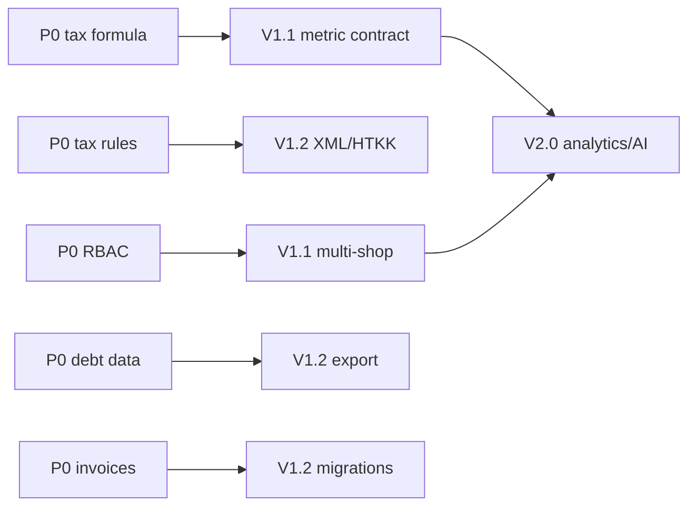

# Product Backlog và lộ trình nâng cấp

> **Cập nhật source audit 01/08/2026:** bổ sung backlog mới về quyền quyết định giá, hoàn hàng,
> phân trang, metadata auth, toàn vẹn tồn và route. Các P0 cũ bên dưới được giữ để truy vết nhưng
> không tự coi là đã đóng nếu chưa có production evidence.

> **Cập nhật backlog 26/07/2026:** bản vá và UI vòng 1 đã deploy production.
> Chỉ đóng hoàn toàn các mục có đủ kiểm thử dữ liệu, phân quyền hoặc giao dịch theo
> [danh mục test](11_ACCEPTANCE_TEST_CATALOG.md).

## Trạng thái các finding sau bản vá local

| Nhóm | Trạng thái local | Việc còn lại trước khi đóng |
|---|---|---|
| P0 RBAC/multi-shop | Đã sửa phần membership active, role cùng shop, all-shops view-only và input fail-closed | Test route integration và negative test production; thống nhất permission key frontend/backend |
| Sales summary | Đã sửa status cũ/mới, query property path và kỳ tháng | Đối soát list/summary với seed và production |
| Dashboard error state | Đã thay một số fallback bằng error/retry | Bao phủ toàn bộ màn chính, kiểm thử 4xx/5xx/timeout |
| Invoice conflict | Đã hợp nhất entity/route và có metadata test | Smoke test CRUD, kiểm tra migration/data hiện hữu |
| Thuế âm/MST placeholder | Đã sửa và có unit test | Deploy, smoke test; kiểm thử XML/XSD/HTKK riêng |
| Customer debt/CSV | Đã nối API thật, chuẩn hóa remaining và CSV an toàn; Flutter tests đạt; production hiển thị empty state thật | Đối soát API–DB–CSV khi có dữ liệu; bổ sung kỳ xuất rõ |
| Mobile POS/AI | CTA/giỏ đã hiển thị ở 390×844, AI không che POS; Flutter tests đạt | Test bàn phím ảo và thiết bị thật |
| Reporting period | Đã dùng helper chung ở dashboard/sales/finance | Chuẩn hóa timezone backend và thêm `period/asOf` vào response |

### Backlog còn mở sau bản vá

1. `P0-VERIFY`: đã deploy cùng commit và smoke test chỉ đọc; còn negative test
   phân quyền/API không phá dữ liệu.
2. `P0-RBAC-MAP`: thống nhất key permission cho tax-config/settings/finance và
   điều kiện hiển thị menu với kiểm tra API.
3. `V1.1-METRIC-CONTRACT`: mọi summary trả `from`, `to`, timezone, filter,
   `asOf`; có reconciliation fixture.
4. `V1.1-DEBT-RECON`: đối soát receivable, payment history, cash ledger và CSV.
5. `V1.1-RESPONSIVE`: matrix viewport, keyboard ảo và screenshot regression.
6. `V1.2-SYSTEM-CONFIG-MIGRATION`: tạo migration `system_configs`, thiết kế unique
   theo shop rồi loại DDL runtime.
7. `V1.2-TAX-EXPORT`: XSD/version contract, fixture và biên bản import HTKK.

## 1. Nguyên tắc ưu tiên

- `P0`: bảo mật, phân quyền, sai dữ liệu/công thức hoặc gián đoạn nghiệp vụ.
- `V1.1`: ổn định và đồng bộ chức năng hiện có.
- `V1.2`: hoàn thiện nghiệp vụ, báo cáo và kiểm soát.
- `V2.0`: mở rộng phân tích, AI và nhiều cửa hàng.

Độ khó: `S` ≤ 3 ngày, `M` khoảng 1–2 tuần, `L` trên 2 tuần; cần ước lượng lại sau
khi chốt thiết kế kỹ thuật.

## 2. P0 hiện tại — Bản vá khẩn cấp trước deploy tiếp theo

| ID | Vấn đề hiện tại | Nguyên nhân | Giải pháp đề xuất | Lợi ích | Ưu tiên | Độ khó | Rủi ro triển khai | Tiêu chí nghiệm thu |
|---|---|---|---|---|---|---|---|---|
| P0-08 | API tạo đơn tin `unitPrice` từ client | Chưa có pricing policy ở service | Backend tải sản phẩm/chính sách và quyết định giá; override cần quyền, lý do, biên độ, audit | Ngăn bán sai giá và sửa request | P0 | L | Ảnh hưởng giá sỉ/khuyến mại hiện có | Request sửa giá trái phép bị 403/validation; POS, đơn, hóa đơn dùng giá backend trả |
| P0-09 | Hoàn một phần có thể trừ toàn bộ COGS đơn | Return summary dùng `sales_orders.total_cogs` | Trả hàng theo `sales_order_item_id`, returned quantity/cost và lot reversal | Lợi nhuận gộp chính xác | P0 | L | Cần migration/backfill return cũ | Hoàn 2/10 chỉ đảo giá vốn 2; nhiều lần hoàn không vượt lượng/cost đã bán |
| P0-10 | Nhiều danh sách chỉ hiện 20 dòng đầu | Provider cố định trang 1, UI thiếu pagination | `PagedResult<T>` dùng chung, server search, pagination/infinite list | Không “mất” dữ liệu trên UI | P0 | L | Thay đổi nhiều feature/form picker | Shop 300 sản phẩm duyệt/tìm/chọn đủ; không lặp/bỏ dòng; export không chỉ trang hiện tại |
| P0-11 | Production chưa có schema cho auth hardening | Metadata `Object` đã sửa local nhưng migration production chưa chạy | Sao lưu DB; cấu hình ba secret riêng; chạy migration; cold-start và auth smoke test | Tránh backend chết cold start và lỗi truy vấn cột thiếu | P0 | S | Migration xóa OTP chờ và secret mới làm phiên cũ hết hiệu lực | Schema đủ cột/bảng; cold-start, login, refresh, logout và OTP đạt |
| P0-12 | Tồn có thể trùng theo shop/kho/sản phẩm | Thiếu unique composite và upsert invariant | Audit duplicate, hợp nhất có phê duyệt, thêm unique constraint, transaction upsert | Tồn và XNT không cộng trùng | P0 | M | Migration fail nếu production có duplicate | Query duplicate = 0; concurrent update không tạo dòng thứ hai; reconciliation đạt |
| P0-13 | KPI Kho hiển thị 20 thay vì 250 sản phẩm | Provider bỏ metadata phân trang rồi dùng `items.length` làm tổng | Giữ `PagedResult` hoặc tạo inventory summary endpoint; KPI dùng `total` | Không báo sai quy mô tồn | P0 | S | Có thể ảnh hưởng provider đang dùng ở màn khác | KPI khớp COUNT DB ở một shop/mọi shop/kho; đổi trang không đổi tổng |
| P0-14 | “Dưới định mức” thực tế là `quantity <= 10` | Provider luôn gửi threshold 10 dù UI ghi định mức sản phẩm | Mặc định dùng `products.min_stock`; threshold cố định chỉ là filter có nhãn/cấu hình | Cảnh báo nhập hàng đúng nghĩa | P0 | S | Dữ liệu hiện từ 112 cảnh báo về 0 ở shop 34 | API/UI/test cùng dùng định mức; filter tùy chọn ghi rõ ngưỡng |
| P0-15 | 60 hóa đơn đầu vào không có dòng hàng | Seed/import chỉ tạo invoice header cho 30 PO mỗi shop | Bổ sung item từ PO có đối soát; bắt buộc invoice hợp lệ có ít nhất một dòng | Drill-down và báo cáo thuế có bằng chứng | P0 | M | Backfill sai giá/số lượng làm lệch thuế và tồn | Shop 34/35 đều có 0 invoice hợp lệ thiếu item; header khớp tổng dòng |
| P0-16 | 558 hóa đơn bán không tự đối soát giảm giá | Header lưu subtotal sau giảm, dòng lưu trước giảm; invoice thiếu `discount_amount` | Chốt contract gross/discount/tax/total, migration/backfill từ đơn gốc, validator bắt buộc cân bằng | Invoice và export không phụ thuộc join ngầm | P0 | L | Contract/migration ảnh hưởng invoice cũ và XML | Mọi invoice tự cân bằng từ dòng; discount allocated rõ; fixture/export khớp |

## 2.1 P0 cũ — Giữ để xác minh đóng trên production

| ID | Vấn đề hiện tại | Nguyên nhân | Giải pháp đề xuất | Lợi ích | Ưu tiên | Độ khó | Rủi ro triển khai | Tiêu chí nghiệm thu |
|---|---|---|---|---|---|---|---|---|
| P0-01 | Người dùng thường có thể dùng `x-shop-id: all` và bỏ qua quyền | Frontend tự đặt OWNER; middleware `all` luôn `next()` | Chỉ backend quyết định scope; kiểm tra quyền trên từng shop; xóa suy luận OWNER ở client | Ngăn truy cập trái phép | P0 | M | Thay đổi có thể làm lộ route đang phụ thuộc hành vi cũ | Employee không quyền nhận 403 ở shop đơn và `all`; owner vẫn dùng được; có integration test |
| P0-02 | Customer, supplier, tag, tax-config thiếu permission middleware | Route chỉ nằm sau auth + shop scope | Gắn permission key/level nhất quán; thêm negative tests | Bảo vệ dữ liệu nghiệp vụ | P0 | M | Có thể chặn nhầm vai trò đang dùng | Ma trận route–permission đầy đủ; test owner/view/edit/none đạt |
| P0-03 | Ngưỡng miễn thuế 100 triệu và tri thức AI đã lỗi thời | Hard-code từ TT40/2021 | Vô hiệu hóa cảnh báo cũ; lưu rule theo văn bản/hiệu lực; cập nhật nội dung đã duyệt | Tránh tư vấn/kết quả sai | P0 | M | Diễn giải pháp lý sai nếu không được duyệt | Không còn khẳng định 100 triệu là hiện hành; rule có nguồn, ngày hiệu lực và người duyệt |
| P0-04 | Dashboard sinh VAT/TNDN âm | Thuế nhân trực tiếp với lợi nhuận âm hoặc số liệu không đúng cơ sở tính | Tách cơ sở VAT/PIT; chặn min 0 khi quy tắc yêu cầu; hiển thị “cần đối soát” nếu dữ liệu thiếu | Tránh nghĩa vụ thuế vô nghĩa | P0 | M | Dễ sửa sai nếu chưa chốt công thức với kế toán | Test số âm/0/dương; expected result được BA + chuyên gia thuế duyệt |
| P0-05 | Sổ nợ và Excel dùng dữ liệu mẫu | Màn hình khai báo list hard-code | Tạm gắn nhãn demo hoặc ẩn; sau đó nối API receivables/payment history | Ngăn người dùng tin dữ liệu giả | P0 | M | Chuyển sang dữ liệu thật có thể lộ thiếu migration | Không còn tên/số liệu mẫu; tổng nợ = tổng dòng; file Excel khớp API |
| P0-06 | Hai entity và route cùng sở hữu `invoices` | Finance/system phát triển song song | Chọn bounded context chủ sở hữu; đổi tên/migrate theo kế hoạch được duyệt; version API nếu contract đổi | Giảm ghi/đọc nhầm bảng | P0 | L | Migration dữ liệu và tương thích API cao | Chỉ một mapping cho mỗi bảng; route không shadow; migration rollback-tested |
| P0-07 | XML có thể dùng MST fallback giả | Service tự điền `0123456789` | Bắt buộc hồ sơ hợp lệ trước khi xuất; không sinh file nếu thiếu MST | Ngăn tệp kê khai sai | P0 | S | Chặn người dùng chưa hoàn thiện hồ sơ | Thiếu MST trả lỗi nghiệp vụ rõ; không tạo file; MST hợp lệ đi đúng vào XML |

## 3. V1.1 – Ổn định

| ID | Vấn đề hiện tại | Nguyên nhân | Giải pháp đề xuất | Lợi ích | Ưu tiên | Độ khó | Rủi ro triển khai | Tiêu chí nghiệm thu |
|---|---|---|---|---|---|---|---|---|
| V11-01 | Dashboard, sales và finance không khớp | Khác khoảng thời gian, trạng thái đơn và định nghĩa metric | Tạo metric contract chung; backend trả `period`, `filters`, `asOf`; UI hiển thị cùng định nghĩa | Một nguồn sự thật | V1.1 | L | Thay đổi số đã quen dùng | Dashboard/sales/finance khớp trên seed data và query kiểm soát |
| V11-02 | Tổng số đơn là 0 dù danh sách có đơn | Summary/filter khác list | Dùng chung query builder/filter trạng thái và kỳ | Tăng độ tin cậy | V1.1 | S | Cache hoặc timezone | Tổng dòng và summary khớp ở 4 filter; có timezone test |
| V11-03 | Mobile dashboard/POS/settings bị cắt/che | Row/chip không wrap; AI FAB và nav dùng vùng chồng lấp | Responsive layout theo breakpoint; safe area; chuyển FAB sang vị trí không che CTA | Hoàn tất luồng trên mobile | V1.1 | M | Thay đổi layout desktop | 390×844 không overflow; POS hoàn tất được; nội dung cuối trang cuộn lên trên nav |
| V11-04 | Loading/empty/error không đồng nhất | Mỗi feature tự xử lý | Chuẩn hóa component và error model; retry có kiểm soát | Dễ hiểu khi lỗi mạng/dữ liệu rỗng | V1.1 | M | Che mất lỗi nghiệp vụ nếu map sai | Tất cả màn chính có loading/empty/error; lỗi 4xx giữ message an toàn |
| V11-05 | Nhiều controller không hỗ trợ `all` | Chỉ sales/finance/inventory có helper scope | Chuẩn hóa `ShopScope` bắt buộc và repository helper | Ngăn query thiếu shopId | V1.1 | L | Query tổng hợp lớn/chậm | Mọi query shop-scoped có test shop đơn + nhiều shop, không trả ngoài scope |
| V11-06 | Bộ test chạy được trên máy hiện tại nhưng chưa là cổng CI bắt buộc | Toolchain local đã hoạt động; pipeline chưa lưu bằng chứng phát hành | Chuẩn hóa CI; pin dependency; lưu artifact test; giữ backend build/lint/P0 trong pipeline | Có cổng chất lượng lặp lại | V1.1 | M | Nâng package gây warning mới | CI chạy analyze, Flutter test, backend build/lint/P0 trên mỗi PR |
| V11-07 | Backend phát cảnh báo Node `DEP0169` trên mỗi số lần gọi serverless | Một dependency còn dùng API `url.parse()` đã bị deprecate | Dùng trace ở staging để xác định package; nâng dependency nhỏ nhất, chạy lại P0 và smoke test | Giảm nợ kỹ thuật và rủi ro tương thích Node | V1.1 | S–M | Nâng transitive dependency có thể đổi hành vi kết nối | Production không còn `DEP0169`; toàn bộ P0 suite hiện hành và API smoke test đạt |
| V11-08 | CTA nhập kho/chi tiết hoàn đã resolve local nhưng detail còn phụ thuộc `state.extra` | Route registry trước đây thiếu contract deep-link | Giữ route registry test; chuyển màn detail tải API theo `:id` khi reload | Luồng không đứt và chia sẻ/reload URL được | V1.1 | M | Cần thống nhất model detail từ API | Mọi CTA resolve; reload detail giữ dữ liệu; route test không có path dùng nhưng chưa khai báo |
| V11-09 | Header, primary action và bảng không đồng nhất | Chỉ 9 điểm dùng `AppPageHeader`; `AppDataTable` thiếu pagination/sort/mobile card | `AppScreenScaffold`, action responsive, `AppPagedTable` + `AppRecordCardList` | Giao diện chuyên nghiệp, dày thông tin đúng thiết bị | V1.1 | L | Chuyển đổi nhiều màn | 55 route dùng pattern được duyệt; desktop/mobile screenshot regression đạt |
| V11-10 | Guard frontend lệch quyền API | Menu/router và middleware có mapping riêng | Một route-policy frontend sinh từ ma trận module/action; contract test với backend | Không vào màn rồi gặp 403 hoặc bị chặn sai | V1.1 | M | Có thể lộ menu cũ đang sai | Owner/view/edit/none test đạt cho tax, activity log, AI knowledge và config |
| V11-11 | Công nợ tải 453 khoản mở cùng lúc ở shop 34 | Endpoint trả toàn bộ; bảng không pagination/virtualize | Server pagination/filter/sort; desktop sticky table, mobile record card; export server-side | Tải nhanh và kiểm soát được tập dữ liệu | V1.1 | M | Cần giữ tương thích export/thu nợ | First load ≤50 dòng; tổng đúng DB; lọc/sort/page không lặp mất dòng; export khớp bộ lọc |
| V11-12 | Form public desktop quá hẹp, validation lỗi chung | Register/forgot dùng layout mobile cố định; login submit thẳng API | Public auth shell chung; inline validation; xóa lỗi khi nhập/chuyển route | Tăng độ tin cậy và dễ hoàn thành | V1.1 | M | Thay đổi nhiều trạng thái auth | 1440×900 cân đối; 390×844 không overflow; submit rỗng không gọi API; lỗi gắn đúng trường |

## 4. V1.2 – Hoàn thiện nghiệp vụ

| ID | Vấn đề hiện tại | Nguyên nhân | Giải pháp đề xuất | Lợi ích | Ưu tiên | Độ khó | Rủi ro triển khai | Tiêu chí nghiệm thu |
|---|---|---|---|---|---|---|---|---|
| V12-01 | XNT/COGS chưa có đối soát chuẩn | Thiếu dataset và invariant | Xây seed ledger; kiểm tra tồn đầu + nhập - xuất ± điều chỉnh; khóa âm theo cấu hình | Tin cậy tồn và lợi nhuận | V1.2 | L | Dữ liệu lịch sử có thể không cân | 100% sản phẩm trong seed cân; báo cáo chênh lệch cho dữ liệu cũ |
| V12-02 | Hoàn/hủy chưa chứng minh transaction toàn vẹn | Nhiều bảng bị ảnh hưởng | Transaction DB + idempotency + audit; test failure injection | Không trừ/hoàn tiền một phần | V1.2 | L | Race condition/payment callback | Retry không nhân đôi; lỗi giữa chừng rollback toàn bộ |
| V12-03 | Excel/XML chưa có hợp đồng dữ liệu | Xuất trực tiếp từ UI/service | Định nghĩa schema/version, metadata kỳ, tổng kiểm soát và validator | Báo cáo dùng được | V1.2 | L | HTKK thay đổi phiên bản | Fixture pass validator; import HTKK được ghi biên bản; Excel khớp DB |
| V12-04 | DDL chạy trong startup/cold start | Thiếu migration quản trị | Chuyển toàn bộ DDL sang migration idempotent có checksum; runtime chỉ connect | Ổn định serverless | V1.2 | M | Migration sai làm downtime | Cold start không chạy DDL; migration dry-run/staging/rollback thành công |
| V12-05 | Audit log chưa bao phủ thao tác trọng yếu | Ghi log rời rạc | Chuẩn event: actor, shop, action, entity, before/after, correlation ID | Truy vết và bảo vệ dữ liệu | V1.2 | L | Lộ dữ liệu nhạy cảm trong log | Sale/return/stock/role/tax export có log; secret/PII nhạy cảm bị redaction |
| V12-06 | Token/OTP thiếu hardening | Chưa có rotation, rate limit toàn diện | Secret riêng, refresh rotation/revoke, OTP hash/attempt limit, lockout hợp lý | Giảm chiếm tài khoản | V1.2 | L | Có thể đăng xuất người dùng hiện có | Security tests đạt; tài liệu recovery; không trả OTP ở production |

## 5. V2.0 – Mở rộng

| ID | Vấn đề/cơ hội | Nguyên nhân | Giải pháp đề xuất | Lợi ích | Ưu tiên | Độ khó | Rủi ro triển khai | Tiêu chí nghiệm thu |
|---|---|---|---|---|---|---|---|---|
| V20-01 | Cảnh báo hiện chủ yếu theo ngưỡng tĩnh | Thiếu pipeline phân tích | Forecast tồn, cashflow và anomaly với giải thích/độ tin cậy | Chủ động vận hành | V2.0 | L | False positive | Có baseline, precision target, lý do và nút phản hồi |
| V20-02 | AI khẳng định “100%” nhưng nguồn mặc định có thể lỗi thời | Tri thức nằm ở client, thiếu vòng đời duyệt | Knowledge service server-side, citation, effective date, approval, revoke và “không đủ nguồn” | AI có kiểm soát | V2.0 | L | Hallucination/pháp lý | Mọi câu trả lời nghiệp vụ có citation; nguồn hết hiệu lực không được dùng |
| V20-03 | Tổng hợp nhiều cửa hàng chưa tối ưu | Query scope chưa thống nhất | Data mart/read model theo shop + period, cache theo quyền | Phân tích chuỗi cửa hàng | V2.0 | L | Dữ liệu trễ | SLA freshness được công bố; không rò dữ liệu giữa shop |
| V20-04 | Thiếu dashboard quản trị chất lượng dữ liệu | Không có reconciliation jobs | KPI chất lượng: missing tax code, stock mismatch, orphan invoice, failed export | Phát hiện sai sớm | V2.0 | L | Quá nhiều cảnh báo | Có owner, SLA xử lý và drill-down cho từng lỗi |

## 6. Thứ tự phụ thuộc

## 7. Definition of Done cho mọi backlog item

- Requirement và acceptance criteria được duyệt.
- Có test thành công, test lỗi và test phân quyền phù hợp.
- Không chứa dữ liệu mẫu trong production trừ khi có nhãn `Demo`.
- Migration/API contract có kế hoạch tương thích và rollback khi áp dụng.
- Tài liệu traceability và verification được cập nhật.
- Có bằng chứng staging; production smoke test không làm thay đổi dữ liệu ngoài kế hoạch.
