# Kiểm toán trực quan production — vòng 3 ngày 01/08/2026

## 1. Phạm vi và mức bằng chứng

- Production được kiểm tra: `https://smartstock-tax.vercel.app/`.
- Commit production đang đối chiếu: `093b17ac`; code local đang đi trước production.
- 62 ảnh đã được chụp và mở kiểm tra lại trong vòng audit hiện tại:
  - 52 ảnh desktop `1280×720`;
  - 10 ảnh mobile `390×843`;
  - bao phủ 49 route/màn nghiệp vụ bảo vệ;
  - có bằng chứng riêng cho Page Not Found và hai deep-link dựng object rỗng.
- Ảnh nằm tại [`screenshots/20260801-production-audit-run3/`](screenshots/20260801-production-audit-run3/).
- Chỉ thực hiện luồng đọc và mở form; không lưu form, duyệt chứng từ, khóa sổ, xóa dữ liệu hay nộp thuế.

Kết luận tổng quát: shell, typography và card đã thống nhất hơn trước, nhưng production chưa đủ điều kiện
được coi là chính xác nghiệp vụ. Có bảy sai lệch P0 nhìn thấy trực tiếp và nhiều vấn đề P1 về phân trang,
ngữ nghĩa kỳ báo cáo, dữ liệu test và xung đột giữa nút AI với hành động chính.

## 2. Các bước kiểm toán và sức khỏe chung

| Bước | Khu vực | Sức khỏe | Bằng chứng chính |
|---:|---|---|---|
| 1 | Dashboard | Đúng một phần | KPI tải được; kỳ tháng mới là 0 nhưng biểu đồ so sánh và cảnh báo vẫn cần giải thích rõ kỳ |
| 2 | Bán hàng/POS | Không chính xác | Cùng mã đơn nhưng tên khách ở list/detail khác nhau; hoàn hàng không chọn dòng/số lượng |
| 3 | Sản phẩm/khách/NCC | Đúng một phần | Ảnh, giá bán, đơn vị đã hiện; danh sách chỉ tải trang đầu và CTA desktop thường bị AI che |
| 4 | Kho/nhập hàng | Không chính xác | KPI `20 tổng sản phẩm` nhỏ hơn `112 dưới định mức`; route form đơn nhập lỗi production |
| 5 | Tài chính | Không chính xác | Sổ lương gắn nhãn tháng 8 nhưng chứa giao dịch 10/07; nhiều báo cáo mặc định một ngày nên trống |
| 6 | Công nợ | Đúng một phần | Tổng nợ và aging có dữ liệu; 453 khoản phải thu chưa có phân trang và biểu đồ aging thiếu trục/đơn vị |
| 7 | Thuế | Đúng một phần, rủi ro cao | Có nguồn pháp lý 2026; kỳ mặc định và thứ tự nghĩa vụ chưa hợp lý; nút “Nộp” chỉ mở thông báo |
| 8 | Cài đặt/RBAC/audit | Đúng một phần | Mở được màn quản trị; quyền còn lẫn key kỹ thuật, log không đủ actor/entity/before-after |
| 9 | Form và hồ sơ | Đúng một phần | Form sản phẩm chia nhóm tốt; email hồ sơ không khớp tiêu đề; hồ sơ cửa hàng thiếu dữ liệu pháp lý |
| 10 | Mobile/responsive | Đúng một phần | Card reflow tốt; AI che CTA, bảng/biểu đồ quan trọng bị đẩy xuống dưới nếp gấp |

Không ghi nhận đạt accessibility. Chưa kiểm thử bàn phím, focus, screen reader, zoom 200% và độ tương phản
bằng công cụ chuyên biệt.

## 3. Bằng chứng trực quan tiêu biểu

### 3.1 Dashboard — hierarchy tốt hơn, nhưng kỳ so sánh chưa rõ

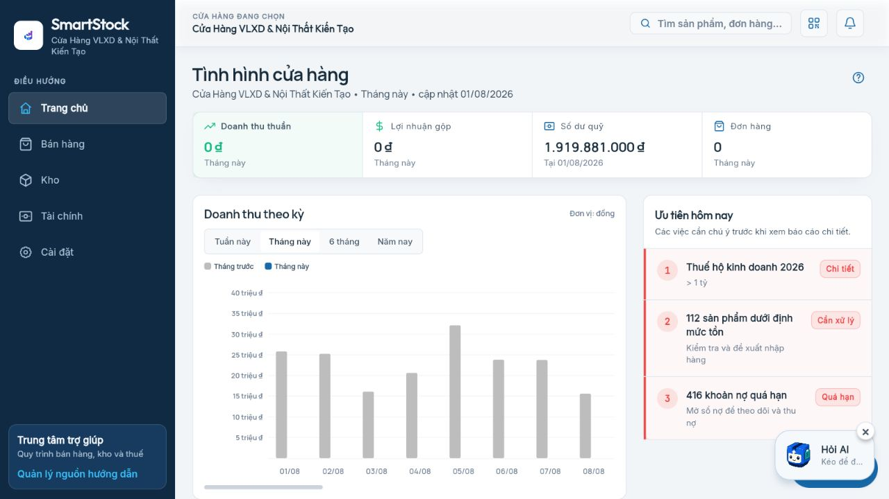

- KPI và ưu tiên hôm nay nằm đúng vùng đầu màn hình.
- Ngày hiện tại là `01/08/2026`; doanh thu/đơn tháng này bằng 0 là có thể hợp lệ, nhưng các cột màu xám
  gắn nhãn ngày 02–08/08 làm người dùng dễ hiểu là dữ liệu tương lai thay vì kỳ so sánh.
- Cần ghi rõ `Tuần trước`/`Cùng kỳ tháng trước`, tooltip có ngày nguồn và bỏ thanh cuộn ngang nếu chỉ có 8 cột.

### 3.2 Kho — mâu thuẫn KPI production

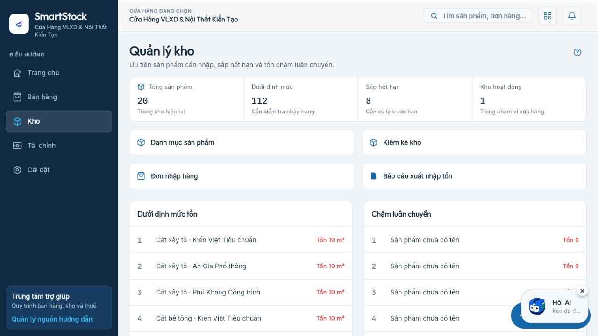

- `Tổng sản phẩm = 20` nhưng `Dưới định mức = 112`: số tổng lấy trang đầu, cảnh báo lấy toàn tập.
- Danh sách chậm luân chuyển có nhiều dòng “Sản phẩm chưa có tên”, cho thấy read model/API chưa trả đủ product.
- Bản sửa local đã chuyển KPI tổng sang tổng server và cảnh báo theo `min_stock`; chưa được deploy.

### 3.3 Tài chính mobile — KPI chiếm toàn bộ nếp gấp

- Bốn KPI xếp thành bốn card dọc; biểu đồ và công việc tài chính bị đẩy xuống sâu.
- Đề xuất mobile dùng lưới `2×2`, mỗi card cao 88–104 px; desktop giữ một hàng bốn card.
- Nút AI che một phần nút “Lịch sử giao dịch”.

### 3.4 Sản phẩm mobile — dữ liệu giàu hơn và đúng ngữ cảnh

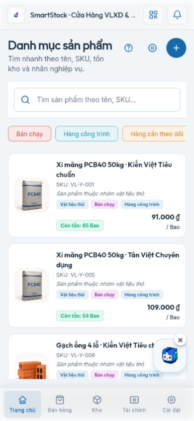

- Ảnh, SKU, nhóm, tag, tồn, giá và đơn vị `/Bao` được hiển thị.
- Đây là pattern mobile nên tái sử dụng cho khách hàng, nhà cung cấp và chứng từ thay vì ép bảng ngang.
- Cần tổng số bản ghi, trạng thái tải tiếp/phân trang và bộ lọc đang áp dụng.

### 3.5 Công nợ — bảng tốt nhưng chưa đủ khả năng vận hành

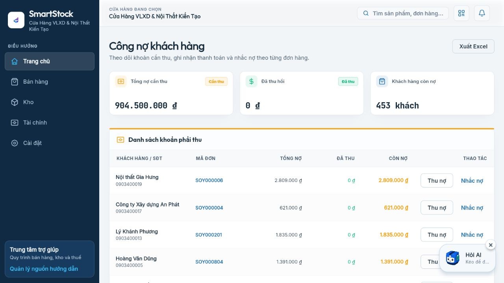

- Tổng nợ `904.500.000 đ` và `453 khách` hiển thị rõ.
- Bảng thiếu hạn nợ, bucket tuổi nợ, lần nhắc gần nhất, người phụ trách và phân trang.
- AI che thao tác ở các hàng dưới; export đặt tách khỏi phạm vi lọc của bảng.

### 3.6 Thuế — có nguồn mới nhưng kỳ và trạng thái chưa rõ

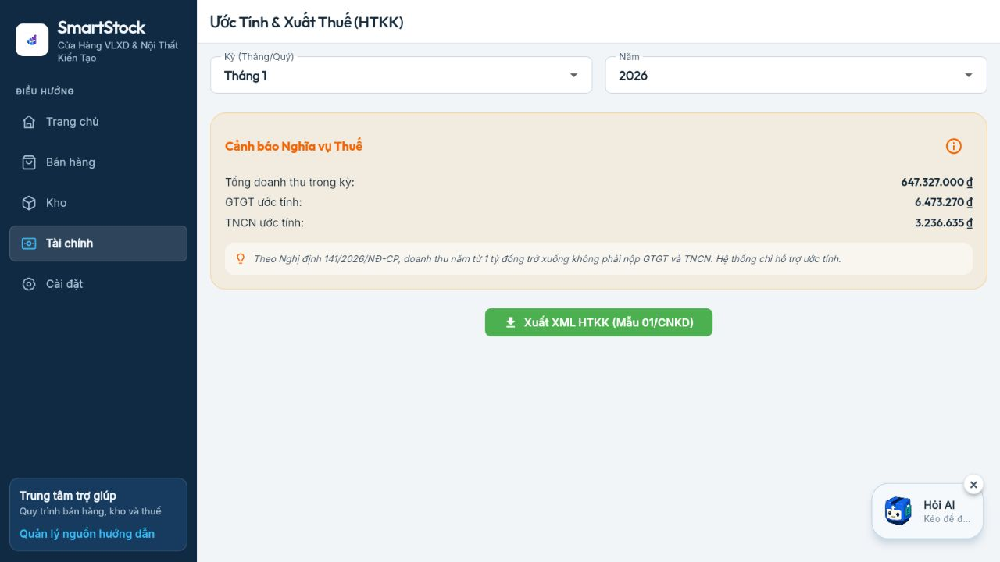

- Màn đang mặc định `Tháng 1/2026` dù ngày hệ thống là 01/08/2026.
- Nội dung viện dẫn Nghị định 141/2026/NĐ-CP là văn bản có thật; ngưỡng doanh thu hộ kinh doanh không
  phải nộp GTGT/TNCN đã được nâng lên 1 tỷ đồng. Nguồn chính thức:
  [Cổng văn bản Chính phủ](https://vanban.chinhphu.vn/?classid=1&docid=217960&pageid=27160&typegroupid=4).
- Ứng dụng vẫn phải hiển thị phiên bản quy tắc, ngày hiệu lực, phạm vi ngành và cách xác định doanh thu năm;
  không chỉ ghi một câu chú thích.

### 3.7 Mua hàng không hóa đơn — dữ liệu không hợp lệ đã được duyệt

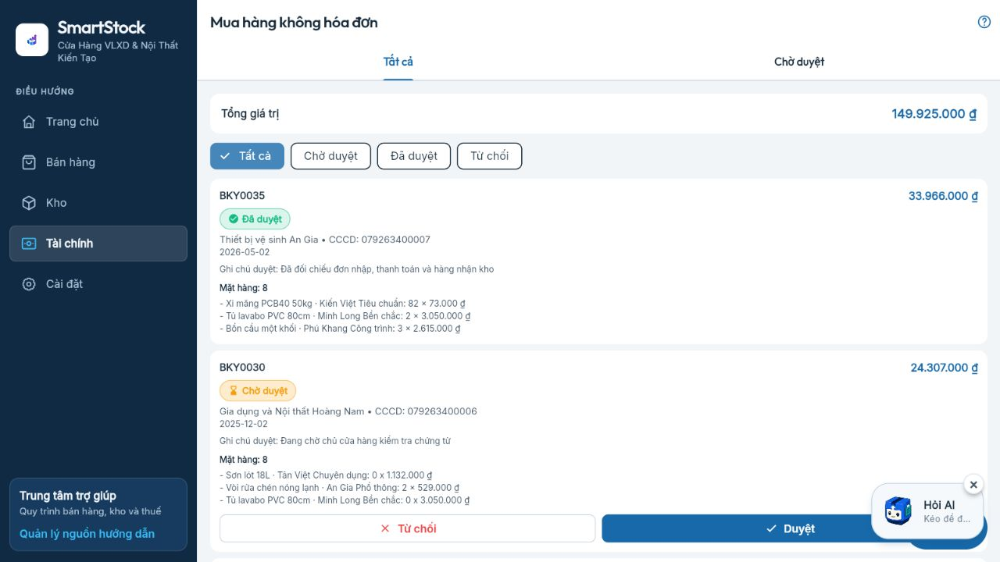

- Chứng từ `BKY0030` đang chờ duyệt có dòng `Tủ lavabo PVC 80cm ... 0 × 3.050.000 đ`.
- Quantity bằng 0 phải bị chặn ở import, API và UI; không được tham gia tổng hoặc chuyển trạng thái duyệt.
- Cần hiển thị tổng dòng, tổng chứng từ và lỗi validation cạnh chính dòng hàng.

### 3.8 Sổ lương — nhãn kỳ không khớp tập dữ liệu

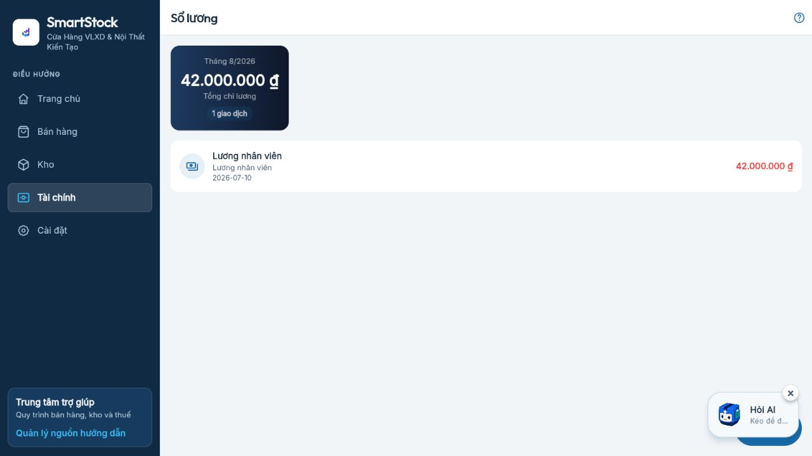

- Header ghi `Tháng 8/2026`, nhưng giao dịch duy nhất có ngày `2026-07-10`.
- Source hiện gọi trang 1 toàn bộ giao dịch chi rồi lọc `SALARY` ở frontend, không truyền `from/to` nhưng vẫn
  gắn nhãn tháng hiện tại. Đây là lỗi công thức/kỳ, không chỉ là lỗi trình bày.

### 3.9 Route form đơn nhập lỗi production

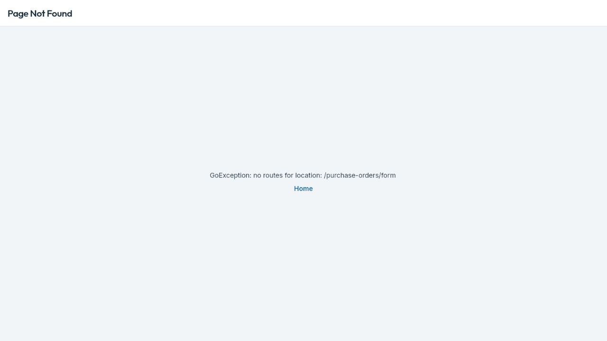

- Dashboard production có CTA đẩy tới `/purchase-orders/form`, nhưng router ở commit production không khai
  báo route này nên mở trực tiếp trả `Page Not Found`.
- Router local đã có route; cần widget smoke test CTA và deep-link sau khi deploy.

### 3.10 RBAC — chưa phải ma trận quyền nghiệp vụ

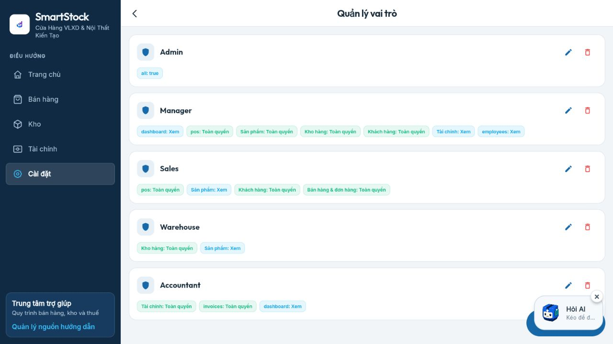

- Quyền hiển thị lẫn `all: true`, `dashboard: Xem`, `pos`, `employees` và tên tiếng Việt.
- Người dùng không biết quyền nào bao hàm quyền nào, quyền nguy hiểm nào sẽ được cấp và thay đổi gì so với hiện tại.
- Desktop cần ma trận module × hành động; mobile dùng accordion theo module, có preview diff trước khi lưu/xóa.

### 3.11 Đơn bán — list và detail không cùng khách hàng

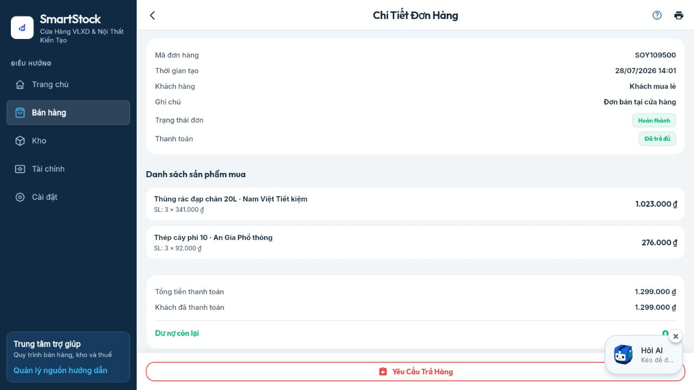

- Danh sách hiển thị `SOY109500 — Đội thầu Minh Tâm`; chi tiết cùng mã lại ghi `Khách mua lẻ`.
- Source backend `findOne` chỉ join `items`, `items.product`, `payments`, không join `customer`; frontend rơi về
  chuỗi mặc định. Đây là lỗi API contract của màn chi tiết.
- Hai dòng hàng cộng đúng `1.299.000 đ`; sai lệch nằm ở định danh khách hàng, không phải tổng dòng trong mẫu này.

### 3.12 Hoàn hàng — chưa hỗ trợ hoàn theo dòng/số lượng

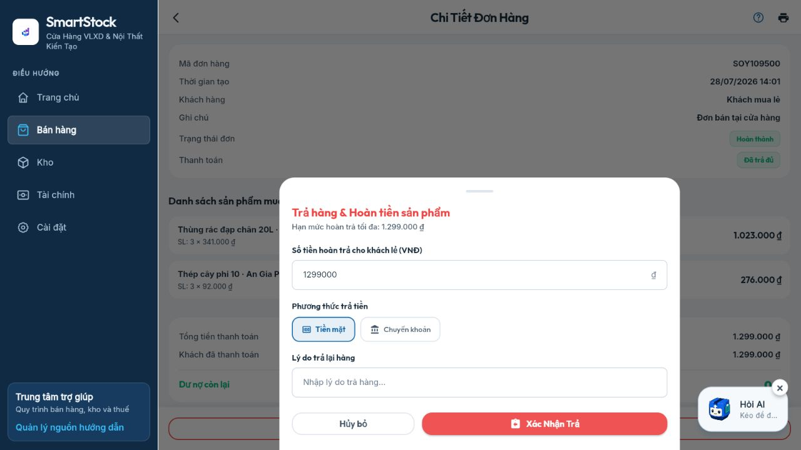

- Modal chỉ nhập tổng tiền hoàn và phương thức, mặc định toàn bộ `1.299.000 đ`.
- Không có `sales_order_item_id`, số lượng trả, giá vốn/lô và số lượng đã trả trước đó.
- Bằng chứng UI này khớp rủi ro P0-09: hoàn một phần có thể đảo toàn bộ COGS của đơn.

### 3.13 Deep-link dựng dữ liệu giả rỗng thay vì báo lỗi

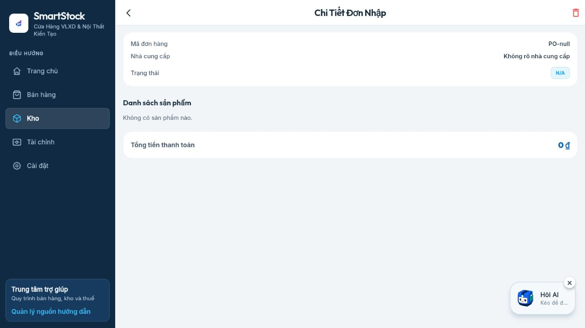

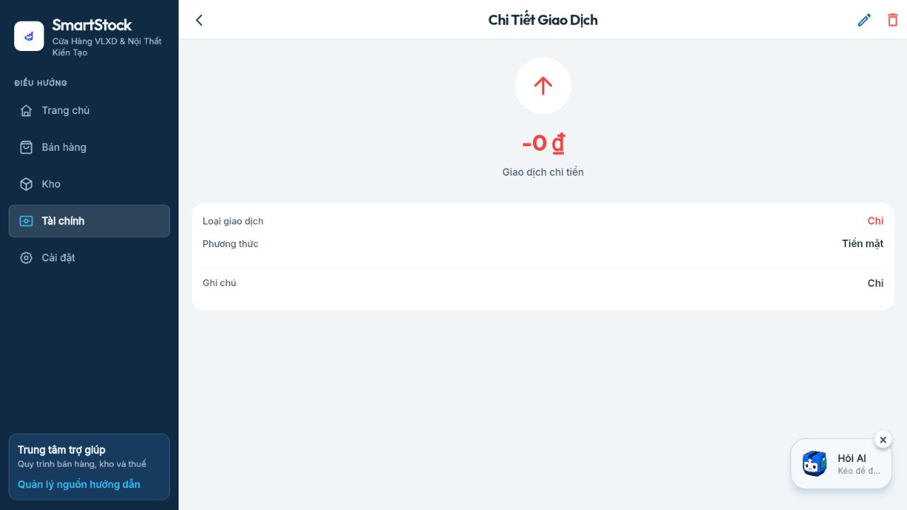

- Mở trực tiếp detail không có `state.extra` tạo `PO-null`, `Không rõ nhà cung cấp`, `-0 đ` và vẫn hiện nút xóa/sửa.
- Route detail phải nhận `:id`, gọi API, hiển thị loading/error/not-found và không render destructive action khi thiếu id.

### 3.14 Ảnh sản phẩm không nhất quán list/detail

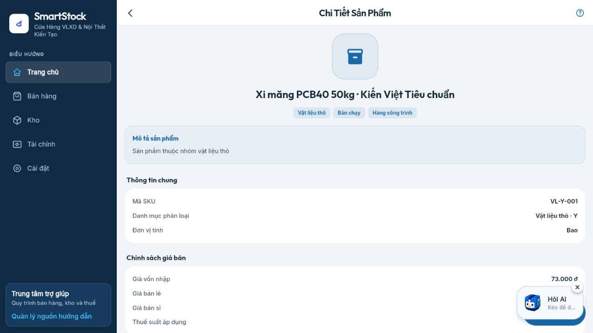

- Danh sách hiển thị ảnh xi măng đã tải lên, nhưng detail cùng sản phẩm chỉ hiện icon hộp mặc định.
- Detail phải dùng cùng `imageUrl`/thumbnail contract với list và có fallback chỉ khi ảnh thật lỗi.

## 4. Sai lệch ưu tiên

### P0 — phải sửa trước deploy rộng

| Mã | Sai lệch | Tác động | Tiêu chí nghiệm thu |
|---|---|---|---|
| UI-DATA-01 | Tổng sản phẩm 20 nhưng dưới định mức 112 | Người dùng quyết định nhập hàng từ KPI sai | Tổng, cảnh báo và export cùng scope; test >20 sản phẩm |
| FIN-01 | Sổ lương tháng hiện tại lấy giao dịch ngoài kỳ | Sai báo cáo chi phí/lương | API nhận `from/to`; tổng bằng đúng dòng trong kỳ; test ranh giới tháng |
| PUR-01 | Chứng từ có quantity 0 | Tổng mua/giá vốn và kiểm soát duyệt sai | DB/API/UI chặn `quantity <= 0`; validator production không còn dòng lỗi |
| NAV-01 | `/purchase-orders/form` Page Not Found | Luồng nhập hàng bị gián đoạn | CTA mở form; refresh URL thành công; route registry/widget test đạt |
| SALES-01 | List/detail cùng mã đơn khác khách hàng | In phiếu, thu nợ và chăm sóc nhầm khách | API detail join customer; list/detail/invoice cùng `customerId/name`; contract test đạt |
| SALES-02 | Modal hoàn không có dòng/số lượng trả | Sai tồn, COGS, doanh thu thuần và tiền hoàn | Hoàn theo item/quantity/cost lot; nhiều lần hoàn không vượt số đã bán |
| NAV-02 | Deep-link detail tạo `PO-null` và `-0 đ` | Dữ liệu giả, action sửa/xóa trên object không hợp lệ | Route `:id`, API fetch, not-found; action bị ẩn/disable khi chưa có entity |

### P1 — ổn định và làm rõ nghiệp vụ

| Mã | Sai lệch | Hướng sửa |
|---|---|---|
| UI-01 | AI che FAB/nút và row action trên desktop/mobile | Khi panel/nút hành động nằm cùng góc, tự dịch launcher; không cho hai CTA chồng bounding box |
| UI-02 | Danh sách >20/453 dòng không phân trang | `AppPagedTable` + server search/filter/sort + tổng toàn tập |
| UI-03 | Aging/forecast thiếu trục, đơn vị, tooltip | Chuẩn chart title/subtitle/unit/legend/tooltip/source/as-of |
| UI-04 | Báo cáo mặc định một ngày tạo màn trống lớn | Mặc định 7/30 ngày hoặc “kỳ gần nhất có dữ liệu”; giữ nút chuyển kỳ rõ |
| UI-05 | Nút “Nộp tờ khai” chỉ mở disclaimer | Đổi thành “Hướng dẫn nộp”; chỉ dùng “Nộp” khi có tích hợp thật và receipt |
| DATA-02 | Notification/nhân viên còn tên `Simulated ...` | Tách dữ liệu demo khỏi production-facing test shop hoặc gắn nhãn demo rõ |
| DATA-03 | Hồ sơ cửa hàng thiếu MST/địa chỉ/chủ hộ | Thêm completeness score và chặn luồng thuế khi dữ liệu bắt buộc thiếu |
| RBAC-01 | Permission key kỹ thuật lẫn tên nghiệp vụ | Dictionary quyền thống nhất FE/BE, Việt hóa label, hiển thị diff và audit |
| AUDIT-01 | Log chỉ ghi “Cập nhật thông tin”, actor “Hệ thống” | Actor, shop, action, entity, id, before/after, IP/device/correlation id theo chính sách |
| MEDIA-01 | Product list có ảnh nhưng detail dùng icon mặc định | Người dùng khó xác nhận đúng sản phẩm | Một image contract; thumbnail/list/detail cùng nguồn; fallback khi tải lỗi |
| CREDIT-01 | Khách nợ 48,414 triệu nhưng hạn mức 25 triệu không có cảnh báo | Tiếp tục bán chịu vượt kiểm soát | Cảnh báo exposure/limit, chặn hoặc yêu cầu quyền override có lý do/audit |

## 5. Đánh giá bảng và biểu đồ so với hệ thống lớn

Đối chiếu chi tiết và nguồn chính thức nằm tại
[23 — KPI, báo cáo, bảng và dữ liệu chuẩn](23_KPI_REPORT_TABLE_AND_DATA_BENCHMARK_20260801.md).

Các hệ thống như Shopify, Square, Dynamics 365 Commerce, Lightspeed và Odoo có điểm chung:

1. KPI tóm tắt luôn drill-down được đến tập giao dịch nguồn.
2. Filter nằm cùng phạm vi bảng/biểu đồ và có kỳ, cửa hàng, trạng thái rõ.
3. Danh sách lớn có server pagination, sort, export theo toàn bộ tập lọc.
4. Inventory ưu tiên sell-through, days on hand, turnover, stockout/low-stock và valuation.
5. Báo cáo tài chính tách doanh thu thuần, hoàn/giảm trừ, COGS, gross margin, operating expense và cash.

Ứng dụng hiện có đủ nền tảng cho dashboard cơ bản, POS, tồn, công nợ và thuế; chưa đủ cho báo cáo vận hành
đáng tin cậy vì thiếu metric contract, phân trang, kỳ chuẩn, đối soát và data-quality gate.

## 6. Thứ tự triển khai tối ưu

1. **P0 dữ liệu và route:** inventory KPI, salary period, quantity 0, purchase-order form.
2. **Nền component:** `AppScreenScaffold`, `AppPagedTable`, mobile record card, chart contract, collision manager cho AI/FAB.
3. **Báo cáo lõi:** sales net/gross/return, P&L, inventory movement/valuation, AR/AP aging, payment reconciliation.
4. **Thuế và audit:** rule version/effective date/source, data-quality gate trước XML, log before/after.
5. **Responsive/accessibility:** mobile tất cả route, keyboard/focus/zoom/screen reader và contrast chuyên biệt.

## 7. Phần chưa xác minh

- 7 route/trạng thái còn lại chưa có ảnh production vòng 3: auth/onboarding/waiting approval và chi tiết phiếu trả đã lưu.
- Mobile mới chụp 10 màn lõi, chưa bao phủ toàn bộ 56 route.
- Chưa thao tác ghi: thanh toán, hoàn/hủy, thu nợ, duyệt chứng từ, khóa sổ, upload/xóa ảnh, đổi quyền.
- Chưa xác minh tooltip bằng tương tác, drag chart, horizontal scroll, keyboard hoặc assistive technology.
- Hai màn code mồ côi `budget_plan_screen` và `invoice_scan_screen` chưa có route/điểm vào.

Vì vậy audit này là bằng chứng mạnh cho các sai lệch nêu trên, nhưng chưa phải tuyên bố toàn bộ hệ thống đạt.
