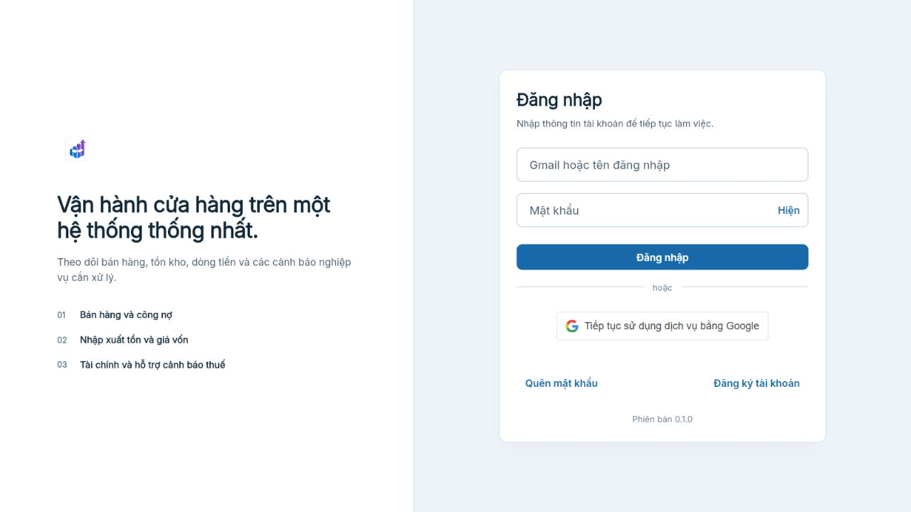
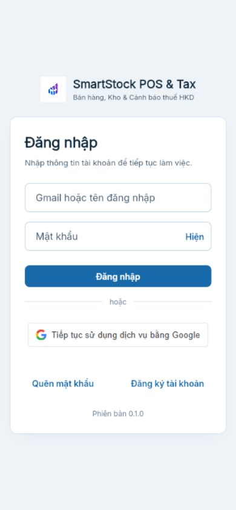

# Audit UI và KPI hàng trả — 13/08/2026

## Phạm vi

- Luồng công khai: đăng nhập production trên desktop và mobile 390×844.
- Luồng nghiệp vụ: tổng quan Bán hàng, KPI tỷ lệ hàng trả và bảng sản phẩm bị trả nhiều ở code local.
- Nguồn số liệu: PostgreSQL production, chỉ đọc; không migration, không backfill.

## Các bước và tình trạng

| Bước | Màn hình / dữ liệu | Tình trạng |
|---|---|---|
| 1 | Đăng nhập production desktop | Tốt: thứ bậc rõ, CTA chính nổi bật, không có lỗi console. |
| 2 | Đăng nhập production mobile 390×844 | Tốt sau khi trang ổn định: nội dung vừa chiều rộng. Ảnh chụp trước reflow bị loại khỏi bằng chứng. |
| 3 | Đối soát dữ liệu trả hàng | Đạt có lưu ý: shop 34 có 67 phiếu/0,87%; shop 35 có 78 phiếu/0,92%; không có phiếu thiếu lý do. Shop 36 chưa có giao dịch nên tỷ lệ 0 là trạng thái thiếu dữ liệu, không phải hiệu suất tốt. |
| 4 | KPI và bảng hàng trả local | Đạt test responsive 390/1280: KPI và bảng dùng API DB, mobile chuyển sang card và desktop dùng hàng/cột. Chưa xác minh production vì chưa deploy. |

## Ảnh bằng chứng

### 1. Đăng nhập production desktop

### 2. Đăng nhập production mobile sau khi ổn định

## Định nghĩa KPI

`Tỷ lệ hàng trả (%) = Giá trị hàng hóa thuần của các dòng trả hợp lệ trong kỳ / Giá trị hàng hóa trước trả sau chiết khấu trong kỳ × 100`

- Grain tử số: dòng `sales_return_items`, theo ngày phiếu trả.
- Grain mẫu số: header đơn bán không hủy, theo ngày đơn.
- Loại khỏi tử số: phiếu `CANCELLED`, `REJECTED`.
- Không dùng `refund_amount` làm giá trị hàng trả vì số tiền hoàn phụ thuộc phần khách đã thanh toán; KPI chất lượng hàng cần đo giá trị hàng hóa.
- Không hard-code ngưỡng cảnh báo trong Flutter. Nếu cần ngưỡng, phải cấu hình DB và backend trả trạng thái.

## Bằng chứng dữ liệu

| Cửa hàng | Doanh thu trước trả | Giá trị hàng trả | Tỷ lệ | Phiếu trả | SKU bị trả | Thiếu lý do |
|---|---:|---:|---:|---:|---:|---:|
| 34 | 20.004.066.000đ | 174.616.000đ | 0,87% | 67 | 112 | 0 |
| 35 | 26.323.298.000đ | 240.958.000đ | 0,92% | 78 | 125 | 0 |
| 36 | 0đ | 0đ | Chưa có dữ liệu | 0 | 0 | 0 |

## Rủi ro và giới hạn

- Chưa tuyên bố đạt accessibility: ảnh chỉ cho thấy bố cục/độ tương phản trực quan; chưa kiểm thử bàn phím, screen reader và zoom 200%.
- Google trên bản local build thủ công không tải vì build đó không truyền Client ID public; đây không phải bằng chứng lỗi production.
- KPI mới chưa xuất hiện trên production cho đến khi người dùng yêu cầu deploy.
