# Tài Liệu Phân Tích Nghiệp Vụ - SmartStock FinTech
## (Business Requirement Document - BRD & SRS)

Hệ sinh thái số Quản lý Bán hàng và Hỗ trợ Cảnh báo Thuế Thông minh dành riêng cho hộ kinh doanh cá thể tại Việt Nam.

---

## 1. Giới Thiệu & Phạm Vi Hệ Thống (Introduction & Scope)

### 1.1. Mục Tiêu Dự Án
SmartStock FinTech được thiết kế nhằm giải quyết các bài toán chuyển đổi số cốt lõi cho các hộ kinh doanh cá thể tại Việt Nam theo Thông tư 88/2021/TT-BTC và Nghị định 123/2020/NĐ-CP:
1. **Quản lý kinh doanh tinh gọn:** Tích hợp bán hàng POS, quản lý sản phẩm, tồn kho và công nợ trên một nền tảng duy nhất.
2. **Tuân thủ pháp luật thuế:** Hệ thống hóa toàn bộ hóa đơn đầu vào/đầu ra, tự động phân loại, tính toán nghĩa vụ thuế và kết xuất tờ khai theo chuẩn HTKK (Hỗ trợ Kê khai).
3. **Cảnh báo rủi ro thuế:** Cảnh báo sớm các nguy cơ vượt ngưỡng doanh thu chịu thuế, bất hợp lý dòng tiền hoặc lệch tồn kho trước khi cơ quan quản lý thuế thanh tra.

### 1.2. Đối Tượng Sử Dụng (Actors)
*   **Chủ hộ kinh doanh (Owner):** Quyền tối cao. Quản lý tài chính, phân quyền nhân sự, xem toàn bộ báo cáo doanh thu, quỹ tiền và kết xuất tờ khai thuế.
*   **Quản lý chi nhánh (Manager):** Quản lý sản phẩm, duyệt đơn đặt hàng (PO), tạo nhãn, quản lý kho tại chi nhánh được chỉ định.
*   **Thủ kho (Storekeeper):** Thực hiện kiểm kho, tạo phiếu nhập kho, theo dõi hàng lỗi, hỏng và luân chuyển kho hàng.
*   **Nhân viên thu ngân (Cashier):** Chỉ có quyền truy cập màn hình POS để quét barcode sản phẩm, tạo hóa đơn bán hàng và thanh toán.

---

## 2. Bản Đồ Tính Năng & Luồng Nghiệp Vụ (Functional Specifications)

```mermaid
graph TD
    A[SmartStock FinTech] --> B(Xác Thực & Bảo Mật)
    A --> C(Cửa Hàng & Nhân Sự)
    A --> D(Hàng Hóa & Kho Vận)
    A --> E(Bán Hàng & POS)
    A --> F(Tài Chính & Quỹ Tiền)
    A --> G(Cảnh Báo Thuế & HTKK)

    B --> B1(Đăng ký/Đăng nhập Email)
    B --> B2(OTP Email 6 số)
    B --> B3(Đo độ mạnh mật khẩu & Xác thực khớp)
    B --> B4(Đổi mật khẩu Cài đặt)

    C --> C1(Chưa có cửa hàng - Xin gia nhập)
    C --> C2(Chuyển đổi Shop & Chế độ Tổng quát)
    C --> C3(Duyệt & Phân quyền nhân viên)

    D --> D1(Độc nhất Barcode)
    D --> D2(Quản lý Nhãn/Tag sản phẩm)
    D --> D3(Duyệt Đơn đặt hàng PO)
    D --> D4(Phiếu kiểm kê cân bằng kho)

    E --> E1(Giỏ hàng & Quét barcode POS)
    E --> E2(Tạo nhanh & Gắn khách hàng tự động)
    E --> E3(QR Code Thanh toán tĩnh/động)

    F --> F1(Mua hàng không hóa đơn)
    F --> F2(Sổ chi phí & Lương nhân viên)
    F --> F3(Dự phóng dòng tiền Cashflow)

    G --> G1(Thay đổi cấu hình giảm VAT)
    G --> G2(Cảnh báo tồn kho/Doanh thu)
    G --> G3(Kết xuất tờ khai XML HTKK)
```



---

## 3. Chi Tiết Nghiệp Vụ Từng Phân Hệ (Detailed Module Requirements)

### 3.1. Phân Hệ Xác Thực & Bảo Mật (Authentication & Security)

#### Luồng Đăng Ký Tài Khoản & Xác Thực OTP
*   **Yêu cầu nghiệp vụ:** 
    *   Hệ thống loại bỏ hoàn toàn luồng đăng ký bằng Số điện thoại (tránh chi phí SMS OTP đắt đỏ) và thay bằng luồng **Đăng ký Email (Gmail)** hoặc **Social Login (Google/Facebook)**.
    *   Khi người dùng đăng ký tài khoản qua Email, hệ thống tạo một phiên tạm thời và gửi mã **OTP 6 chữ số** về email đã đăng ký.
    *   Người dùng phải được điều hướng sang một màn hình xác thực OTP chuyên biệt (`/verify-otp`) để nhập mã xác nhận trước khi tài khoản được kích hoạt thành công.
*   **Ràng buộc bảo mật (Chuẩn quốc tế):**
    *   **Thanh đo độ mạnh mật khẩu (Password Strength):** Kiểm tra thời gian thực mật khẩu theo 5 tiêu chuẩn: Độ dài tối thiểu 8 ký tự, có Chữ hoa, Chữ thường, Chữ số và Ký tự đặc biệt. Hiển thị 5 thanh màu tương ứng với độ mạnh yếu (Yếu -> Cực mạnh). Hệ thống chặn không cho bấm Đăng ký nếu mật khẩu đạt dưới 3/5 điểm.
    *   **Xác nhận mật khẩu khớp (Real-time Match):** Phản hồi trực quan tức thì thông báo mật khẩu nhập lại có trùng khớp với mật khẩu chính hay không để tránh sai sót gõ phím.
    *   **Chống Spam & Tránh Race Condition:** Vô hiệu hóa nút bấm và hiển thị trạng thái đang xử lý (`_isLoading`) khi người dùng click gửi mã/đăng nhập để tránh gửi nhiều yêu cầu đồng thời lên server.

#### Đổi Mật Khẩu Trong Cài Đặt
*   **Yêu cầu nghiệp vụ:** Khi người dùng đã đăng nhập và truy cập tab *Cài đặt* -> *Đổi mật khẩu*, hệ thống hiển thị màn hình đổi mật khẩu riêng biệt. Người dùng nhập mật khẩu cũ, nhập mật khẩu mới (áp dụng đầy đủ thước đo độ mạnh và khớp mật khẩu thời gian thực) và tiến hành lưu thay đổi qua API `PUT /profile/password`.

---

### 3.2. Quản Lý Cửa Hàng & Nhân Sự (Shop & Member Management)

#### Luồng Chưa Có Cửa Hàng (No-Shop Flow)
*   **Yêu cầu nghiệp vụ:** Tài khoản nhân viên mới đăng ký xong chưa thuộc bất kỳ cửa hàng nào. Khi đăng nhập, hệ thống hiển thị giao diện trống kèm nút *"Tìm kiếm & Xin gia nhập cửa hàng"*. Nhân viên tìm kiếm theo tên hoặc mã shop để gửi yêu cầu tham gia. Trạng thái hiển thị là "Chờ duyệt".

#### Quản Lý Nhân Sự (Staff Approvals)
*   **Yêu cầu nghiệp vụ:** Chủ cửa hàng (Owner) vào *Cài đặt* -> *Quản lý nhân viên* -> *Chờ duyệt* để phê duyệt yêu cầu tham gia của nhân viên hoặc từ chối. Sau khi phê duyệt, tiến hành cấu hình quyền hạn ứng với vai trò nghiệp vụ (Quản lý, Thủ kho, Thu ngân).

#### Chuyển Đổi Chi Nhánh & Chế Độ Tổng Quát
*   **Yêu cầu nghiệp vụ:** Đối với chủ sở hữu có chuỗi cửa hàng, hệ thống cung cấp dropdown chuyển shop.
    *   Khi chọn 1 shop cụ thể, toàn bộ dữ liệu Dashboard và POS chỉ hiển thị của shop đó.
    *   Khi chọn *"Tất cả cửa hàng (Tổng quát)"*, hệ thống thực hiện truy vấn cộng dồn toàn bộ số liệu của tất cả các chi nhánh (Sản phẩm, Đơn hàng, Doanh thu) để hiển thị báo cáo tổng hợp.

---

### 3.3. Phân Hệ Hàng Hóa & Kho Vận (Inventory & Products)

#### Ràng Buộc Độc Nhất Barcode (Mã Vạch)
*   **Yêu cầu nghiệp vụ:** Mỗi sản phẩm trong một cửa hàng chỉ được phép có duy nhất một mã vạch (`barcode`). Khi thêm mới hoặc chỉnh sửa sản phẩm, hệ thống bắt buộc phải kiểm tra trùng lặp trên Database. Nếu trùng, phải chặn lại và hiển thị cảnh báo thay vì gây crash API server.

#### Quản Lý Nhãn Hàng Hóa (Custom Tagging)
*   **Yêu cầu nghiệp vụ:** Cho phép phân loại hàng hóa thông qua hệ thống thẻ nhãn tự định nghĩa (ví dụ: *Hàng bán chạy, Hàng ký gửi, Hàng dễ vỡ*). Nhãn này hiển thị dạng badge màu trên sản phẩm và hỗ trợ bộ lọc nhanh tại màn hình danh sách sản phẩm.

#### Đơn Đặt Hàng (Purchase Order - PO) & Kiểm Kho (Stocktake)
*   **Yêu cầu nghiệp vụ:**
    *   Khi tạo đơn PO mua hàng từ nhà cung cấp, đơn ở trạng thái "Nháp/Chờ duyệt". Sau khi được Manager/Owner phê duyệt, số lượng tồn kho của các sản phẩm tương ứng mới tự động tăng lên.
    *   **Cảnh báo tồn kho dưới hạn mức:** Dashboard hiển thị danh sách các sản phẩm có lượng tồn kho thực tế nhỏ hơn hạn mức tối thiểu đã thiết lập để hỗ trợ chủ shop lên kế hoạch nhập hàng kịp thời.
    *   **Kiểm kê kho:** Tạo phiếu kiểm kho định kỳ, ghi chép chênh lệch thừa/thiếu. Khi lưu phiếu kiểm kho, tồn kho hệ thống tự động cập nhật khớp với số lượng thực tế kiểm kê.

---

### 3.4. Giao Dịch Bán Hàng & POS (Point of Sale)

#### Luồng Bán Hàng Tại Quầy
*   **Yêu cầu nghiệp vụ:** 
    *   Thu ngân chọn sản phẩm bằng cách click vào danh mục sản phẩm hoặc quét mã vạch trực tiếp bằng đầu đọc mã vạch.
    *   Giỏ hàng POS tự động tính toán tổng tiền, chiết khấu, thuế VAT động dựa trên các sản phẩm đã thêm.
    *   **Tạo nhanh Khách hàng:** Cho phép tạo nhanh khách hàng mới ngay tại màn hình POS (không cần chuyển trang) và tự động gắn ID khách hàng vừa tạo vào đơn hàng hiện hành.

#### Thanh Toán & Xác Nhận
*   **Yêu cầu nghiệp vụ:**
    *   Hỗ trợ thanh toán bằng Tiền mặt hoặc quét mã QR ngân hàng (tự động tạo QR động chứa số tiền hóa đơn).
    *   **Modal Xác nhận (Safety Confirmation):** Với các hành động nhạy cảm như "Hủy đơn hàng đang bán", "Xóa giỏ hàng", hệ thống bắt buộc hiển thị Modal màu đỏ để yêu cầu xác nhận, tránh trường hợp nhân viên ấn nhầm gây mất dữ liệu phiên làm việc.

---

### 3.5. Tài Chính & Quỹ Tiền (Finance & Cashflow)

#### Bảng Kê Mua Hàng Không Hóa Đơn (Mẫu số 01/TNDN)
*   **Yêu cầu nghiệp vụ:** Ghi nhận các giao dịch mua nông, lâm, thủy sản hoặc dịch vụ của người dân tự khai thác không có hóa đơn đỏ.
    *   **Trải nghiệm người dùng thông minh:** Khi đang nhập dở thông tin một mặt hàng trên bảng kê (chưa kịp nhấn nút "Thêm vào danh sách") mà người dùng đã nhấn nút "Lưu bảng kê", hệ thống sẽ tự động hoàn thiện nốt dòng đang nhập dở đó vào bảng và thực hiện lưu trữ xuống DB để tránh mất dữ liệu.

#### Sổ Chi Phí, Lương & Dự Phóng Dòng Tiền
*   **Yêu cầu nghiệp vụ:**
    *   Ghi chép các khoản chi phí phát sinh hàng ngày (điện, nước, mặt bằng) và lương nhân viên (Sổ lương).
    *   Toàn bộ luồng tiền ra (chi phí, nhập hàng) và tiền vào (bán hàng) sẽ được tổng hợp tự động để vẽ biểu đồ **Dự phóng dòng tiền (Cashflow Forecast)** giúp chủ hộ kinh doanh đánh giá sức khỏe tài chính.

---

### 3.6. Báo Cáo Thuế & Tờ Khai HTKK (Tax Compliance)

#### Cấu Hình Giảm Thuế VAT
*   **Yêu cầu nghiệp vụ:** Cập nhật linh hoạt tỷ lệ giảm thuế VAT theo các nghị quyết hỗ trợ của Chính phủ. Cho phép thiết lập và lưu trữ cấu hình thuế xuống Database. Khi tính toán thuế hóa đơn, hệ thống sẽ áp dụng cấu hình thuế này làm căn cứ tính tiền.

#### Xuất Tờ Khai Thuế XML HTKK
*   **Yêu cầu nghiệp vụ:** Tự động kết xuất dữ liệu kinh doanh thành tệp tin tờ khai thuế định dạng `.xml` tương thích 100% với phần mềm **HTKK (Hỗ trợ Kê khai)** của Tổng cục Thuế Việt Nam để chủ hộ nộp tờ khai trực tuyến nhanh chóng.

---

## 4. Yêu Cầu Phi Chức Năng (Non-Functional Requirements)

### 4.1. Hiển Thị Đa Thiết Bị & Bản Địa Hóa
*   **Phông chữ tiếng Việt (UTF-8):** Toàn bộ giao diện hệ thống và các thành phần biểu đồ (fl_chart) bắt buộc phải sử dụng font chữ có hỗ trợ đầy đủ bảng mã tiếng Việt UTF-8 (ví dụ: GoogleFonts Outfit/Inter), tuyệt đối không để xảy ra hiện tượng vỡ font, lỗi hiển thị diacritics (như hiển thị `Tổng quan` thay vì `Tổng quan`).
*   **Autocomplete Địa Chỉ:** Cung cấp dropdown chọn Tỉnh/Thành phố khi điền địa chỉ cửa hàng, nhà cung cấp, khách hàng để đảm bảo tính nhất quán dữ liệu địa lý.

### 4.2. Hiệu Năng & Khả Năng Mở Rộng
*   **Tốc độ phản hồi:** API phản hồi dưới 200ms cho các giao dịch POS thông thường.
*   **Chống lỗi giao diện biểu đồ:** Giao diện vẽ biểu đồ phải có cơ chế kiểm tra biên dữ liệu (ví dụ: nếu chỉ có duy nhất 1 điểm dữ liệu bán hàng trong ngày, hệ thống vẫn phải thiết lập giá trị biên $maxX > minX$ để tránh crash thư viện vẽ biểu đồ).

---

## 5. Kiến Trúc Dữ Liệu Sơ Bộ (Data Architecture)

```
[Khách Hàng / POS Web]
        │ (HTTPS / JWT Bearer Token)
        ▼
[API Gateway / Route Middleware] (Xác thực phân quyền dựa trên Member Role & x-shop-id)
        │
        ▼
[Node.js Express Services] (Xử lý nghiệp vụ chính)
        │
        ▼
[TypeORM / PostgreSQL Database]
   ├── users (Thông tin tài khoản, mật khẩu băm)
   ├── shops (Mã cửa hàng, cấu hình thuế)
   ├── shop_members (Danh sách nhân viên, vai trò hoạt động)
   ├── products (Hàng hóa, giá cả, barcode, tags)
   ├── orders & order_items (Hóa đơn bán lẻ POS)
   ├── purchase_orders (Đơn đặt hàng nhà cung cấp)
   ├── cashflows (Báo cáo quỹ và dự phòng tiền tệ)
   └── tax_configs (Cấu hình thuế VAT quốc gia)
```
