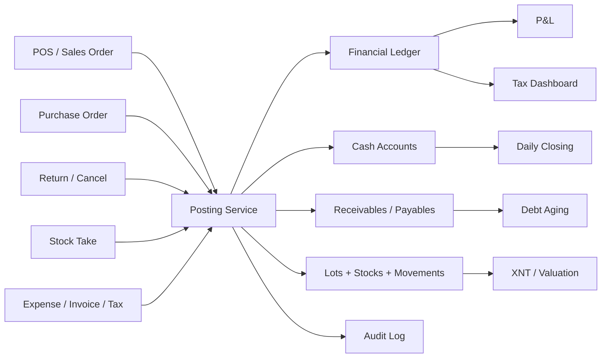

# Danh gia ung dung quan ly ban hang, kho va tai chinh

Ngay danh gia: 19/05/2026  
Vai tro danh gia: Chuyen gia tai chinh van hanh, kiem soat noi bo va san pham so cho cua hang/ho kinh doanh

## 1. Tom tat dieu hanh

Ung dung da co nen tang tot cho mot he thong quan ly cua hang: POS, don ban, khach hang, nha cung cap, ton kho, nhap hang, kiem ke, so quy, lai/lo, hoa don, nghia vu thue, bang ke mua khong hoa don, du bao dong tien va phan quyen nhan vien. Day la pham vi dung huong vi chu shop khong chi can "ban hang" ma can biet tien, hang, no va thue co khop nhau hay khong.

Tuy vay, o goc nhin tai chinh, rui ro lon nhat hien nay la so lieu chua du co che dam bao tin cay. Mot so bao cao dang tinh truc tiep tu bang nghiep vu nhu `sales_orders`, `cash_transactions`, `inventory_movements`, trong khi chua co lop "but toan/su kien tai chinh" bat bien lam nguon su that. Neu mot don hang bi huy, tra hang, thu them tien, nhap hang, kiem kho hoac sua hoa don, cac he qua ve tien, cong no, gia von, ton kho va thue co the lech nhau.

Uu tien cao nhat nen la: dong bo doanh thu - tien - cong no - ton kho - gia von - thue trong mot co che ghi nhan co kiem soat. Sau khi lam duoc lop nay, cac bao cao nhu lai/lo, cashflow forecast, tax dashboard va daily closing se dang tin hon nhieu.

## 2. Diem manh hien co

- Pham vi module kha day du cho cua hang/HKD: Sales, Inventory, Finance, Tax, Customers, Suppliers, Settings, Staff/RBAC.
- Backend co `shop_id` va auth middleware, da co huong multi-shop.
- Co y thuc ve gia von qua `COGSService`, inventory lots va tuy chon FIFO/AVG.
- Co cac man hinh tai chinh can thiet: so quy, chot so ngay, P&L, tuoi no, hoa don, nghia vu thue, bang ke mua khong hoa don, du bao dong tien.
- Co QA plan rieng cho rui ro logic tai chinh/kho/thue, day la diem rat tot vi dung nhom rui ro co kha nang lam sai quyet dinh kinh doanh.
- `npm run build` trong `backend` da pass tai thoi diem kiem tra.

## 3. Rui ro P0 can xu ly truoc

### P0.1. Chua co so cai/but toan tai chinh lam nguon su that

Hien `getProfitLoss` trong `backend/src/services/finance.service.ts` tong hop doanh thu tu `sales_orders.total_amount`, gia von tu `sales_orders.total_cogs`, chi phi tu `cash_transactions`. Cach nay chay nhanh, nhung de vo khi co huy don, tra hang, thu no, hoan tien, dieu chinh kho, hoa don sai hoac giao dich bi xoa.

De xuat:

- Tao lop `financial_events` hoac `journal_entries`/`journal_lines` bat bien.
- Moi nghiep vu phat sinh tien/hang/no/thue tao mot event: ban hang, thu tien, ban chiu, tra hang, huy don, nhap hang, thanh toan NCC, kiem kho, chi phi, lap/nop thue.
- Khong xoa giao dich tai chinh; chi duoc `void` hoac tao but toan dao.
- Bao cao P&L, cashflow, cong no va thue nen doc tu ledger/event da post, khong doc truc tiep tu form nhap lieu.

### P0.2. Don ban chiu chua dam bao tao cong no phai thu

Trong `SalesService.create`, he thong co kiem tra han muc tin dung nhung chua thay buoc tao `Receivable` khi `totalAmount > paidAmount`. Neu ban chiu ma khong tao receivable, man Debt Aging co the van rong, khach hang khong tang du no, va thu no sau nay khong co chung tu goc de doi chieu.

De xuat:

- Khi tao don: neu `unpaidAmount > 0`, tao `receivables` voi `orderId`, `dueDate`, `amount`, `paidAmount`, `status`.
- Khi thu them tien: cap nhat `receivables.paid_amount`, `customer.balance`, tao `DebtPaymentHistory` va `CashTransaction`.
- Khi huy/tra hang: giam cong no hoac tao but toan dao, khong chi cap nhat status don.
- Dashboard can co KPI `No phai thu`, `No qua han`, `DSO`, `Top khach no`.

### P0.3. Luong kho, lo hang va bao cao XNT chua dong bo chat

`InventoryService.createPurchaseOrder` tao inventory lot de tinh COGS, nhung can dam bao dong thoi tao/cap nhat `inventory_stocks` va `inventory_movements`. `SalesService.create` commit lot deductions nhung cung can ghi movement `OUT` va tru stock hien hanh. Neu lots, stocks va movements khong di cung nhau trong transaction, man POS/Inventory/XNT co the hien ton khac nhau.

De xuat:

- Tao service `InventoryPostingService` dung chung cho nhap hang, ban hang, tra hang, kiem kho.
- Moi post kho phai cap nhat ca 3 lop: lot, stock, movement.
- XNT chi nen tinh tu movement da post; stock hien tai nen doi chieu duoc voi tong movement.
- Kiem kho khi duyet phai tao movement `ADJUSTMENT`, cap nhat lot/stock va ghi ly do chenhlech.
- Return hang phai tao movement `RETURN_IN` hoac `RETURN`, dong thoi xu ly gia von dao nguoc.

### P0.4. So du quy tien mat dang la so thu - chi theo ky, chua phai so du tai khoan tien

`getCashFlowSummary` tinh `income - expense` theo period. Day la dong tien rong trong ky, khong phai so du quy tien mat neu khong co opening balance va cash account posting. Entity `CashAccount.balance` va `CashTransaction.runningBalance` da co, nhung can cap nhat nhat quan khi giao dich phat sinh.

De xuat:

- Moi giao dich tien phai gan `account_id`: tien mat, ngan hang A, vi dien tu, COD.
- Cap nhat `cash_accounts.balance` trong database transaction.
- `running_balance` tinh theo account, khong tinh chung toan shop.
- Man Finance nen tach `So du hien tai` va `Dong tien thuan trong ky`.
- Daily closing nen doi chieu rieng tien mat vat ly, chuyen khoan, vi dien tu, QR.

### P0.5. Chinh sach thue HKD trong app can cap nhat theo 2026

Trong `lib/features/settings/providers/tax_config_provider.dart`, app dang hard-code cac nguong 100 trieu, 300 trieu, 500 trieu, 1 ty. Theo thong tin cong khai 2026, HKD/canhan kinh doanh doanh thu nam tu 500 trieu dong tro xuong thuoc dien khong chiu GTGT va khong phai nop TNCN; tren 500 trieu bat dau co nghia vu khai/nop; tu 1 ty dong/nam tro len thuoc dien bat buoc ap dung hoa don dien tu. Nguon tham chieu:

- Chinhphu.vn ngay 23/04/2026: doanh thu duoi 500 trieu dong/nam khong chiu GTGT, TNCN; neu phat sinh doanh thu tren 500 trieu thi khai/nop tu quy phat sinh.
- Chinhphu.vn ngay 05/05/2026 va 20/04/2026: duoi 500 trieu khong bat buoc dung hoa don dien tu nhung duoc tiep tuc dung neu co nhu cau hop phap; tu 1 ty dong/nam tro len bat buoc ap dung hoa don dien tu.
- Thong tu 18/2026/TT-BTC: mau 01/TKN-CNKD, 01/CNKD, 02/CNKD-TNCN-QTT, 01/BK-STK va quy trinh thong bao/ke khai.

De xuat:

- Dua tax rules ve backend, co `effective_from`, `effective_to`, `version`, `source_url`, `business_type`.
- Khong luu rule thue quan trong chi bang `SharedPreferences`.
- Cap nhat tax calculator: duoi/den 500 trieu la khong chiu GTGT/TNCN; tren 500 trieu can tinh theo phuong phap phu hop.
- Them canh bao doanh thu luy ke nam, khong chi doanh thu thang.
- Tao lich han: 31/7, 31/1, han khai quy/thang tuy quy mo doanh thu.

## 4. Rui ro P1 nen xu ly ke tiep

### P1.1. Phan quyen can duoc enforce o backend

Co `permission.middleware.ts`, nhung cac route finance/sales/inventory hien chu yeu duoc bao ve bang auth + shopId. Neu user la thanh vien shop nhung khong co quyen Finance, van co nguy co goi API truc tiep.

De xuat:

- Gan `requirePermission('finance', 'view/edit/full')`, `requirePermission('sales', ...)`, `requirePermission('inventory', ...)` vao route.
- Phan biet quyen xem bao cao, tao giao dich, sua/huy/void, duyet bang ke, chot so.
- Log audit cho hanh dong nhay cam: huy don, tra hang, xoa/void giao dich, sua hoa don, sua gia von, sua ton kho.

### P1.2. Update/delete tai chinh can doi thanh quy trinh dieu chinh

`deleteCashTransaction`, `deleteInvoice`, `deleteTaxObligation` co the lam mat vet lich su. Voi tai chinh, xoa thang thuong tao rui ro lon hon sua.

De xuat:

- Doi delete thanh `void` co ly do, nguoi thuc hien, thoi gian.
- Neu can sua so tien da post, tao phien ban moi hoac but toan dieu chinh.
- Them trang thai: `DRAFT`, `POSTED`, `VOIDED`, `REVERSED`.
- UI can hien lich su thay doi va ly do dieu chinh.

### P1.3. Data contract decimal giua Postgres va Flutter can chuan hoa

Postgres `numeric/decimal` qua TypeORM thuong tra string. Mot so man da `num.tryParse`, nhung mot so cho van `.toDouble()` truc tiep. Rui ro la Flutter red screen khi API tra `"500000.00"`.

De xuat:

- Tao helper Flutter dung chung: `asNum(dynamic value)`, `asDouble`, `asInt`, `asDate`.
- Backend response DTO nen ep number cho cac tong hop va chuan hoa naming camelCase.
- Them test cho decimal string o Finance, Customers, Sales, Inventory.

### P1.4. Dong bo schema/entity/migration

Dang co dau hieu schema drift: entity purchase without invoice xuat hien o ca `backend/src/finance/entities.ts` va `backend/src/system/entities.ts` voi field khac nhau; migration them `approval_status` can dam bao da chay tren database. Neu TypeORM load duplicate entity/table, rui ro mapping va deploy se kho doan.

De xuat:

- Moi bang chi co mot entity chinh thuc.
- Migration can co trang thai ap dung, rollback va checklist deploy.
- Them endpoint health check schema version.
- CI nen chay `npm run build` va smoke test API voi database test.

### P1.5. Daily closing can thanh quy trinh doi soat

Chot so ngay hien co la mot man dung huong, nhung nen thanh quy trinh:

- Lay opening cash tu closing truoc.
- Tong hop thu/chi theo tung payment method.
- Nhap tien mat thuc te, tien chuyen khoan theo sao ke, vi dien tu theo provider.
- Tu dong tinh chenh lech va bat buoc nhap ly do neu vuot nguong.
- Khoa ngay da chot; muon sua phai mo khoa co quyen owner.

## 5. De xuat tinh nang tai chinh nen bo sung

### 5.1. Bao cao quan tri cho chu shop

Nen them cac KPI:

- Doanh thu luy ke nam va tien do toi nguong thue 500 trieu/1 ty.
- Loi nhuan gop, bien loi nhuan gop, loi nhuan rong.
- Gia tri ton kho, vong quay ton kho, ngay ton kho binh quan.
- No phai thu, no qua han, DSO.
- No phai tra nha cung cap, lich thanh toan sap den han.
- Cash runway: so ngay du tien theo toc do chi trung binh.
- Ty le huy don, ty le tra hang, shrinkage/chenh lech kiem kho.
- Top san pham loi nhuan cao, top san pham ban cham, top khach hang sinh loi.

### 5.2. Du bao dong tien that su

Cashflow forecast hien la nhap tay theo ngay. Nen nang cap thanh forecast ban tu dong:

- Opening balance tu cash accounts.
- Cash inflows: don da thanh toan, cong no den han, forecast doanh thu.
- Cash outflows: PO chua thanh toan, chi phi lap lai, luong, thue den han, no NCC.
- Scenario: conservative/base/growth.
- Canh bao ngay am quy, goi y thu no/giam nhap hang.

### 5.3. Quan ly gia von va gia ban

- Hien margin tren tung san pham ngay trong form gia ban.
- Canh bao ban duoi gia von hoac duoi margin muc tieu.
- Gia von nen co lich su va ly do thay doi.
- Chi phi bo sung vao gia von: van chuyen, boc xep, hao hut, chiet khau NCC.
- Bao cao GMROI: loi nhuan gop tren gia tri ton kho.

### 5.4. Cong no va thu hoi no

- Tao lich hen thanh toan theo don/khach.
- Mau tin nhan SMS/Zalo theo tuoi no.
- Luu bang chung no: anh bien nhan, ky nhan, ghi am, nguoi lam chung.
- Chinh sach han muc tin dung: theo nhom khach, lich su thanh toan, so ngay qua han.
- Canh bao thu ngan khi khach da qua han/gan cham han muc.

### 5.5. Thue va hoa don

- Quan ly tax rules theo nam, co nguon van ban.
- Tach doanh thu tinh thue, doanh thu khong chiu thue, doanh thu bi khau tru/khai thay.
- Ho tro mau/du lieu cho 01/TKN-CNKD, 01/CNKD, 01/BK-STK, 02/CNKD-TNCN-QTT.
- Doi chieu hoa don dau ra voi doanh thu POS va don hang.
- Doi chieu hoa don dau vao/bang ke khong hoa don voi nhap hang va gia von.
- Canh bao bat thuong: dau vao cao bat thuong, doanh thu tien mat lon nhung hoa don thap, huy/tra hang bat thuong gan ky khai thue.

## 6. Lo trinh trien khai de xuat

### Giai doan 1: Lam dung so lieu cot loi

1. Tao co che posting dung chung cho Sales, Inventory, Finance.
2. Tao receivable tu don ban chiu va cap nhat khi thu tien.
3. Dong bo lot, stock, movement khi nhap/ban/tra/kiem kho.
4. Cap nhat cash account balance/running balance theo tung account.
5. Doi delete tai chinh thanh void/reversal.
6. Chuan hoa parser decimal cho Flutter.
7. Cap nhat tax thresholds 2026 va dua tax rules ve backend.

### Giai doan 2: Kiem soat va doi chieu

1. Enforce RBAC tren backend route.
2. Them audit log cho tat ca nghiep vu nhay cam.
3. Hoan thien daily closing theo payment method.
4. Them reconciliation: Sales vs Cash vs Receivable; PO vs Inventory vs Payable; Invoice vs Sales/Purchase.
5. Them test E2E cho cac luong P0 trong `QA_TEST_PLAN.md`.

### Giai doan 3: Nang cap ra quyet dinh

1. Dashboard KPI quan tri: margin, cash runway, DSO, inventory turnover.
2. Cashflow forecast ban tu dong.
3. Canh bao thue theo doanh thu luy ke nam.
4. Bao cao san pham loi nhuan cao/thap, hang ban cham, sap het han.
5. Export Excel/PDF cho bao cao tai chinh, cong no, XNT, thue.

## 7. Checklist nghiem thu tai chinh nen them

- Ban tien mat: tao order, tao payment, tao cash transaction, tru stock, tru lot, tao movement OUT, P&L tang doanh thu/gia von, daily closing tang thu.
- Ban chiu: tao order, khong tao cash income cho phan chua thu, tao receivable, customer balance tang, debt aging hien dung.
- Thu no: cash tang, receivable paidAmount tang, customer balance giam, payment history co dong moi.
- Huy don chua thanh toan: doanh thu khong tinh, cong no khong con, stock/lot duoc dao neu da tru.
- Huy don da thanh toan: phai co quy trinh refund/void ro rang, khong xoa vet giao dich.
- Tra hang mot phan: revenue net giam, COGS duoc dao phan tuong ung, stock tang, cash expense/refund hoac cong no giam.
- Nhap hang: lot tang, stock tang, movement IN, PO total dung, payable/cash theo payment status.
- Kiem kho: difference tao movement adjustment, co ly do va nguoi duyet.
- Chot so: opening + thu - chi = expected; chenh lech bat buoc co ly do khi vuot nguong.
- Thue 2026: doanh thu luy ke <= 500 trieu khong tinh GTGT/TNCN; > 500 trieu can khai/nop; >= 1 ty can canh bao hoa don dien tu bat buoc.

## 8. Kien truc muc tieu goi y

## 9. Tai lieu va ma nguon da tham chieu

Ma nguon noi bo:

- `backend/src/services/finance.service.ts`
- `backend/src/services/sales.service.ts`
- `backend/src/services/inventory.service.ts`
- `backend/src/services/cogs.service.ts`
- `backend/src/finance/entities.ts`
- `backend/src/customer/entities.ts`
- `backend/src/middleware/auth.middleware.ts`
- `backend/src/middleware/permission.middleware.ts`
- `lib/features/settings/providers/tax_config_provider.dart`
- `lib/features/finance/providers/finance_provider.dart`
- `lib/features/finance/presentation/finance_screen.dart`
- `lib/features/finance/presentation/profit_loss_screen.dart`
- `QA_TEST_PLAN.md`

Nguon chinh sach cong khai da doi chieu:

- [Chinhphu.vn - Chinh sach thue voi ho kinh doanh doanh thu duoi 500 trieu dong](https://xaydungchinhsach.chinhphu.vn/chinh-sach-thue-voi-ho-kinh-doanh-co-doanh-nam-thu-duoi-500-trieu-dong-119260401110929512.htm)
- [Chinhphu.vn - Phuong phap tinh thue ho kinh doanh co doanh thu duoi 3 ty](https://chinhsachonline.chinhphu.vn/phuong-phap-tinh-thue-ho-kinh-doanh-co-doanh-thu-duoi-3-ty-85332.htm)
- [Chinhphu.vn - Luu y ke khai thue 2026 cho ho kinh doanh](https://xaydungchinhsach.chinhphu.vn/luu-y-chinh-trong-ky-khai-thue-quy-i-2026-119260312174235595.htm)
- [Chinhphu.vn - Su dung hoa don dien tu cua ho kinh doanh duoi 500 trieu dong/nam](https://xaydungchinhsach.chinhphu.vn/thong-tin-ve-su-dung-hoa-don-dien-tu-cua-ho-kinh-doanh-co-doanh-thu-duoi-500-trieu-dong-nam-119260417170447357.htm)
- [Chinhphu.vn - Thong tu 18/2026/TT-BTC ve ho so, thu tuc quan ly thue voi ho, ca nhan kinh doanh](https://xaydungchinhsach.chinhphu.vn/thong-tu-18-2026-tt-btc-quy-dinh-ve-ho-so-thu-tuc-quan-ly-thue-voi-ho-ca-nhan-kinh-doanh-119260309174321852.htm)

## 10. Ket luan

Ung dung dang di dung huong va da co rat nhieu module ma chu shop thuc su can. De hoan thien o muc co the tin cay cho quyet dinh tai chinh, nen tam thoi uu tien it tinh nang moi hon va tap trung vao "posting + ledger + reconciliation". Khi moi nghiep vu deu tu dong tao du he qua ve tien, hang, no, gia von va thue, app se vuot qua muc quan ly ban hang thong thuong va tro thanh mot cong cu quan tri tai chinh that su.
